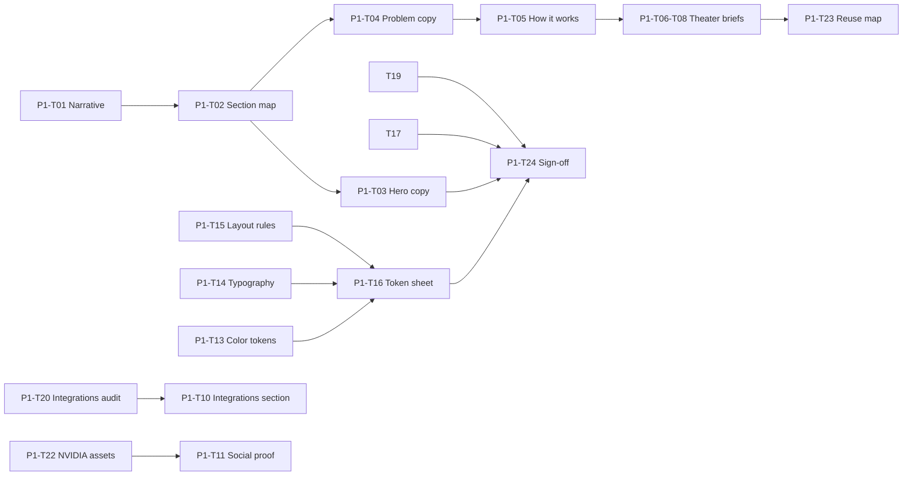

# Phase 1: Task Breakdown

Parent spec: [phase-1-foundation.md](./phase-1-foundation.md)

This file breaks Phase 1 into individual tasks. Each task is scoped so we can expand it into its own detailed doc (copy deck, token sheet, demo storyboard, etc.) before any code is written in Phase 2.

**How to use this file**

1. Pick a task by ID (for example `P1-T04`).
2. Expand it into a child doc: `docs/phase-1/tasks/P1-T04-hero-copy.md`.
3. Mark status here when the task output is approved.
4. Do not start Phase 2 implementation until all **Blocker** tasks are `done`.

**Status values:** `todo` | `in_progress` | `done` | `blocked`

---

## Task index (quick view)

| ID | Task | Status | Blocker? |
|----|------|--------|----------|
| P1-T01 | Lock product narrative and messaging pillars | done | Yes |
| P1-T02 | Approve homepage section map (10 sections) | done | Yes |
| P1-T03 | Write Hero section copy deck | done | Yes |
| P1-T04 | Write Problem section copy deck | done | Yes |
| P1-T05 | Write How it works section copy deck | done | Yes |
| P1-T06 | Write Product theater: Connect brief | done | No |
| P1-T07 | Write Product theater: Focus brief | done | No |
| P1-T08 | Write Product theater: Execute brief | done | No |
| P1-T09 | Define feature grid cards and links | done | No |
| P1-T10 | Define integrations section (7 apps) | done | No |
| P1-T11 | Define social proof section (NVIDIA + trust) | done | No |
| P1-T12 | Define final CTA section | done | No |
| P1-T13 | Approve semantic color token map | done | Yes |
| P1-T14 | Approve typography system (Manrope + Inter) | done | Yes |
| P1-T15 | Approve spacing, radius, and layout rules | done | Yes |
| P1-T16 | Produce marketing token reference sheet | done | Yes |
| P1-T17 | Accept performance budget as gate for Phase 2+ | done | Yes |
| P1-T18 | Set up performance measurement workflow | done | No |
| P1-T19 | Confirm deprecation and reuse inventory | done | Yes |
| P1-T20 | Audit integrations list across website + app | done | No |
| P1-T21 | Source Slack and Jira brand assets for marketing | done | No |
| P1-T22 | Source NVIDIA Inception badge/copy for Section 9 | done | No |
| P1-T23 | Define product theater reuse map (Static* components) | done | No |
| P1-T24 | Phase 1 sign-off checklist | done | Yes |

---

## Workstream A: Narrative and messaging

### P1-T01 — Lock product narrative and messaging pillars

**Status:** done  
**Blocker:** Yes  
**Depends on:** nothing  
**Deliverable:** [P1-T01-narrative.md](./phase-1/tasks/P1-T01-narrative.md) (completed 2026-07-03)

**Goal:** One approved story every section, demo, and CTA must reinforce.

**Inputs**

- [phase-1-foundation.md §1](./phase-1-foundation.md#1-product-narrative-the-one-sentence-version)

**Deliverable**

- One-sentence thesis (final wording)
- Three pillars with 1-line definitions: Connect, Prioritize, Execute
- "Does not belong on homepage" list (3-5 examples of out-of-scope content)

**Acceptance criteria**

- [ ] Thesis is ≤ 25 words and mentions apps, priority, and action
- [ ] Every homepage section can be tagged Connect / Prioritize / Execute / Conversion
- [ ] Stakeholder sign-off recorded in task expansion doc

**Expand into:** [P1-T01-narrative.md](./phase-1/tasks/P1-T01-narrative.md) (done)

---

### P1-T02 — Approve homepage section map (10 sections)

**Status:** done  
**Blocker:** Yes  
**Depends on:** P1-T01  
**Deliverable:** [P1-T02-section-map.md](./phase-1/tasks/P1-T02-section-map.md) (completed 2026-07-03)

---

## Workstream B: Section copy decks (expand one per section)

Each copy deck should include: eyebrow (optional), headline, subhead, body (if any), CTA labels, and mobile truncation notes.

### P1-T03 — Write Hero section copy deck

**Status:** done  
**Blocker:** Yes  
**Depends on:** P1-T01, P1-T02  
**Deliverable:** [P1-T03-hero-copy.md](./phase-1/tasks/P1-T03-hero-copy.md) (completed 2026-07-03)

---

### P1-T04 — Write Problem section copy deck

**Status:** done  
**Blocker:** Yes  
**Depends on:** P1-T01  
**Deliverable:** [P1-T04-problem-copy.md](./phase-1/tasks/P1-T04-problem-copy.md) (completed 2026-07-03)

---

### P1-T05 — Write How it works section copy deck

**Status:** done  
**Blocker:** Yes  
**Depends on:** P1-T01, P1-T04  
**Deliverable:** [P1-T05-how-it-works-copy.md](./phase-1/tasks/P1-T05-how-it-works-copy.md) (completed 2026-07-03)

---

### P1-T06 — Write Product theater: Connect brief

**Status:** done  
**Blocker:** No  
**Depends on:** P1-T05  
**Deliverable:** [P1-T06-theater-connect.md](./phase-1/tasks/P1-T06-theater-connect.md) (completed 2026-07-03)

---

### P1-T07 — Write Product theater: Focus brief

**Status:** done  
**Blocker:** No  
**Depends on:** P1-T05  
**Deliverable:** [P1-T07-theater-focus.md](./phase-1/tasks/P1-T07-theater-focus.md) (completed 2026-07-03)

---

### P1-T08 — Write Product theater: Execute brief

**Status:** done  
**Blocker:** No  
**Depends on:** P1-T05, P1-T07  
**Deliverable:** [P1-T08-theater-execute.md](./phase-1/tasks/P1-T08-theater-execute.md) (completed 2026-07-03)

---

### P1-T09 — Define feature grid cards and links

**Status:** done  
**Blocker:** No  
**Depends on:** P1-T02  
**Deliverable:** [P1-T09-feature-grid.md](./phase-1/tasks/P1-T09-feature-grid.md) (completed 2026-07-03)

---

### P1-T10 — Define integrations section (7 apps)

**Status:** done  
**Blocker:** No  
**Depends on:** P1-T20  
**Deliverable:** [P1-T10-integrations.md](./phase-1/tasks/P1-T10-integrations.md) (completed 2026-07-03)

---

### P1-T11 — Define social proof section (NVIDIA + trust)

**Status:** done  
**Blocker:** No  
**Depends on:** P1-T22  
**Deliverable:** [P1-T11-social-proof.md](./phase-1/tasks/P1-T11-social-proof.md) (completed 2026-07-03)

---

### P1-T12 — Define final CTA section

**Status:** done  
**Blocker:** No  
**Depends on:** P1-T03, P1-T11  
**Deliverable:** [P1-T12-final-cta.md](./phase-1/tasks/P1-T12-final-cta.md) (completed 2026-07-03)

---

## Workstream C: Design system

### P1-T13 — Approve semantic color token map

**Status:** done  
**Blocker:** Yes  
**Depends on:** nothing  
**Deliverable:** [P1-T13-color-tokens.md](./phase-1/tasks/P1-T13-color-tokens.md) (completed 2026-07-03)

---

### P1-T14 — Approve typography system (Manrope + Inter)

**Status:** done  
**Blocker:** Yes  
**Depends on:** nothing  
**Deliverable:** [P1-T14-typography.md](./phase-1/tasks/P1-T14-typography.md) (completed 2026-07-03)

---

### P1-T15 — Approve spacing, radius, and layout rules

**Status:** done  
**Blocker:** Yes  
**Depends on:** P1-T13, P1-T14  
**Deliverable:** [P1-T15-layout-rules.md](./phase-1/tasks/P1-T15-layout-rules.md) (completed 2026-07-03)

---

### P1-T16 — Produce marketing token reference sheet

**Status:** done  
**Blocker:** Yes  
**Depends on:** P1-T13, P1-T14, P1-T15  
**Deliverable:** [P1-T16-token-reference.md](./phase-1/tasks/P1-T16-token-reference.md) (completed 2026-07-03)

---

## Workstream D: Performance and quality gates

### P1-T17 — Accept performance budget as gate for Phase 2+

**Status:** done  
**Blocker:** Yes  
**Depends on:** nothing  
**Deliverable:** [P1-T17-performance-budget.md](./phase-1/tasks/P1-T17-performance-budget.md) (completed 2026-07-03)

---

### P1-T18 — Set up performance measurement workflow

**Status:** done  
**Blocker:** No  
**Depends on:** P1-T17  
**Deliverable:** [P1-T18-perf-workflow.md](./phase-1/tasks/P1-T18-perf-workflow.md) (completed 2026-07-03) · Baseline template: [homepage-legacy-lighthouse.md](./phase-1/baselines/homepage-legacy-lighthouse.md)

---

## Workstream E: Inventory, assets, and reuse

### P1-T19 — Confirm deprecation and reuse inventory

**Status:** done  
**Blocker:** Yes  
**Depends on:** P1-T02  
**Deliverable:** [P1-T19-deprecation-reuse.md](./phase-1/tasks/P1-T19-deprecation-reuse.md) (completed 2026-07-03)

---

### P1-T20 — Audit integrations list across website + app

**Status:** done  
**Blocker:** No  
**Depends on:** nothing  
**Deliverable:** [P1-T20-integrations-audit.md](./phase-1/tasks/P1-T20-integrations-audit.md) (completed 2026-07-03)

---

### P1-T21 — Source Slack and Jira brand assets for marketing

**Status:** done  
**Blocker:** No  
**Depends on:** P1-T10, P1-T20  
**Deliverable:** [P1-T21-slack-jira-assets.md](./phase-1/tasks/P1-T21-slack-jira-assets.md) (completed 2026-07-03) · Assets: [`slack.png`](../../public/images/icons/slack.png), [`jira.png`](../../public/images/icons/jira.png), [`slack.svg`](../../public/images/icons/slack.svg) (source)

---

### P1-T22 — Source NVIDIA Inception badge/copy for Section 9

**Status:** done  
**Blocker:** No  
**Depends on:** P1-T11  
**Deliverable:** [P1-T22-nvidia-inception.md](./phase-1/tasks/P1-T22-nvidia-inception.md) (completed 2026-07-03) · Assets: [`public/images/badges/nvidia-inception.svg`](../../public/images/badges/nvidia-inception.svg)

---

### P1-T23 — Define product theater reuse map (Static* components)

**Status:** done  
**Blocker:** No  
**Depends on:** P1-T06, P1-T07, P1-T08  
**Deliverable:** [P1-T23-theater-reuse-map.md](./phase-1/tasks/P1-T23-theater-reuse-map.md) (completed 2026-07-03)

---

## Workstream F: Sign-off

### P1-T24 — Phase 1 sign-off checklist

**Status:** done  
**Blocker:** Yes  
**Depends on:** all Blocker tasks above  
**Deliverable:** [P1-T24-sign-off.md](./phase-1/tasks/P1-T24-sign-off.md) (completed 2026-07-03) · Phase 2: [phase-2-shell.md](./phase-2-shell.md) · [phase-2-tasks.md](./phase-2-tasks.md)

**Phase 1 closed 2026-07-03.** All 24 tasks done. Proceed to Phase 2.

---

## Suggested expansion order

If you want to expand tasks one at a time, this order unblocks the most downstream work:



**Recommended first expansions:** P1-T01, P1-T02, P1-T13, P1-T14 (these unlock almost everything else).

---

## Child doc folder (create as you expand)

```
docs/phase-1/
  tasks/
    P1-T01-narrative.md
    P1-T02-section-map.md
    P1-T03-hero-copy.md
    ...
```

When a child doc is created, link it from this file in the task's **Expand into** line and update status here.
