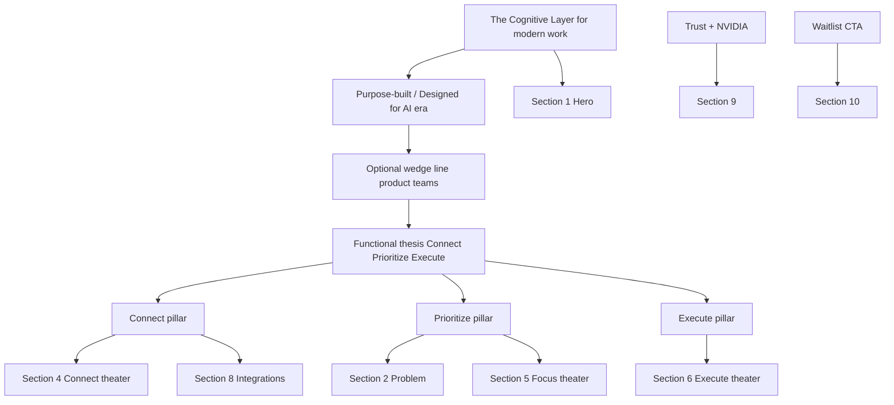

# P1-T01: Product Narrative and Messaging Pillars

**Task ID:** P1-T01  
**Status:** done  
**Type:** Strategy and documentation (no code; Phase 2 is first implementation)  
**Completed:** 2026-07-03  
**Parent:** [phase-1-tasks.md](../phase-1-tasks.md) | [phase-1-foundation.md](../phase-1-foundation.md)  
**Blocks:** P1-T02, P1-T03, P1-T04, P1-T05 (unblocked)

---

## Quick reference (copy-paste for downstream tasks)

| Element | Approved copy |
|---------|---------------|
| **H1** | The Cognitive Layer for modern work |
| **Subhead 1** | Purpose-built for the modern professional. |
| **Subhead 2** | Designed for the AI era. |
| **Functional thesis** | MindMesh connects your apps, finds the one thing that matters most right now, and gets it done for you. |
| **Optional wedge line** | Built for the teams who ship first: PMs, engineers, and product builders. |
| **Pillars** | Connect → Prioritize → Execute |
| **Proof wedge** | Product development teams (demos §2-6, not headline) |
| **Category (technical)** | Cognitive orchestration layer |

---

## 1. Purpose of this document

Lock the story MindMesh tells on the homepage before any layout, copy deck, or demo work begins. Every section, animation, and CTA must trace back to one thesis and three pillars defined here.

This doc is the **source of truth for messaging**. Section copy decks (P1-T03 through P1-T12) should not contradict it.

---

## 2. What MindMesh is (product truth)

MindMesh is a **cognitive orchestration layer** for **modern work**. It sits above the apps professionals already use (Slack, Jira, email, calendar) and does three things:

1. **Ingests** signals from connected source apps
2. **Decides** what deserves attention right now (via the Attention Engine: normalize, filter, score, relate, synthesize, rank)
3. **Acts** on that decision (draft replies, schedule blocks, update tasks, surface narratives)

It is **not** another inbox, not another calendar, and not a chatbot that answers questions. It is the layer that answers: **"What should I do right now?"** and then helps you do it.

**Product evidence (for internal alignment):**

- Desktop app connects Gmail, Outlook, Google Calendar, Outlook Calendar, SMTP, Slack, and Jira
- Attention Engine produces a ranked Attention Board (single ordered view of priorities)
- Security positioning: local-first, private by design, read-only integrations where it matters

---

## 3. Messaging stack (approved direction)

Stakeholder-approved hero positioning. The homepage uses a **three-layer stack**: category headline, era taglines, then functional thesis.

### Audience strategy: wide category, sharp proof (hybrid)

**Product truth:** MindMesh is useful for anyone who works with information across multiple apps (email, calendar, chat, tasks).

**Marketing truth:** A homepage still needs a wedge so demos, problem copy, and theater sequences feel specific, not generic.

| Layer | Scope | Role |
|-------|--------|------|
| **Category headline (H1)** | Wide | Invites anyone doing modern information work |
| **Era taglines** | Wide | "Modern professional" + "AI era" without excluding roles |
| **Functional thesis** | Universal | Connect → Prioritize → Execute applies to all |
| **Problem + demos (§4-6)** | Narrow wedge | Product development teams as the **first proof story** |
| **Integrations theater** | Wedge-weighted | Slack + Jira prominent, but email/calendar included |

**Principle:** Build the story for a wedge; do not write copy that says "PMs only." Others self-select when they see Slack, Jira, inbox, and calendar in one layer.

**Wedge (proof audience):** Product development teams (PMs, engineers, people who ship).  
**Category (headline audience):** Modern professionals who live in information across apps.

---

### Layer 1: Category headline (Hero H1)

> **The Cognitive Layer for modern work**

Wide enough for any information worker. Specificity comes from demos and problem copy below the fold, not from narrowing the H1.

**Alternative H1 (if "modern work" feels too vague in testing):**  
The Cognitive Layer for knowledge work

**Retired H1 (too narrow for category layer):**  
~~The Cognitive Layer for product development~~ → moves to proof wedge, not headline

---

### Layer 2: Era taglines (Hero subhead, two lines)

> **Purpose-built for the modern professional.**  
> **Designed for the AI era.**

These sit directly under the headline. They set tone and era without locking to a single job title.

**Optional wedge line (below taglines, above functional thesis):**  
Built for the teams who ship first: PMs, engineers, and product builders.

Use this line if user testing shows the wide H1 needs one anchor example. Omit if the hero feels crowded.

**Copy notes (editorial):**

- Use "Purpose-built" (not "Purpose-build")
- Use "the modern professional" (not "modern day professional")
- Two short sentences for era taglines; wedge line is optional third line

---

### Layer 3: Functional thesis (Hero body or second subhead)

> **MindMesh connects your apps, finds the one thing that matters most right now, and gets it done for you.**

This carries the Connect / Prioritize / Execute story. Universal: applies to PMs, engineers, analysts, founders, and anyone drowning in app tabs.

**Word count:** 18  
**Covers:** apps (Connect), priority (Prioritize), action (Execute)

### How the three layers work together

| Layer | Role | Scope | Example placement |
|-------|------|-------|-------------------|
| Headline | Category | Wide | Hero H1 |
| Era taglines | Tone + era | Wide | Hero subhead (2 lines) |
| Wedge line (optional) | Proof anchor | Narrow | Hero, line 3 |
| Functional thesis | Mechanism | Universal | Hero body |
| Problem + theaters | Proof | Narrow wedge | Sections 2-6 |

### Retired alternatives (not selected)

| Option | Copy | Why not lead |
|--------|------|--------------|
| Old site framing | AI-powered productivity assistant | Too generic; wrong category |
| Thesis-only hero | MindMesh connects your apps... | Missing category |
| PM-only headline | The Cognitive Layer for product managers | Too narrow; excludes engineers and other information workers |
| Product-dev-only H1 | The Cognitive Layer for product development | Good wedge, wrong layer; use in demos not headline |

### What we are moving away from

Current site copy frames MindMesh as an **"AI-powered productivity assistant"** that **"automates meeting notes, tasks and calendar."** The new stack leads with a **wide category** (cognitive layer for modern work), **era positioning** (AI era, modern professional), and **wedge-specific proof** in scroll demos (product development workflows).

**New positioning:** cognitive layer for modern work, proven first through product development teams.

---

## 4. Three messaging pillars

Everything on the homepage maps to one of these. If it maps to none, it does not belong above the fold.

### Pillar 1: Connect

**One-line definition:** Your existing tools become sources MindMesh can read and reason over.

**What it means for the user:**

- No migration. No new inbox to check. MindMesh plugs into Gmail, Outlook, calendars, Slack, Jira, SMTP.
- One unified view of what is happening across apps, without tab-switching.
- Sources are connected once; MindMesh keeps them in sync.

**Proof points we can claim today:**

- 7 supported integrations (Gmail, Google Calendar, Outlook Email, Outlook Calendar, SMTP, Slack, Jira)
- Connected apps panel in the product UI
- Local-first architecture; data stays under user control

**Homepage expression:**

- Section 4 (Product theater: Connect)
- Section 8 (Integrations logo row)
- Feature grid card: Connected apps

**Words to use:** connect, sources, apps you already use, unified, sync, plug in  
**Words to avoid:** replace your tools, all-in-one app, new inbox, switch to MindMesh

---

### Pillar 2: Prioritize

**One-line definition:** MindMesh cuts through noise to surface the single most important focus right now.

**What it means for the user:**

- Not a list of 50 notifications. One clear priority with a plain-English reason why.
- Cross-app signals combined: an email thread, a meeting in 90 minutes, and a Jira ticket can become one actionable focus.
- Attention Engine ranks and synthesizes; the user sees "the board," not raw feeds.

**Proof points we can claim today:**

- Attention Engine (normalize, filter, score, relate, synthesize, rank)
- Attention Board in the desktop app
- Daily narrative / yesterday's recap as memory and context

**Homepage expression:**

- Section 5 (Product theater: Focus) - **core differentiator section**
- Section 2 (Problem) sets up why prioritization is broken today
- Section 3 (How it works) step 2
- Feature grid cards: Daily narrative, Upcoming events

**Words to use:** one thing, right now, priority, focus, signal, noise, what matters, attention  
**Words to avoid:** dashboard of everything, see all your data, infinite feed, stay on top of everything (implies more tabs, not less)

---

### Pillar 3: Execute

**One-line definition:** MindMesh does not just tell you what to do. It drafts, schedules, checks off, and completes the work.

**What it means for the user:**

- A priority card is not a reminder you ignore. MindMesh can draft the reply, block calendar time, or mark the task done.
- Execution closes the loop from Prioritize. Connect and Prioritize earn trust; Execute delivers value.
- Actions are tied to real app context (open the thread, pre-fill the draft, add the event).

**Proof points we can claim today:**

- Draft reply flows from attention actions
- Calendar event creation / scheduling context
- Task completion and narrative updates in the product

**Homepage expression:**

- Section 6 (Product theater: Execute)
- Section 3 (How it works) step 3
- Feature grid cards: Inbox, Upcoming events

**Words to use:** done, draft, schedule, act, complete, handle it, takes action  
**Words to avoid:** suggests, recommends only, AI insights (passive), you figure it out

---

## 5. Supporting narrative layers

These sit beneath the thesis and pillars. Use them in subheads, feature pages, and trust sections, not as the hero headline.

### 5.1 Category name

**Primary (hero H1):** The Cognitive Layer for modern work  
**Supporting (hero subhead):** Purpose-built for the modern professional. Designed for the AI era.  
**Proof wedge (demos + problem):** Product development teams (PMs, engineers, shippers)  
**Technical (body/meta):** Cognitive orchestration layer  
**Avoid as lead:** AI assistant, productivity app, super-app, workspace, "for product managers only"

### 5.2 Problem frame (feeds Section 2)

**Wide hook (first line):** If your work lives across apps, you already know the problem: too much information, no clear "what now?"

**Wedge proof (3 punchy lines, product development flavored):**

- Slack threads, Jira tickets, and stakeholder email never agree on what matters most
- PMs and engineers lose hours switching tabs instead of shipping
- Generic AI chat adds another interface; it does not orchestrate your stack into one priority

MindMesh's answer: **one cognitive layer above your apps**, for modern work in the AI era. Demos on this page show product teams first; the same pattern applies to anyone living in information.

**Copy rule:** Problem section opens wide, proves narrow. Do not say "only for product teams."

### 5.3 Audience (primary)

**Category audience (headline):** Modern professionals whose work is information across multiple apps. Anyone who asks "what should I focus on right now?" at least once a day.

**Proof wedge (demos + first scroll):** Product development teams: PMs, engineers, and people who ship. Slack + Jira + email + calendar is the canonical demo stack.

**Secondary persona:** Early-adopter builders who want local-first, private AI orchestration inside their existing workflow.

**Not primary (homepage):** Enterprise IT procurement, API-only developers, mascot enthusiasts (dedicated pages only).

**Who self-selects without us naming them:** Founders, ops leads, analysts, consultants, and other knowledge workers who recognize the Slack/Jira/email pattern even if they are not "product development."

### 5.4 Voice and tone

| Attribute | Do | Don't |
|-----------|-----|-------|
| Clarity | Short sentences. Plain English. | Jargon-heavy AI hype |
| Confidence | State what MindMesh does directly | "We hope to" / "Coming soon" in hero |
| Restraint | Linear-style minimal copy | Feature dumps, bullet walls |
| Specificity | "One priority with a reason" | "Boost productivity 10x" |
| Trust | Privacy/local-first when relevant | Fear-based security marketing |

---

## 6. Terminology glossary

| Term | Use on homepage? | Definition / note |
|------|------------------|-------------------|
| The Cognitive Layer | Yes (hero H1) | Wide category positioning |
| The Cognitive Layer for modern work | Yes (hero H1) | Approved headline |
| Product development (teams) | Yes (problem + demos) | Proof wedge, not headline |
| Purpose-built for the modern professional | Yes (hero subhead) | Wide audience |
| Designed for the AI era | Yes (hero subhead) | Era positioning |
| Attention Engine | Feature pages, optional in theater captions | Internal/product name for prioritization pipeline |
| Attention Board | Product theater, dashboard links | User-facing ranked priority view |
| Source apps | Yes | Apps the user connects (Gmail, Slack, etc.) |
| Connect / Prioritize / Execute | Yes | The three pillars; use as verbs |
| AI-powered productivity assistant | Retire from hero | Old positioning; too generic |
| Automate meeting notes | Feature depth only | True capability but not the lead story |
| Mascot / sensor bar | Dedicated pages only | Not homepage narrative |

---

## 7. What does NOT belong on the homepage

Content that is valid elsewhere but dilutes the three-beat story:

| Out of scope for homepage | Where it belongs instead |
|---------------------------|--------------------------|
| Mascot character showcase | `/sensor&mascot` |
| Sensor bar spotlight / onboarding tour | `/sensor&mascot` or in-app only |
| macOS-style draggable windows metaphor | Retired with Hero replacement |
| Custom cursor / context menu | Removed from marketing routes |
| Full feature list (inbox, weather, billing, etc.) | Feature grid links to depth pages |
| Pricing / subscription details | `/billing` or dedicated pricing page |
| Developer docs / API | `/docs` |
| Fake testimonials or inflated user counts | Section 9 uses NVIDIA Inception + trust instead |
| "10 users" as headline social proof | Secondary line only in trust section |
| Every integration under the sun | 7-app baseline only; "more added regularly" |

---

## 8. Homepage section → pillar mapping

Every section must tag to a pillar or Conversion. No orphan sections.

| Section | ID (proposed) | Primary pillar | Secondary |
|---------|---------------|----------------|-----------|
| 1. Hero | `#hero` | All three (thesis) | Conversion |
| 2. Problem | `#problem` | Prioritize (setup) | Connect |
| 3. How it works | `#how-it-works` | Connect, Prioritize, Execute | - |
| 4. Theater: Connect | `#connect` | Connect | - |
| 5. Theater: Focus | `#focus` | Prioritize | - |
| 6. Theater: Execute | `#execute` | Execute | - |
| 7. Feature grid | `#features` | All (depth links) | - |
| 8. Integrations | `#integrations` | Connect | - |
| 9. Social proof | `#trust` | Conversion | Trust (not a pillar) |
| 10. Final CTA | `#cta` | Conversion | All three (thesis restated) |

**Conversion** is not a fourth pillar. It is the action layer (waitlist, sign-up) that wraps the story.

---

## 9. Messaging hierarchy (what goes where)

**Above the fold (Hero):** category headline + era taglines + functional thesis. No feature list.  
**First scroll (Problem + How it works):** why + three steps in text.  
**Mid page (Theaters 4-6):** prove each pillar visually.  
**Lower page (Features, Integrations, Trust):** depth and credibility.  
**Bottom (CTA):** thesis restated + waitlist.

---

## 10. Competitive differentiation (internal reference)

Use in Problem section and sales conversations. Do not name competitors on the homepage.

| Alternative | What user gets | MindMesh difference |
|-------------|----------------|---------------------|
| Tab-switching manually | Raw feeds in each app | One prioritized focus across apps |
| Generic AI chat (ChatGPT, etc.) | Answers when asked | Proactive priority + action in workflow |
| Notion AI / workspace tools | AI inside one product | Orchestration across existing tools |
| Super-apps / unified inbox | Another app to check | Layer that reduces apps to one decision |
| Automation (Zapier, etc.) | Rules you configure | Cognitive prioritization, not IF/THEN |

**Lead differentiation line (optional, Problem or How it works):**  
MindMesh does not add another app to check. It tells you the one thing worth doing next, then helps you do it.

---

## 11. SEO and meta alignment (narrative only)

When Phase 6 updates metadata, align with this narrative:

| Field | Direction |
|-------|-----------|
| Title | MindMesh - The Cognitive Layer for modern work |
| Description | Purpose-built for the modern professional. Connect your apps, find what matters most right now, get it done. |
| OG / social | Headline + product frame screenshot, not mascot |

Retire lead framing: "AI-powered productivity assistant" and "automate meeting notes" as primary hooks.

---

## 12. Acceptance criteria checklist

- [x] Messaging stack approved (headline + taglines + functional thesis)
- [x] Thesis drafted (≤ 25 words, covers apps + priority + action)
- [x] Three pillars defined with 1-line definitions
- [x] "Does not belong on homepage" list (≥ 5 items)
- [x] Every homepage section tagged to a pillar or Conversion
- [x] Stakeholder locked hybrid audience strategy (wide headline + product-dev proof wedge)
- [x] Final sign-off recorded below

---

## 13. Stakeholder sign-off

| Role | Name | Decision | Date |
|------|------|----------|------|
| Product / founder | Rohit | Approved messaging stack (§3), hybrid audience strategy | 2026-07-03 |
| Marketing / copy | | Approved pillars + voice table | |
| Design | | Confirm narrative fits Linear-style minimal tone | |

- [x] Audience strategy locked: hybrid (wide category + product-dev proof wedge)

**Approved messaging stack:**

> **The Cognitive Layer for modern work**  
> Purpose-built for the modern professional. Designed for the AI era.  
> MindMesh connects your apps, finds the one thing that matters most right now, and gets it done for you.

**Proof wedge (sections 2-6, not headline):** Product development teams; Slack + Jira-forward demos.

**P1-T01 status:** Done. Proceed to [P1-T02](../phase-1-tasks.md#p1-t02--approve-homepage-section-map-10-sections) or [P1-T03](../phase-1-tasks.md#p1-t03--write-hero-section-copy-deck).

---

## 14. Downstream handoff

Once signed off, these tasks can proceed:

| Task | What they take from this doc |
|------|------------------------------|
| P1-T02 | Section map + anchor IDs from §8 |
| P1-T03 | Hero stack (§3): headline, taglines, functional thesis + voice (§5.4) |
| P1-T04 | Problem frame (§5.2) |
| P1-T05 | Three steps = three pillars (§4) |
| P1-T06-T08 | Pillar definitions + proof points (§4) |
| P1-T11 | Trust is Conversion support, not a fourth pillar (§8) |
