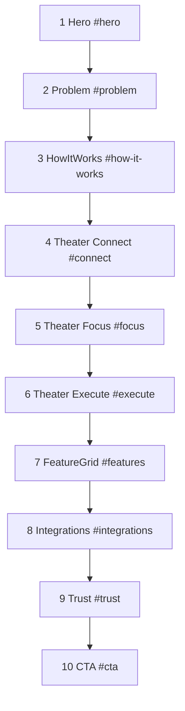

# P1-T02: Homepage Section Map

**Task ID:** P1-T02  
**Status:** done  
**Type:** Strategy and documentation (no code; Phase 2 is first implementation)  
**Completed:** 2026-07-03  
**Parent:** [phase-1-tasks.md](../phase-1-tasks.md) | [phase-1-foundation.md](../phase-1-foundation.md)  
**Depends on:** [P1-T01-narrative.md](./P1-T01-narrative.md) (done)  
**Blocks:** P1-T03, P1-T04, P1-T05, Phase 2 homepage scaffold (unblocked)

---

## Quick reference (all 10 sections)

| # | Name | Anchor | Type | Pillar | Nav | Lazy load | Phase 2 component |
|---|------|--------|------|--------|-----|-----------|-------------------|
| 1 | Hero | `#hero` | hero | All + Conversion | No | No | `HeroSection.tsx` |
| 2 | Problem | `#problem` | text | Prioritize | No | No | `ProblemSection.tsx` |
| 3 | How it works | `#how-it-works` | text | Connect, Prioritize, Execute | Yes | No | `HowItWorksSection.tsx` |
| 4 | Theater: Connect | `#connect` | theater | Connect | Yes | Yes | `ProductTheaterConnect.tsx` |
| 5 | Theater: Focus | `#focus` | theater | Prioritize | No | Yes | `ProductTheaterFocus.tsx` |
| 6 | Theater: Execute | `#execute` | theater | Execute | No | Yes | `ProductTheaterExecute.tsx` |
| 7 | Feature grid | `#features` | grid | All | Yes | Yes | `FeatureGridSection.tsx` |
| 8 | Integrations | `#integrations` | logos | Connect | No | Yes | `IntegrationsSection.tsx` |
| 9 | Trust | `#trust` | trust | Conversion | Yes | Yes | `TrustSection.tsx` |
| 10 | Final CTA | `#cta` | cta | Conversion | Yes (button) | No | `FinalCTASection.tsx` |

**Page route:** `/`  
**Excluded from map:** Sensor & mascot (dedicated page only: `/sensor&mascot`)

---

## Frozen section order



No reordering without a new planning task.

---

## Sticky nav spec (minimal, Linear-style)

Four text links + one primary button. Nav does **not** link to all 10 sections.

| Nav label | Target | Behavior |
|-----------|--------|----------|
| Product | `#connect` | Smooth scroll to Connect theater (first product proof) |
| Features | `#features` | Smooth scroll to feature grid |
| Security | `#trust` | Smooth scroll to trust section |
| Join waitlist | `#cta` or modal | Primary button; opens waitlist or scrolls to final CTA |

**Nav component (Phase 2):** [`components/marketing/MarketingNav.tsx`](../../../components/marketing/MarketingNav.tsx)

**Notes:**

- "How it works" (`#how-it-works`) is not in nav; users reach it by scrolling or via Hero secondary CTA path through `#connect`
- Hero secondary CTA "See how it works" scrolls to **`#connect`**, not `#how-it-works`
- Sticky nav appears after user scrolls past `#hero` (implementation detail for Phase 2)

---

## Feature grid (Section 7, frozen)

**5 cards.** Sensor & mascot excluded per [P1-T01-narrative.md](./P1-T01-narrative.md).

| Card title | Href | Source file |
|------------|------|-------------|
| Inbox | `/inbox` | [`app/inbox/page.tsx`](../../../app/inbox/page.tsx) |
| Connected apps | `/connected-apps` | [`app/connected-apps/page.tsx`](../../../app/connected-apps/page.tsx) |
| Daily narrative | `/yesterdays-narrative` | [`app/yesterdays-narrative/page.tsx`](../../../app/yesterdays-narrative/page.tsx) |
| Upcoming events | `/upcoming-events` | [`app/upcoming-events/page.tsx`](../../../app/upcoming-events/page.tsx) |
| Security | `/security` | [`app/security/page.tsx`](../../../app/security/page.tsx) |

---

## Integrations (Section 8, frozen)

**7 apps** in display order:

1. Gmail
2. Google Calendar
3. Outlook Email
4. Outlook Calendar
5. SMTP Mailbox
6. Slack
7. Jira

**Copy frame:** "Connect what you already use" + "More integrations added regularly"  
**Depth link:** `/connected-apps`  
**Animation:** Static logo grid by default; CSS marquee only if performance-tested in Phase 6

---

## Per-section specifications

### Section 1: Hero

| Field | Value |
|-------|-------|
| **Anchor** | `id="hero"` |
| **Heading id** | `hero-heading` |
| **Type** | hero |
| **Pillar** | All three + Conversion |
| **Purpose** | Land category + era positioning in under 3 seconds |
| **Scroll height** | `min-h-screen` (100vh), no overflow hidden on page root |
| **Lazy load** | No (above fold, LCP-critical) |
| **Component** | `components/marketing/sections/HeroSection.tsx` |

**Content source:** [P1-T01-narrative.md §3](./P1-T01-narrative.md#3-messaging-stack-approved-direction); copy deck [P1-T03](../phase-1-tasks.md#p1-t03--write-hero-section-copy-deck)

**Layout:**

- H1, two taglines, functional thesis, optional wedge line
- No product frame or demo in hero
- Background: marketing dark (`--mm-bg`); minimal motion

**CTAs:**

| Label | Action |
|-------|--------|
| Join the waitlist | Primary: scroll to `#cta` or open `WaitlistModal` |
| See how it works | Secondary: smooth scroll to `#connect` |

**Mobile:** Stack CTAs vertically; H1 scales `display-xl` down to ~40px

---

### Section 2: Problem

| Field | Value |
|-------|-------|
| **Anchor** | `id="problem"` |
| **Heading id** | `problem-heading` |
| **Type** | text |
| **Pillar** | Prioritize (setup) |
| **Purpose** | Wide hook + wedge proof: why "what now?" is broken |
| **Scroll height** | ~80-100vh (content-driven) |
| **Lazy load** | No |
| **Component** | `components/marketing/sections/ProblemSection.tsx` |

**Content source:** [P1-T01-narrative.md §5.2](./P1-T01-narrative.md#52-problem-frame-feeds-section-2); copy deck [P1-T04](../phase-1-tasks.md#p1-t04--write-problem-section-copy-deck)

**Layout:**

- Section headline
- Wide hook: information across apps, no clear "what now?"
- 3 punchy wedge lines (Slack/Jira/email sprawl)
- Closing line: cognitive layer answer (no "PMs only" language)

**CTAs:** None  
**Mobile:** Same content; reduce horizontal padding

---

### Section 3: How it works

| Field | Value |
|-------|-------|
| **Anchor** | `id="how-it-works"` |
| **Heading id** | `how-it-works-heading` |
| **Type** | text |
| **Pillar** | Connect, Prioritize, Execute |
| **Purpose** | Preview the 3-beat structure before product theaters |
| **Scroll height** | ~80-120vh |
| **Lazy load** | No |
| **Component** | `components/marketing/sections/HowItWorksSection.tsx` |

**Content source:** [P1-T01-narrative.md §4](./P1-T01-narrative.md#4-three-messaging-pillars); copy deck [P1-T05](../phase-1-tasks.md#p1-t05--write-how-it-works-section-copy-deck)

**Layout:**

- Section headline
- 3 numbered steps with icons: Connect → Prioritize → Execute
- Text + icons only; **no product demo**

**CTAs:** None  
**Mobile:** Steps stack vertically

---

### Section 4: Theater - Connect

| Field | Value |
|-------|-------|
| **Anchor** | `id="connect"` |
| **Heading id** | `connect-heading` |
| **Type** | theater (sticky scroll) |
| **Pillar** | Connect |
| **Purpose** | Prove step 1: apps become sources |
| **Scroll height** | ~200-250vh wrapper; sticky frame ~70vh |
| **Lazy load** | Yes (`next/dynamic`, `ssr: false`) |
| **Component** | `components/marketing/sections/ProductTheaterConnect.tsx` |

**Content source:** [P1-T01-narrative.md Pillar 1](./P1-T01-narrative.md#pillar-1-connect); brief [P1-T06](../phase-1-tasks.md#p1-t06--write-product-theater-connect-brief)

**Layout:**

- Section headline + subhead outside sticky frame
- `ProductFrame` chrome with connected-apps panel
- Scroll-driven sequence: empty → 7 apps connect → synced state

**Apps in animation order:** Gmail → Google Calendar → Outlook Email → Outlook Calendar → SMTP → Slack → Jira

**Reuse target:** [`StaticConnectedApps.tsx`](../../../components/dashboard/StaticConnectedApps.tsx)

**Depth link:** `/connected-apps` (text link below theater)

**Mobile:** ~120vh scroll height or static final frame; `prefers-reduced-motion` shows final frame only

---

### Section 5: Theater - Focus

| Field | Value |
|-------|-------|
| **Anchor** | `id="focus"` |
| **Heading id** | `focus-heading` |
| **Type** | theater (sticky scroll) |
| **Pillar** | Prioritize |
| **Purpose** | Core differentiator: one priority with plain-English reason |
| **Scroll height** | ~200-250vh wrapper; sticky frame ~70vh |
| **Lazy load** | Yes |
| **Component** | `components/marketing/sections/ProductTheaterFocus.tsx` |

**Content source:** [P1-T01-narrative.md Pillar 2](./P1-T01-narrative.md#pillar-2-prioritize); brief [P1-T07](../phase-1-tasks.md#p1-t07--write-product-theater-focus-brief)

**Layout:**

- Noisy inbox + calendar → cross-highlight → single priority card scales in
- Other items dim to `opacity: 0.4`

**Reuse targets:** `StaticDailySummaryPanel`, `StaticInboxList`, `StaticCalendarEvents`

**Depth link:** `/yesterdays-narrative`

**Mobile:** Shorter scroll or static priority card + caption

---

### Section 6: Theater - Execute

| Field | Value |
|-------|-------|
| **Anchor** | `id="execute"` |
| **Heading id** | `execute-heading` |
| **Type** | theater (sticky scroll) |
| **Pillar** | Execute |
| **Purpose** | Close the loop: draft, schedule, check off |
| **Scroll height** | ~200-250vh wrapper; sticky frame ~70vh |
| **Lazy load** | Yes |
| **Component** | `components/marketing/sections/ProductTheaterExecute.tsx` |

**Content source:** [P1-T01-narrative.md Pillar 3](./P1-T01-narrative.md#pillar-3-execute); brief [P1-T08](../phase-1-tasks.md#p1-t08--write-product-theater-execute-brief)

**Layout:**

- Action emphasis → typing draft ([`TypingText.tsx`](../../../components/ui/TypingText.tsx)) → success checkmarks

**Reuse targets:** `StaticDailyNarrativeCard`

**Depth links:** `/inbox`, `/upcoming-events`

**Mobile:** Static success frame under reduced motion or narrow viewports

---

### Section 7: Feature grid

| Field | Value |
|-------|-------|
| **Anchor** | `id="features"` |
| **Heading id** | `features-heading` |
| **Type** | grid |
| **Pillar** | All (depth links) |
| **Purpose** | Map for depth-seekers; link to existing feature pages |
| **Scroll height** | Content-driven (~100-140vh) |
| **Lazy load** | Yes |
| **Component** | `components/marketing/sections/FeatureGridSection.tsx` |

**Content source:** [P1-T09](../phase-1-tasks.md#p1-t09--define-feature-grid-cards-and-links); cards frozen in this doc (Feature grid section above)

**Layout:**

- Section headline
- 5-card grid (2 cols mobile, 3 cols desktop)
- Each card: title, 1-line description, arrow link

**CTAs:** Per-card links only  
**Mobile:** Single column stack

---

### Section 8: Integrations

| Field | Value |
|-------|-------|
| **Anchor** | `id="integrations"` |
| **Heading id** | `integrations-heading` |
| **Type** | logos |
| **Pillar** | Connect |
| **Purpose** | Show supported apps without overclaiming |
| **Scroll height** | ~60-80vh |
| **Lazy load** | Yes |
| **Component** | `components/marketing/sections/IntegrationsSection.tsx` |

**Content source:** [P1-T10](../phase-1-tasks.md#p1-t10--define-integrations-section-7-apps); list frozen in this doc (Integrations section above)

**Layout:**

- Headline + subhead
- 7-logo grid (consistent icon weight on dark bg)
- Footer line: "More integrations added regularly"
- Link to `/connected-apps`

**CTAs:** "See all integrations" → `/connected-apps`  
**Mobile:** 2-column logo grid

---

### Section 9: Trust

| Field | Value |
|-------|-------|
| **Anchor** | `id="trust"` |
| **Heading id** | `trust-heading` |
| **Type** | trust |
| **Pillar** | Conversion (support) |
| **Purpose** | Credibility before final conversion |
| **Scroll height** | ~80-100vh |
| **Lazy load** | Yes |
| **Component** | `components/marketing/sections/TrustSection.tsx` |

**Content source:** [P1-T11](../phase-1-tasks.md#p1-t11--define-social-proof-section-nvidia--trust)

**Layout:**

- Primary: NVIDIA Inception Program member (badge + approved copy)
- Secondary: security/privacy trust line with links to `/security`, `/trust`
- Tertiary: "10+ early users" (small, not headline)

**CTAs:** Links to `/security`, `/trust`  
**Mobile:** Stack badge + copy vertically

---

### Section 10: Final CTA

| Field | Value |
|-------|-------|
| **Anchor** | `id="cta"` |
| **Heading id** | `cta-heading` |
| **Type** | cta |
| **Pillar** | Conversion |
| **Purpose** | Convert: restate thesis + waitlist capture |
| **Scroll height** | ~80-100vh |
| **Lazy load** | No (user may scroll directly here from nav/hero) |
| **Component** | `components/marketing/sections/FinalCTASection.tsx` |

**Content source:** [P1-T12](../phase-1-tasks.md#p1-t12--define-final-cta-section); thesis from [P1-T01](./P1-T01-narrative.md)

**Layout:**

- Headline restating functional thesis
- Inline email capture (or name + email + platform per existing API)
- Reuse [`WaitlistModal.tsx`](../../../components/WaitlistModal.tsx) + [`app/api/waitlist/route.ts`](../../../app/api/waitlist/route.ts)
- Privacy microcopy under form

**CTAs:** Single primary submit  
**Mobile:** Full-width form fields

---

## Phase 2 file structure

```
components/marketing/
  MarketingLayout.tsx
  MarketingNav.tsx
  MarketingFooter.tsx
  sections/
    HeroSection.tsx
    ProblemSection.tsx
    HowItWorksSection.tsx
    ProductTheaterConnect.tsx    # dynamic import, ssr: false
    ProductTheaterFocus.tsx
    ProductTheaterExecute.tsx
    FeatureGridSection.tsx
    IntegrationsSection.tsx
    TrustSection.tsx
    FinalCTASection.tsx
  ProductFrame.tsx               # shared theater chrome (Phase 3)
```

**Homepage composition** ([`app/page.tsx`](../../../app/page.tsx)):

```tsx
<MarketingLayout>
  <HeroSection />
  <ProblemSection />
  <HowItWorksSection />
  <ProductTheaterConnect />
  <ProductTheaterFocus />
  <ProductTheaterExecute />
  <FeatureGridSection />
  <IntegrationsSection />
  <TrustSection />
  <FinalCTASection />
</MarketingLayout>
```

Theater components loaded via `next/dynamic({ ssr: false })` in the page or layout wrapper.

---

## Scroll and performance notes (Phase 2+)

| Rule | Applies to |
|------|------------|
| No `h-screen overflow-hidden` on page root | Entire homepage |
| `content-visibility: auto` on sections 4-9 | Below-fold blocks |
| Theaters pause when off-screen (`IntersectionObserver`) | Sections 4-6 |
| Animations: `transform` + `opacity` only in scroll paths | All theaters |
| `prefers-reduced-motion`: static final frames | Sections 4-6 |

---

## Acceptance criteria checklist

- [x] Order matches [phase-1-foundation.md §2](../phase-1-foundation.md#2-homepage-section-map-and-copy-briefs)
- [x] All 10 anchor IDs documented with heading id pattern
- [x] Sensor/mascot excluded from homepage map
- [x] Minimal nav spec defined (Product, Features, Security, Join waitlist)
- [x] Hero secondary CTA scroll target: `#connect`
- [x] Feature grid frozen at 5 cards (no mascot)
- [x] Integrations frozen at 7 apps with display order
- [x] Phase 2 component names mapped
- [x] Per-section scroll heights, lazy-load flags, and mobile notes documented

---

## Stakeholder sign-off

| Role | Name | Decision | Date |
|------|------|----------|------|
| Product / founder | Rohit | Approved 10-section map + minimal nav | 2026-07-03 |

**P1-T02 status:** Done. Proceed to [P1-T03](../phase-1-tasks.md#p1-t03--write-hero-section-copy-deck) or [P1-T04](../phase-1-tasks.md#p1-t04--write-problem-section-copy-deck).

---

## Downstream handoff

| Task | What it takes from this doc |
|------|------------------------------|
| P1-T03 | Section 1 spec, CTAs, `#hero` ids |
| P1-T04 | Section 2 spec |
| P1-T05 | Section 3 spec, step alignment to theaters |
| P1-T06-T08 | Sections 4-6 theater specs, scroll heights, reuse targets |
| P1-T09 | Section 7 card list |
| P1-T10 | Section 8 integrations list |
| P1-T11 | Section 9 trust layout |
| P1-T12 | Section 10 CTA layout |
| Phase 2 | Full component tree + `app/page.tsx` composition |
