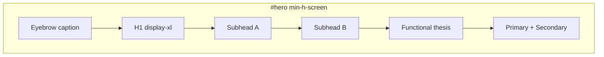

# P1-T03: Hero Section Copy Deck

**Task ID:** P1-T03  
**Status:** done  
**Type:** Strategy and documentation (no code; Phase 2 is first implementation)  
**Completed:** 2026-07-03  
**Parent:** [phase-1-tasks.md](../phase-1-tasks.md) | [phase-1-foundation.md](../phase-1-foundation.md)  
**Depends on:** [P1-T01-narrative.md](./P1-T01-narrative.md), [P1-T02-section-map.md](./P1-T02-section-map.md) (both done)  
**Blocks:** Phase 2 `HeroSection.tsx`, P1-T04 (problem copy must not duplicate hero)

---

## Quick reference (copy-paste for Phase 2)

**Primary variant (launch):**

```
[Cognitive orchestration layer]                    ← eyebrow

The Cognitive Layer for modern work              ← H1

Purpose-built for the modern professional.         ← subhead A
Designed for the AI era.                         ← subhead B

MindMesh connects your apps, finds the one thing that matters most right now, and gets it done for you.

[Join the waitlist]  [See how it works]
```

---

## Section context

| Field | Value |
|-------|-------|
| **Anchor** | `id="hero"` |
| **Heading id** | `hero-heading` |
| **Component** | `components/marketing/sections/HeroSection.tsx` |
| **Scroll height** | `min-h-screen` (100vh) |
| **Lazy load** | No (LCP-critical) |
| **Pillar** | Connect + Conversion (all three via thesis) |

Spec source: [P1-T02-section-map.md § Section 1](./P1-T02-section-map.md#section-1-hero)

---

## Copy hierarchy (final approved text)

| Order | Element | HTML role | Approved copy | Words |
|-------|---------|-----------|---------------|-------|
| 1 | Eyebrow | `<p class="hero-eyebrow">` | Cognitive orchestration layer | 3 |
| 2 | Headline | `<h1 id="hero-heading">` | The Cognitive Layer for modern work | 7 |
| 3 | Subhead A | `<p class="hero-subhead">` | Purpose-built for the modern professional. | 6 |
| 4 | Subhead B | `<p class="hero-subhead">` | Designed for the AI era. | 5 |
| 5 | Body / thesis | `<p class="hero-body">` | MindMesh connects your apps, finds the one thing that matters most right now, and gets it done for you. | 18 |

**Primary variant (launch):** Elements 1-5 above. **Wedge line omitted** to keep above-the-fold clean; audience wedge moves to Problem section (P1-T04).

### Alternate variant (A/B, not launch default)

Insert between Subhead B and Body:

| Element | Copy |
|---------|------|
| Wedge line (muted) | Built for the teams who ship first: PMs, engineers, and product builders. |

Use only if user testing shows the wide H1 needs an audience anchor. Hide on mobile (`hidden sm:block`) if enabled.

---

## CTA specification

| Button | Label | Action | Visual | `aria-label` |
|--------|-------|--------|--------|--------------|
| Primary | Join the waitlist | Smooth scroll to `#cta`; fallback: open [`WaitlistModal.tsx`](../../../components/WaitlistModal.tsx) | Solid, `--mm-accent-strong` background | Join the MindMesh waitlist |
| Secondary | See how it works | Smooth scroll to `#connect` | Ghost / outline, `--mm-border` | See how MindMesh works |

**Rules:**

- No tertiary CTA (no "Try dashboard", no feature deep links)
- Primary on the left (desktop) or top (mobile)
- Both buttons use `<a href="#...">` or button + scroll handler for accessible keyboard nav

---

## Typography mapping

Manrope for display (H1), Inter for body and UI. Tokens from [phase-1-foundation.md §3.3](../phase-1-foundation.md#33-typography).

| Element | Font | Token | Desktop | Mobile | Color token |
|---------|------|-------|---------|--------|-------------|
| Eyebrow | Inter | caption | 14px / 500 | 13px | `--mm-text-muted` |
| H1 | Manrope | display-xl | 72px / tight tracking | 40px | `--mm-text` |
| Subheads A + B | Inter | body-lg | 20px / 400 | 18px | `--mm-text-muted` |
| Body thesis | Inter | body-lg | 20px / 400 | 18px | `--mm-text` |
| Wedge (alt only) | Inter | body | 16px | 16px | `--mm-text-muted` |
| Primary CTA | Inter | button | 16px / 600 | 16px / full width | on-accent |
| Secondary CTA | Inter | button | 16px / 500 | 16px / full width | `--mm-text` |

---

## Layout and spacing



| Rule | Value |
|------|-------|
| Text block max-width | ~720px |
| Alignment | Left-aligned (Linear pattern); center on mobile optional if design prefers |
| Gap H1 → subheads | `gap-6` (24px) |
| Gap subheads → body | `gap-4` (16px) |
| Gap body → CTAs | `gap-8` (32px) |
| CTA gap (horizontal) | `gap-4` |
| Background | `--mm-bg` (#060e20); optional static subtle gradient, no animation |
| Product frame | **None** in hero |
| Motion | None above fold (LCP budget) |

---

## Mobile rules

| Element | Rule |
|---------|------|
| H1 | 40px min; allow 2-line wrap |
| Subheads A + B | Keep as two separate lines; do not merge |
| Body thesis | Full text visible; no truncation |
| CTAs | Stack vertically; primary on top; `w-full` below `sm` breakpoint |
| Eyebrow | Visible on mobile |
| Wedge (alt variant) | `hidden sm:block` if used |
| Horizontal padding | `px-6` minimum |

---

## Copy constraints

### Do

- Land category + era + mechanism in under 3 seconds scan time
- Reinforce Connect pillar (apps) and Conversion (waitlist)
- Match [P1-T01-narrative.md](./P1-T01-narrative.md) messaging stack exactly

### Do not

- Feature lists ("inbox, calendar, Slack, Jira...")
- "AI-powered productivity assistant"
- Mascot or sensor bar mention
- Fake social proof ("Join 10,000+ users")
- "Automate meeting notes" as lead line
- Problem-state language (save for P1-T04 `#problem`)

---

## Metadata (Phase 6 implementation)

Update [`app/page.tsx`](../../../app/page.tsx) and JSON-LD when homepage ships:

| Field | Value |
|-------|-------|
| `<title>` | MindMesh - The Cognitive Layer for modern work |
| `meta description` | Purpose-built for the modern professional. Connect your apps, find what matters most right now, get it done. |
| `openGraph.title` | MindMesh - The Cognitive Layer for modern work |
| `openGraph.description` | Same as meta description |
| JSON-LD `SoftwareApplication.description` | Replace "AI-powered productivity assistant" with: A cognitive orchestration layer that connects your apps, finds what matters most right now, and gets it done. |

---

## Phase 2 implementation snippet

Reference copy for `HeroSection.tsx` (structure only):

```tsx
<section id="hero" aria-labelledby="hero-heading" className="min-h-screen ...">
  <p className="hero-eyebrow">Cognitive orchestration layer</p>
  <h1 id="hero-heading">The Cognitive Layer for modern work</h1>
  <p className="hero-subhead">Purpose-built for the modern professional.</p>
  <p className="hero-subhead">Designed for the AI era.</p>
  <p className="hero-body">
    MindMesh connects your apps, finds the one thing that matters most right now,
    and gets it done for you.
  </p>
  <div className="hero-ctas">
    <a href="#cta" aria-label="Join the MindMesh waitlist">Join the waitlist</a>
    <a href="#connect" aria-label="See how MindMesh works">See how it works</a>
  </div>
</section>
```

---

## Acceptance criteria checklist

- [x] H1 is 7 words (≤ 8)
- [x] Subheads + body readable in under 3 seconds at desktop size
- [x] No feature-list language
- [x] CTA labels and targets match P1-T02 (`#cta`, `#connect`)
- [x] Primary variant chosen: eyebrow + H1 + 2 subheads + thesis, **no wedge line**
- [x] Alternate variant documented for future A/B
- [x] Typography, mobile, and metadata documented

---

## Stakeholder sign-off

| Role | Name | Decision | Date |
|------|------|----------|------|
| Product / founder | Rohit | Approved primary hero variant (no wedge in hero) | 2026-07-03 |

**P1-T03 status:** Done. Proceed to [P1-T04](../phase-1-tasks.md#p1-t04--write-problem-section-copy-deck) or Phase 2 `HeroSection.tsx`.

---

## Downstream handoff

| Consumer | Uses from this doc |
|----------|-------------------|
| Phase 2 `HeroSection.tsx` | Full copy hierarchy, CTAs, typography, spacing |
| P1-T04 Problem copy | Must not repeat hero subheads or thesis wording |
| Phase 6 SEO | Metadata table above |
| `WaitlistModal` | Primary CTA scroll/modal behavior |
