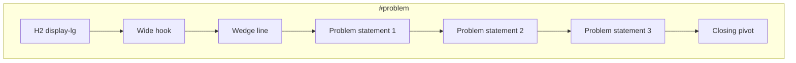

# P1-T04: Problem Section Copy Deck

**Task ID:** P1-T04  
**Status:** done  
**Type:** Strategy and documentation (no code; Phase 2 is first implementation)  
**Completed:** 2026-07-03  
**Parent:** [phase-1-tasks.md](../phase-1-tasks.md) | [phase-1-foundation.md](../phase-1-foundation.md)  
**Depends on:** [P1-T01-narrative.md](./P1-T01-narrative.md), [P1-T03-hero-copy.md](./P1-T03-hero-copy.md) (both done)  
**Blocks:** Phase 2 `ProblemSection.tsx`, P1-T05 (how-it-works must follow without repeating problem lines)

---

## Quick reference (copy-paste for Phase 2)

```
Information everywhere. Focus nowhere.              ← H2

If your work lives across apps, you already know the feeling: too much coming in, no clear answer to "what now?"

Built for the teams who ship first: PMs, engineers, and product builders.

• Slack, Jira, and email rarely agree on what matters most.
• Hours disappear switching tabs instead of doing the work.
• Another AI chatbot is not another way to focus.

MindMesh sits above your stack and answers one question: what should I do right now?
```

---

## Section context

| Field | Value |
|-------|-------|
| **Anchor** | `id="problem"` |
| **Heading id** | `problem-heading` |
| **Component** | `components/marketing/sections/ProblemSection.tsx` |
| **Scroll height** | ~80-100vh (content-driven) |
| **Lazy load** | No |
| **Pillar** | Prioritize (setup) |
| **CTAs** | None |

Spec source: [P1-T02-section-map.md § Section 2](./P1-T02-section-map.md#section-2-problem)

---

## Copy hierarchy (final approved text)

| Order | Element | HTML role | Approved copy | Words |
|-------|---------|-----------|---------------|-------|
| 1 | Section headline | `<h2 id="problem-heading">` | Information everywhere. Focus nowhere. | 5 |
| 2 | Wide hook | `<p class="problem-lede">` | If your work lives across apps, you already know the feeling: too much coming in, no clear answer to "what now?" | 22 |
| 3 | Wedge line | `<p class="problem-wedge">` | Built for the teams who ship first: PMs, engineers, and product builders. | 12 |
| 4 | Problem 1 | `<li>` or `<p>` | Slack, Jira, and email rarely agree on what matters most. | 11 |
| 5 | Problem 2 | `<li>` or `<p>` | Hours disappear switching tabs instead of doing the work. | 9 |
| 6 | Problem 3 | `<li>` or `<p>` | Another AI chatbot is not another way to focus. | 9 |
| 7 | Closing line | `<p class="problem-close">` | MindMesh sits above your stack and answers one question: what should I do right now? | 15 |

**Structure:** Headline → wide hook → wedge line → 3 punchy statements → closing pivot to solution (no product feature names yet).

---

## Hero deduplication check

Must **not** repeat language from [P1-T03-hero-copy.md](./P1-T03-hero-copy.md):

| Hero copy | Used in Problem? |
|-----------|------------------|
| The Cognitive Layer for modern work | No |
| Purpose-built for the modern professional | No |
| Designed for the AI era | No |
| MindMesh connects your apps, finds the one thing... | No (closing uses different framing) |
| Cognitive orchestration layer | No |

Wedge line **intentionally placed here** (omitted from hero per P1-T03).

---

## Typography mapping

| Element | Font | Token | Desktop | Mobile | Color |
|---------|------|-------|---------|--------|-------|
| Section headline | Manrope | display-lg | 48px / tight | 32px | `--mm-text` |
| Wide hook | Inter | body-lg | 20px | 18px | `--mm-text-muted` |
| Wedge line | Inter | body | 16px | 16px | `--mm-text-muted` |
| Problem lines 1-3 | Inter | body-lg | 20px / 500 | 18px | `--mm-text` |
| Closing line | Inter | body-lg | 20px | 18px | `--mm-accent` or `--mm-text` |

Problem lines can use a simple bullet list, numbered list, or three stacked `<p>` tags with a leading em dash (Linear-style). No icons required.

---

## Layout and spacing



| Rule | Value |
|------|-------|
| Text block max-width | ~640px (narrower than hero for readability) |
| Alignment | Left-aligned, same column as hero |
| Gap headline → lede | `gap-6` |
| Gap lede → wedge | `gap-4` |
| Gap wedge → problem list | `gap-8` |
| Gap between problem lines | `gap-4` |
| Gap list → closing | `gap-8` |
| Background | Same as page (`--mm-bg`); optional subtle section divider (1px `--mm-border`) at top |
| Motion | Optional fade-in on scroll (`whileInView`); no scroll-linked animation |

---

## Mobile rules

| Element | Rule |
|---------|------|
| Headline | 32px; allow 2-line wrap |
| Wide hook | Full text; no truncation |
| Wedge line | Visible on mobile (unlike hero alt variant) |
| Problem lines | Stack vertically; full width |
| Closing line | Full text visible |
| Padding | `px-6`, `py-24` section padding |

---

## Copy constraints

### Do

- Open wide (anyone who lives in apps), prove narrow (Slack/Jira/email wedge)
- Set up Prioritize pillar: the pain is no single "what now"
- Lead into P1-T05 How it works without naming MindMesh features (inbox, narrative, etc.)
- Use short punchy lines; no paragraphs beyond the wide hook

### Do not

- Repeat hero subheads or functional thesis verbatim
- Say "PMs only" or "for product managers only"
- List product features (Attention Engine, inbox, dashboard)
- Name competitors
- Use fake stats ("lose 2+ hours daily" unless sourced later)

---

## Relationship to adjacent sections

| Section | Handoff |
|---------|---------|
| **Hero (#hero)** | Problem deepens the "why" after hero states category + mechanism |
| **How it works (#how-it-works)** | Closing line teases "one question"; next section answers with Connect / Prioritize / Execute steps |
| **Connect theater (#connect)** | Problem line 1 (Slack, Jira, email) is visually proven in theater |

---

## Phase 2 implementation snippet

```tsx
<section id="problem" aria-labelledby="problem-heading" className="...">
  <h2 id="problem-heading">Information everywhere. Focus nowhere.</h2>
  <p className="problem-lede">
    If your work lives across apps, you already know the feeling: too much coming in,
    no clear answer to &quot;what now?&quot;
  </p>
  <p className="problem-wedge">
    Built for the teams who ship first: PMs, engineers, and product builders.
  </p>
  <ul className="problem-list">
    <li>Slack, Jira, and email rarely agree on what matters most.</li>
    <li>Hours disappear switching tabs instead of doing the work.</li>
    <li>Another AI chatbot is not another way to focus.</li>
  </ul>
  <p className="problem-close">
    MindMesh sits above your stack and answers one question: what should I do right now?
  </p>
</section>
```

---

## Acceptance criteria checklist

- [x] Section headline finalized (5 words)
- [x] 3 problem statements each ≤ 12 words (11, 9, 9)
- [x] Wide hook + closing line included
- [x] Wedge line placed here (not in hero)
- [x] No duplicate of hero subheads or thesis
- [x] Sets up How it works without naming product features
- [x] Typography and mobile rules documented

---

## Stakeholder sign-off

| Role | Name | Decision | Date |
|------|------|----------|------|
| Product / founder | Rohit | Approved problem copy deck | 2026-07-03 |

**P1-T04 status:** Done. Proceed to [P1-T05](../phase-1-tasks.md#p1-t05--write-how-it-works-section-copy-deck) or Phase 2 `ProblemSection.tsx`.

---

## Downstream handoff

| Consumer | Uses from this doc |
|----------|-------------------|
| Phase 2 `ProblemSection.tsx` | Full copy hierarchy and layout |
| P1-T05 How it works | Must follow problem → solution arc; no repeated problem lines |
| Product theaters 4-6 | Problem line 1 foreshadows Connect/Focus demos |
