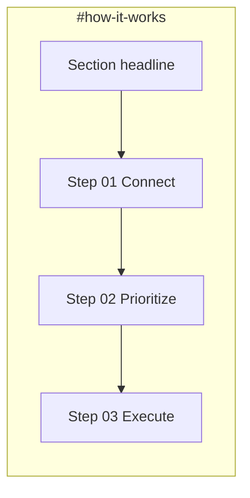

# P1-T05: How It Works Section Copy Deck

**Task ID:** P1-T05  
**Status:** done  
**Type:** Strategy and documentation (no code; Phase 2 is first implementation)  
**Completed:** 2026-07-03  
**Parent:** [phase-1-tasks.md](../phase-1-tasks.md) | [phase-1-foundation.md](../phase-1-foundation.md)  
**Depends on:** [P1-T01-narrative.md](./P1-T01-narrative.md), [P1-T04-problem-copy.md](./P1-T04-problem-copy.md) (both done)  
**Blocks:** Phase 2 `HowItWorksSection.tsx`, P1-T06-T08 (theater briefs map 1:1 to these steps)

---

## Quick reference (copy-paste for Phase 2)

```
Three steps to one clear focus.                     ← H2

01  Connect your apps
    Plug in Gmail, Slack, Jira, calendars, and more. MindMesh reads your sources without replacing them.

02  Find your one priority
    MindMesh cuts through the noise and surfaces the single most important thing right now, with a plain-English reason why.

03  MindMesh gets it done
    Draft the reply, block the time, check the task off. MindMesh acts in context instead of handing you another list.
```

---

## Section context

| Field | Value |
|-------|-------|
| **Anchor** | `id="how-it-works"` |
| **Heading id** | `how-it-works-heading` |
| **Component** | `components/marketing/sections/HowItWorksSection.tsx` |
| **Scroll height** | ~80-120vh |
| **Lazy load** | No |
| **Pillar** | Connect, Prioritize, Execute (all three) |
| **CTAs** | None |
| **Nav link** | Not in sticky nav (users scroll naturally from Problem) |

Spec source: [P1-T02-section-map.md § Section 3](./P1-T02-section-map.md#section-3-how-it-works)

---

## Copy hierarchy (final approved text)

| Order | Element | HTML role | Approved copy |
|-------|---------|-----------|---------------|
| 1 | Section headline | `<h2 id="how-it-works-heading">` | Three steps to one clear focus. |
| 2 | Step 1 number | `<span class="step-num">` | 01 |
| 2a | Step 1 title | `<h3>` | Connect your apps |
| 2b | Step 1 description | `<p>` | Plug in Gmail, Slack, Jira, calendars, and more. MindMesh reads your sources without replacing them. |
| 3 | Step 2 number | `<span class="step-num">` | 02 |
| 3a | Step 2 title | `<h3>` | Find your one priority |
| 3b | Step 2 description | `<p>` | MindMesh cuts through the noise and surfaces the single most important thing right now, with a plain-English reason why. |
| 4 | Step 3 number | `<span class="step-num">` | 03 |
| 4a | Step 3 title | `<h3>` | MindMesh gets it done |
| 4b | Step 3 description | `<p>` | Draft the reply, block the time, check the task off. MindMesh acts in context instead of handing you another list. |

**Text-only section:** No product screenshots, no scroll animation, no demo embed. Product theaters in sections 4-6 prove each step visually.

---

## Step → pillar → theater mapping

| Step | Pillar | Theater section | Anchor | P1-T brief |
|------|--------|-----------------|--------|------------|
| 01 Connect your apps | Connect | Product theater: Connect | `#connect` | P1-T06 |
| 02 Find your one priority | Prioritize | Product theater: Focus | `#focus` | P1-T07 |
| 03 MindMesh gets it done | Execute | Product theater: Execute | `#execute` | P1-T08 |

Step 2 copy explicitly uses **"single most important thing right now"** per acceptance criteria.

---

## Visual treatment (icons / numbers)

**Primary (launch):** Minimal numbered labels `01`, `02`, `03` in `--mm-text-muted`, Manrope or Inter tabular nums. No illustration pack required for Phase 2.

**Optional upgrade (Phase 5+):** Lucide icons per step:

| Step | Icon | Rationale |
|------|------|-----------|
| 01 | `Link2` or `Plug` | Connect sources |
| 02 | `Crosshair` or `Focus` | One priority |
| 03 | `CheckCircle2` or `Zap` | Action complete |

**Layout pattern:** Horizontal row on desktop (3 columns), vertical stack on mobile. Each cell: number → title → description.

---

## Typography mapping

| Element | Font | Token | Desktop | Mobile | Color |
|---------|------|-------|---------|--------|-------|
| Section headline | Manrope | display-lg | 48px | 32px | `--mm-text` |
| Step number | Manrope | caption | 14px / 600 | 13px | `--mm-text-muted` |
| Step title | Manrope | heading | 24px | 20px | `--mm-text` |
| Step description | Inter | body | 16px | 16px | `--mm-text-muted` |

---

## Layout and spacing



| Rule | Value |
|------|-------|
| Section padding | `py-24` mobile, `py-32` desktop |
| Grid | 3 columns desktop (`grid-cols-3`), 1 column mobile |
| Gap between steps | `gap-8` desktop, `gap-12` mobile stack |
| Gap within step | number → title `gap-2`, title → description `gap-3` |
| Max width | Marketing grid ~1120px |
| Background | `--mm-bg`; optional top border `--mm-border` |
| Motion | Optional staggered fade-in on scroll; no sticky scroll |

---

## Mobile rules

| Element | Rule |
|---------|------|
| Headline | 32px; single or two-line wrap |
| Steps | Stack vertically in order 01 → 02 → 03 |
| Step descriptions | Full text; no truncation |
| Numbers | Stay visible above each step title |

---

## Dedup checks (hero + problem)

Must **not** repeat verbatim from prior sections:

| Prior copy | Repeated here? |
|------------|----------------|
| Hero functional thesis ("connects your apps, finds the one thing...") | No (rephrased across 3 steps) |
| Problem headline ("Information everywhere...") | No |
| Problem closing ("what should I do right now?") | No |
| Problem bullet lines (Slack/Jira/chatbot) | No |

**Handoff from Problem:** Problem ends with "one question: what should I do right now?" How it works answers with the three-step framework (Connect → Prioritize → Execute).

---

## Copy constraints

### Do

- Map steps 1:1 to theaters 4-6
- Emphasize "one priority right now" in step 2
- Name app categories lightly in step 1 (Gmail, Slack, Jira) without a full feature list
- Keep descriptions to one sentence each

### Do not

- Embed product UI or Lottie
- Mention Attention Engine, Attention Board, or internal product names
- Add CTAs (waitlist stays in hero and final CTA)
- Use "AI-powered assistant" framing

---

## Phase 2 implementation snippet

```tsx
<section id="how-it-works" aria-labelledby="how-it-works-heading" className="...">
  <h2 id="how-it-works-heading">Three steps to one clear focus.</h2>
  <div className="steps-grid">
    <article>
      <span className="step-num">01</span>
      <h3>Connect your apps</h3>
      <p>
        Plug in Gmail, Slack, Jira, calendars, and more. MindMesh reads your sources
        without replacing them.
      </p>
    </article>
    <article>
      <span className="step-num">02</span>
      <h3>Find your one priority</h3>
      <p>
        MindMesh cuts through the noise and surfaces the single most important thing
        right now, with a plain-English reason why.
      </p>
    </article>
    <article>
      <span className="step-num">03</span>
      <h3>MindMesh gets it done</h3>
      <p>
        Draft the reply, block the time, check the task off. MindMesh acts in context
        instead of handing you another list.
      </p>
    </article>
  </div>
</section>
```

---

## Acceptance criteria checklist

- [x] Section headline finalized
- [x] 3 step titles + 1-line descriptions each
- [x] Steps map 1:1 to product theater sections 4-6
- [x] Step 2 emphasizes "one thing right now"
- [x] Text-only; no demo in section
- [x] No duplicate of hero or problem copy
- [x] Icon/number treatment documented
- [x] Typography and mobile rules documented

---

## Stakeholder sign-off

| Role | Name | Decision | Date |
|------|------|----------|------|
| Product / founder | Rohit | Approved how-it-works copy deck | 2026-07-03 |

**P1-T05 status:** Done. Proceed to [P1-T06](../phase-1-tasks.md#p1-t06--write-product-theater-connect-brief) or Phase 2 `HowItWorksSection.tsx`.

---

## Downstream handoff

| Consumer | Uses from this doc |
|----------|-------------------|
| Phase 2 `HowItWorksSection.tsx` | Full copy + 3-column layout |
| P1-T06 Connect theater | Step 01 title/description as section intro reference |
| P1-T07 Focus theater | Step 02 "one priority right now" language |
| P1-T08 Execute theater | Step 03 action verbs (draft, block, check off) |
