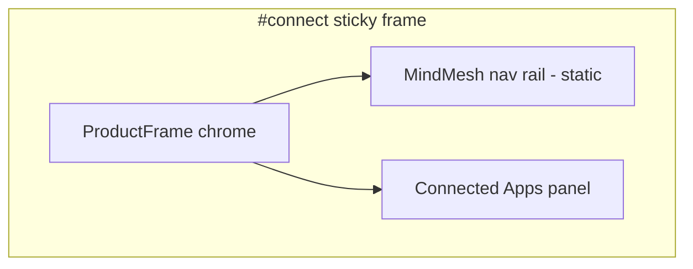

# P1-T06: Product Theater — Connect Brief

**Task ID:** P1-T06  
**Status:** done  
**Type:** Strategy and documentation (no code; Phase 3-4 is implementation)  
**Completed:** 2026-07-03  
**Parent:** [phase-1-tasks.md](../phase-1-tasks.md) | [phase-1-foundation.md](../phase-1-foundation.md)  
**Depends on:** [P1-T05-how-it-works-copy.md](./P1-T05-how-it-works-copy.md) (step 01)  
**Blocks:** Phase 4 `ProductTheaterConnect.tsx`, P1-T23 (theater reuse map)

---

## Quick reference

| Field | Value |
|-------|-------|
| **Anchor** | `#connect` |
| **Headline** | Bring every app into one place. |
| **Subhead** | Connect the tools you already use. MindMesh reads them as sources without replacing them. |
| **Pillar** | Connect |
| **Maps to** | How it works step 01 |
| **Depth link** | `/connected-apps` |
| **Reuse target** | [`StaticConnectedApps.tsx`](../../../components/dashboard/StaticConnectedApps.tsx) |

---

## Section copy (outside sticky frame)

| Element | Approved copy |
|---------|---------------|
| **Headline** | Bring every app into one place. |
| **Subhead** | Connect the tools you already use. MindMesh reads them as sources without replacing them. |
| **Depth link label** | Explore connected apps → |
| **Reduced-motion caption** | All seven sources connected and syncing in MindMesh. |

Aligns with [P1-T05](./P1-T05-how-it-works-copy.md) step 01 title ("Connect your apps") without repeating the step description verbatim.

---

## Apps in animation order (7 total)

**Product readiness:** All 7 apps are **production-ready** in the desktop app today (`mindmesh_app` connectors + OAuth flows for Slack and Jira). The gap is **marketing UI only**: [`StaticConnectedApps.tsx`](../../../components/dashboard/StaticConnectedApps.tsx) and the website `/connected-apps` page still show fewer apps.

| Order | App | Type | Production ready | In `StaticConnectedApps` | Marketing icon |
|-------|-----|------|------------------|--------------------------|----------------|
| 1 | Gmail | Email | Yes | Yes | `public/images/icons/gmail.png` |
| 2 | Google Calendar | Calendar | Yes | Yes | `public/images/icons/google-calendar.png` |
| 3 | Outlook Email | Email | Yes | Yes (as "Outlook") | `public/images/icons/outlook.png` |
| 4 | Outlook Calendar | Calendar | Yes | No | `public/images/icons/outlook-calendar.png` |
| 5 | SMTP Mailbox | Email | Yes | Yes | `public/images/icons/smtp.png` |
| 6 | Slack | Messaging | **Yes** | No | Add to website ([P1-T21](../phase-1-tasks.md#p1-t21--source-slack-and-jira-brand-assets-for-marketing)); product uses `/img/apps/` in desktop app |
| 7 | Jira | Tasks | **Yes** | No | Same as Slack; Jira OAuth + sync live in production |

**Fixture account labels (marketing demo):**

| App | Display label |
|-----|---------------|
| Gmail | alex@acme.co |
| Google Calendar | alex@acme.co |
| Outlook Email | alex@outlook.com |
| Outlook Calendar | alex@outlook.com |
| SMTP Mailbox | mail@acme.co |
| Slack | Acme Workspace |
| Jira | acme.atlassian.net |

Use fictional Acme Co. persona consistently across all theater sequences (Focus, Execute).

---

## Scroll sequence beat sheet

**Wrapper:** `min-h-[220vh]` desktop, `min-h-[120vh]` mobile  
**Sticky frame:** `position: sticky; top: 80px; height: ~70vh`  
**Driver:** Framer Motion `useScroll` → `scrollYProgress` 0→1

| Progress | UI state | Motion |
|----------|----------|--------|
| **0.00 – 0.15** | Empty connected-apps panel. Header "Connected Apps" visible. "Add App" button highlighted subtly. Copy: "No sources yet." | Panel at rest |
| **0.15 – 0.55** | Apps appear one by one in grid order (1→7). Each card: `translateY(12px)` + `opacity 0→1`, ~120ms stagger. | Sequential fly-in |
| **0.55 – 0.75** | All 7 visible. Each card shows green "connected" badge animating in. | Badge pulse once |
| **0.75 – 0.90** | Top banner: "7 sources syncing" with subtle sync icon. Refresh button gets one highlight pulse. | Status line fade-in |
| **0.90 – 1.00** | Hold final state. All cards connected. | Static hold |

**Animation rules:**

- `transform` and `opacity` only
- Pause sequence when section off-screen (`IntersectionObserver`)
- Respect `prefers-reduced-motion`: jump to **0.90** state immediately

---

## Reduced-motion static frame

When `prefers-reduced-motion: reduce`, render final frame only:

- All 7 app cards visible in connected state
- Banner: "7 sources syncing"
- Caption below frame: "All seven sources connected and syncing in MindMesh."

No scroll-linked animation.

---

## ProductFrame layout

| Layer | Content |
|-------|---------|
| **ProductFrame** | Rounded window, subtle shadow, `--mm-surface-raised` chrome |
| **Left rail** | Minimal MindMesh nav icons (static, non-interactive) |
| **Main panel** | Connected Apps grid (animated content) |
| **No** | Mascot, sensor bar, live data, real OAuth flows |

Headline + subhead sit **above** the sticky wrapper, not inside the frame.

---

## Reuse and refactor notes (`StaticConnectedApps.tsx`)

**Current state:** Component hardcodes 4 apps (Gmail, Google Calendar, Outlook, SMTP). Uses light theme (`bg-white`), dashboard-specific hover tooltips. **Does not yet render Slack or Jira**, even though both are production-ready in the product app (`appsStore.ts`, `AppBrandIcon.tsx`, `@mindmesh/connector-slack`, `@mindmesh/connector-jira`).

**Phase 4 refactor (minimal):**

1. Extract fixture data to `lib/marketing-demo-data.ts` (shared with Focus/Execute theaters)
2. Add props: `step?: number` (0-4 maps to beat sheet), `variant?: 'dashboard' | 'marketing'`, `apps?: ConnectedAppFixture[]`
3. Marketing variant: dark theme tokens (`--mm-surface`), no `HoverTypingTooltip`, no `SectionHoverContext`
4. Extend fixture list to all 7 production apps (add Outlook Calendar, **Slack**, **Jira**)
5. Grid: `grid-cols-2` in frame (4 rows for 7 apps, last row single or 2+1 layout)

**Do not** break existing dashboard usage; default props preserve current behavior. Longer term, dashboard `StaticConnectedApps` should also show Slack + Jira to match production.

---

## Typography (section header, outside frame)

| Element | Token | Size |
|---------|-------|------|
| Headline | display-lg | 48px / 32px mobile |
| Subhead | body-lg | 20px / 18px mobile |
| Depth link | body | 16px, `--mm-accent` |

---

## Mobile simplification

| Rule | Value |
|------|------|
| Scroll wrapper | `min-h-[120vh]` (shorter than desktop) |
| App fly-in | Show 4 apps max in animation, or skip to final 7-card frame |
| Sticky frame | Full width, reduced padding |
| Fallback | Static final frame on narrow viewports if scroll jank detected |

---

## Copy constraints

### Do

- Show all 7 integrations
- Emphasize "sources" and "without replacing them"
- Link to `/connected-apps` for depth

### Do not

- Show OAuth modals or real credentials
- Imply integrations beyond the 7-app list
- Duplicate How it works step 01 description word-for-word

---

## Phase 4 implementation checklist

- [ ] `ProductTheaterConnect.tsx` with scroll wrapper + sticky frame
- [ ] `ProductFrame.tsx` shared chrome
- [ ] `useScrollSection` hook (Phase 3)
- [ ] Marketing variant of connected apps panel
- [ ] `lib/marketing-demo-data.ts` fixtures
- [ ] Copy Slack + Jira icons into `public/images/icons/` for website ([P1-T21](../phase-1-tasks.md#p1-t21--source-slack-and-jira-brand-assets-for-marketing); product assets exist in desktop app)
- [ ] `next/dynamic` import, `ssr: false`
- [ ] Reduced-motion branch
- [ ] Depth link to `/connected-apps`

---

## Acceptance criteria checklist

- [x] Section headline + subhead finalized
- [x] Scroll beat sheet 0.0–1.0 documented
- [x] All 7 apps in animation order listed
- [x] Reduced-motion static frame + caption defined
- [x] Reuse target: `StaticConnectedApps.tsx` with refactor notes
- [x] Gap documented: website/marketing UI lags product (3 apps missing from `StaticConnectedApps`; Slack/Jira are production-ready, not roadmap)

---

## Stakeholder sign-off

| Role | Name | Decision | Date |
|------|------|----------|------|
| Product / founder | Rohit | Approved Connect theater brief | 2026-07-03 |

**P1-T06 status:** Done. Proceed to [P1-T07](./P1-T07-theater-focus.md) or Phase 3 scroll kit.

---

## Downstream handoff

| Consumer | Uses from this doc |
|----------|-------------------|
| Phase 3 `ProductFrame`, `useScrollSection` | Layout + scroll math |
| Phase 4 `ProductTheaterConnect.tsx` | Beat sheet + fixtures |
| P1-T21 | Copy Slack + Jira brand icons from product app into website `public/images/icons/` |
| P1-T23 | Reuse map + refactor scope |
| P1-T10 | Same 7-app list for integrations section |
