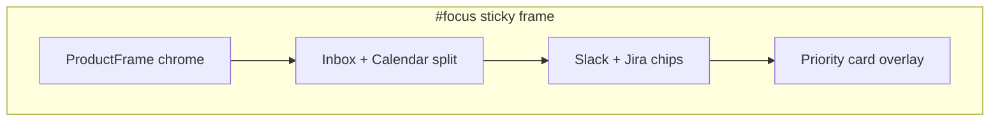

# P1-T07: Product Theater — Focus Brief

**Task ID:** P1-T07  
**Status:** done  
**Type:** Strategy and documentation (no code; Phase 3-4 is implementation)  
**Completed:** 2026-07-03  
**Parent:** [phase-1-tasks.md](../phase-1-tasks.md) | [phase-1-foundation.md](../phase-1-foundation.md)  
**Depends on:** [P1-T05-how-it-works-copy.md](./P1-T05-how-it-works-copy.md) (step 02), [P1-T06-theater-connect.md](./P1-T06-theater-connect.md) (Acme Co. persona)  
**Blocks:** Phase 4 `ProductTheaterFocus.tsx`, [P1-T08-theater-execute.md](./P1-T08-theater-execute.md) (priority fixture source of truth)

---

## Quick reference

| Field | Value |
|-------|-------|
| **Anchor** | `#focus` |
| **Headline** | One thing. Right now. |
| **Subhead** | MindMesh reads every signal across your apps and surfaces the single priority that matters most, with a reason you can trust. |
| **Pillar** | Prioritize |
| **Maps to** | How it works step 02 |
| **Depth link** | `/yesterdays-narrative` |
| **Reuse targets** | `StaticInboxList`, `StaticCalendarEvents`, `StaticDailySummaryPanel` (adapted) |

---

## Section copy (outside sticky frame)

| Element | Approved copy |
|---------|---------------|
| **Headline** | One thing. Right now. |
| **Subhead** | MindMesh reads every signal across your apps and surfaces the single priority that matters most, with a reason you can trust. |
| **Depth link label** | See daily narrative → |
| **Reduced-motion caption** | One priority: Prepare for the 2pm client call, backed by email, calendar, and Jira context. |

Aligns with [P1-T05](./P1-T05-how-it-works-copy.md) step 02 ("Find your one priority") and core differentiator language: **single most important thing right now**.

---

## Canonical priority fixture (source of truth)

This fixture is **shared with Execute** ([P1-T08](./P1-T08-theater-execute.md)). Do not change without updating both briefs.

| Field | Fixture copy |
|-------|--------------|
| **Priority title** | Prepare for 2pm client call |
| **Plain-English reason** | Dana's unread thread needs a reply before your call, and PROD-142 is still open in Jira. |
| **Source chips** | Gmail · Google Calendar · Jira |
| **Linked signals** | Email thread from Dana; Client call at 2:00 PM; Jira PROD-142 In Progress |

**Persona:** Alex @ Acme Co. (`alex@acme.co`), same as Connect theater.

---

## Noisy input fixtures (pre-priority state)

Marketing-specific fixtures for the "chaos" phase. Replace generic dashboard copy when `variant="marketing"`.

### Inbox (3 visible rows, crowded)

| From | Subject | Preview | Account |
|------|---------|---------|---------|
| Dana Reyes | Re: Q2 rollout timeline | Can we confirm scope before today's call? | alex@acme.co |
| #product-updates (Slack) | 12 new messages | Sprint retro notes posted | Acme Workspace |
| Jira | PROD-142 updated | Status changed to In Progress | acme.atlassian.net |

### Calendar (2 events, same afternoon)

| Event | Time | Calendar |
|-------|------|----------|
| Team standup | 11:00 AM | Google Calendar |
| Client call — Acme x ClientCo | 2:00 PM | Google Calendar |

### Slack snippet (optional side panel)

| Channel | Message |
|---------|---------|
| #launch | @alex Can you confirm rollout scope before the client call? |

---

## Scroll sequence beat sheet

**Wrapper:** `min-h-[240vh]` desktop (slightly longer than Connect; more beats), `min-h-[120vh]` mobile  
**Sticky frame:** `position: sticky; top: 80px; height: ~70vh`  
**Driver:** Framer Motion `useScroll` → `scrollYProgress` 0→1

| Progress | UI state | Panels visible | Motion |
|----------|----------|----------------|--------|
| **0.00 – 0.18** | Split view: noisy inbox (left) + calendar (right). Many unread badges, no priority yet. | `StaticInboxList`, `StaticCalendarEvents` | Panels at full opacity |
| **0.18 – 0.35** | Slack/Jira signals fade in as small toast-style chips overlapping inbox ("12 Slack msgs", "PROD-142 updated"). | Inbox + calendar + chips | Chips `translateY` in |
| **0.35 – 0.50** | Cross-highlight: subtle lines or glow connect Dana email + 2pm event + PROD-142 chip (CSS only, no canvas). | Same panels | Connecting lines draw via `opacity` + `scaleX` |
| **0.50 – 0.65** | Non-priority content dims to `opacity: 0.35`. Priority card begins scale-in at center-bottom of frame. | Dimmed panels + priority card | Card `scale 0.92→1`, `opacity 0→1` |
| **0.65 – 0.85** | Priority card fully visible with title, reason, source chips. Noisy panels remain dimmed in background. | Priority card dominant | Hold + subtle emphasis pulse on card |
| **0.85 – 1.00** | Final state: one priority, everything else faded. Label: "Your one focus." | Priority card only (panels optional ghost) | Static hold |

**Animation rules:**

- `transform` and `opacity` only
- No Attention Engine naming in UI copy
- Pause off-screen; `prefers-reduced-motion` → jump to **0.85** state (priority card + caption)

---

## Priority card UI spec

| Element | Content |
|---------|---------|
| **Eyebrow** | Your priority |
| **Title** | Prepare for 2pm client call |
| **Body** | Dana's unread thread needs a reply before your call, and PROD-142 is still open in Jira. |
| **Source chips** | Gmail · Google Calendar · Jira |
| **Optional CTA (visual only)** | Review and act → (leads visually into Execute section on scroll, not a link) |

**Styling:** Marketing dark theme (`--mm-surface-raised`), accent border on left (`--mm-accent-strong`), larger type than background panels.

---

## Reduced-motion static frame

- Priority card fully visible with all fixture copy
- Optional ghost thumbnails of inbox/calendar dimmed behind
- Caption: "One priority: Prepare for the 2pm client call, backed by email, calendar, and Jira context."

---

## ProductFrame layout

| Beat | Layout |
|------|--------|
| 0.0–0.35 | 50/50 inbox + calendar |
| 0.35–0.50 | Same + connection highlights |
| 0.50–1.0 | Priority card overlays center; background dimmed |

---

## Static* panels at each beat

| Beat | StaticInboxList | StaticCalendarEvents | StaticDailySummaryPanel |
|------|-----------------|----------------------|-------------------------|
| 0.0–0.50 | Full, marketing fixtures | Full, 2 events | Hidden or minimal |
| 0.50–0.65 | Dimmed | Dimmed | Optional: show empty "Today's Overview" transitioning out |
| 0.65–1.0 | Hidden or ghost | Hidden or ghost | **Not used** for priority card (build dedicated `MarketingPriorityCard`) |

**Recommendation:** Do not reuse `StaticDailySummaryPanel` for the priority card. It is a multi-section dashboard widget (time clash, todos, events). Focus theater needs a **single priority card** component. Reuse **layout patterns** and **fixture data** only.

---

## Reuse and refactor notes

### `StaticInboxList.tsx`

- Rich fixture array already exists; add `variant="marketing"` + `messages={MARKETING_INBOX_FIXTURES}`
- Show 3 rows max in theater; strip detail pane interaction
- Remove `HoverTypingTooltip` / `SectionHoverContext` in marketing variant

### `StaticCalendarEvents.tsx`

- Marketing fixtures: standup + client call (see above)
- Hide "Join Meeting" buttons in theater or make non-interactive

### New component (Phase 4)

- `MarketingPriorityCard.tsx` — renders canonical priority fixture
- Data from `lib/marketing-demo-data.ts` → `PRIORITY_FIXTURE_ACME`

---

## Typography (section header)

| Element | Token | Size |
|---------|-------|------|
| Headline | display-lg | 48px / 32px mobile |
| Subhead | body-lg | 20px / 18px mobile |
| Priority title | heading | 24px |
| Priority reason | body | 16px |
| Depth link | body | 16px, `--mm-accent` |

---

## Mobile simplification

| Rule | Value |
|------|------|
| Scroll wrapper | `min-h-[120vh]` |
| Layout | Stack inbox above calendar (no split) |
| Cross-highlight | Skip; jump from noisy stack to priority card |
| Fallback | Static priority card + caption |

---

## Copy constraints

### Do

- Feel specific: meeting + thread + Jira ticket (not generic "stay productive")
- Emphasize **one** priority with plain-English **why**
- Use production-ready apps (Gmail, Calendar, Slack, Jira)
- Hand off cleanly to Execute ([P1-T08](./P1-T08-theater-execute.md))

### Do not

- Show a ranked list of 5+ priorities (defeats the differentiator)
- Name Attention Engine or internal pipeline stages
- Use passive "AI recommends" language
- Duplicate How it works step 02 description verbatim

---

## Phase 4 implementation checklist

- [ ] `ProductTheaterFocus.tsx` scroll wrapper + sticky frame
- [ ] `MarketingPriorityCard.tsx`
- [ ] Marketing variants of inbox + calendar panels
- [ ] `lib/marketing-demo-data.ts` — priority + noisy input fixtures
- [ ] CSS cross-highlight (no canvas)
- [ ] Reduced-motion branch
- [ ] Depth link to `/yesterdays-narrative`
- [ ] `next/dynamic`, `ssr: false`

---

## Acceptance criteria checklist

- [x] Section headline + subhead finalized
- [x] Priority fixture specific (meeting + thread + Jira doc)
- [x] Scroll beat sheet 0.0–1.0 documented
- [x] Static* panels mapped per beat
- [x] Reuse targets identified with refactor notes
- [x] Fixture aligned with P1-T08 Execute brief
- [x] Reduced-motion static frame defined

---

## Stakeholder sign-off

| Role | Name | Decision | Date |
|------|------|----------|------|
| Product / founder | Rohit | Approved Focus theater brief | 2026-07-03 |

**P1-T07 status:** Done. Priority fixture is source of truth for [P1-T08](./P1-T08-theater-execute.md). Proceed to Phase 4 or remaining Phase 1 tasks.

---

## Downstream handoff

| Consumer | Uses from this doc |
|----------|-------------------|
| P1-T08 Execute | Canonical priority fixture (already aligned) |
| Phase 4 `ProductTheaterFocus.tsx` | Beat sheet + all fixtures |
| P1-T23 | Reuse map + `MarketingPriorityCard` scope |
| `lib/marketing-demo-data.ts` | `PRIORITY_FIXTURE_ACME`, inbox/calendar noise fixtures |
