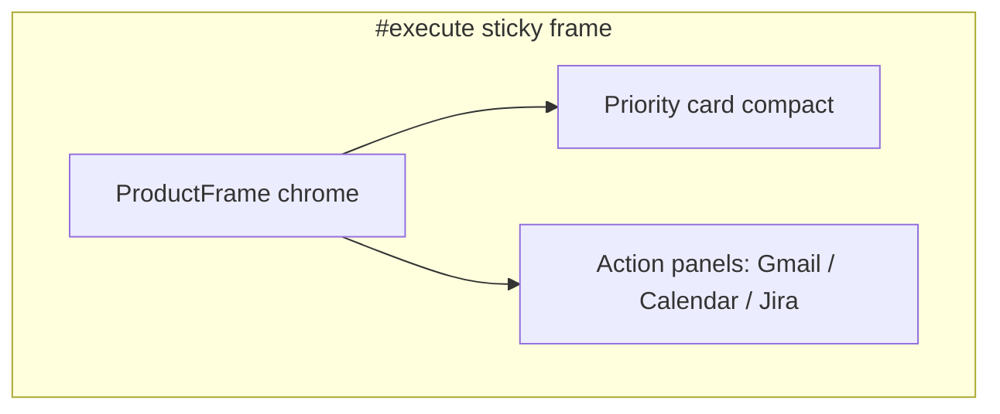

# P1-T08: Product Theater — Execute Brief

**Task ID:** P1-T08  
**Status:** done  
**Type:** Strategy and documentation (no code; Phase 3-4 is implementation)  
**Completed:** 2026-07-03  
**Parent:** [phase-1-tasks.md](../phase-1-tasks.md) | [phase-1-foundation.md](../phase-1-foundation.md)  
**Depends on:** [P1-T05-how-it-works-copy.md](./P1-T05-how-it-works-copy.md) (step 03), [P1-T07-theater-focus.md](./P1-T07-theater-focus.md) (priority fixture)  
**Blocks:** Phase 4 `ProductTheaterExecute.tsx`, P1-T23 (theater reuse map)

---

## Quick reference

| Field | Value |
|-------|-------|
| **Anchor** | `#execute` |
| **Headline** | MindMesh doesn't just tell you. It does it. |
| **Subhead** | From priority to done: draft, schedule, and check off without switching apps. |
| **Pillar** | Execute |
| **Maps to** | How it works step 03 |
| **Depth links** | `/inbox`, `/upcoming-events` |
| **Reuse targets** | [`TypingText.tsx`](../../../components/ui/TypingText.tsx), [`StaticDailyNarrativeCard.tsx`](../../../components/dashboard/StaticDailyNarrativeCard.tsx) (adapted) |

---

## Narrative continuity (from Focus theater)

Execute **closes the loop** opened in `#focus`. Use the same Acme Co. fixture persona (alex@acme.co).

**Priority card carried in** (canonical fixture from [P1-T07](./P1-T07-theater-focus.md)):

| Field | Fixture copy |
|-------|--------------|
| **Priority title** | Prepare for 2pm client call |
| **Reason** | Unread thread from Dana needs a reply, and the spec doc is still open in Jira. |
| **Sources** | Gmail thread, Google Calendar, Jira PROD-142 |

Execute theater shows MindMesh **acting on that one priority**, not surfacing a new one.

---

## Section copy (outside sticky frame)

| Element | Approved copy |
|---------|---------------|
| **Headline** | MindMesh doesn't just tell you. It does it. |
| **Subhead** | From priority to done: draft, schedule, and check off without switching apps. |
| **Depth link 1** | See the inbox → `/inbox` |
| **Depth link 2** | See upcoming events → `/upcoming-events` |
| **Reduced-motion caption** | Reply drafted, prep block scheduled, Jira task updated. Ready for your 2pm call. |
| **Success confirmation (in-frame)** | Done. Ready for your 2pm call. |

Aligns with [P1-T05](./P1-T05-how-it-works-copy.md) step 03 ("MindMesh gets it done") and action verbs: draft, block, check off.

---

## Scroll sequence beat sheet

**Wrapper:** `min-h-[220vh]` desktop, `min-h-[120vh]` mobile  
**Sticky frame:** `position: sticky; top: 80px; height: ~70vh`  
**Driver:** Framer Motion `useScroll` → `scrollYProgress` 0→1

| Progress | UI state | Motion |
|----------|----------|--------|
| **0.00 – 0.12** | Priority card from Focus visible at top (compact). Label: "Your priority." Same fixture as `#focus`. | Card pinned, slight scale 1.0 |
| **0.12 – 0.22** | "MindMesh acts" affordance pulses on priority card (button or auto-start indicator). | Single pulse on CTA |
| **0.22 – 0.50** | **Split or tabbed panel:** Gmail compose opens. [`TypingText`](../../../components/ui/TypingText.tsx) types draft reply (see fixture below). | Typing synced to scroll progress 0.22–0.50 |
| **0.50 – 0.68** | Calendar strip: new block appears "Client call prep · 1:30–2:00 PM" on Google Calendar. | Block slides in from right, `opacity 0→1` |
| **0.68 – 0.82** | Jira row: PROD-142 checkbox animates to checked. Status → Done. | Checkmark draw or scale-in |
| **0.82 – 0.92** | Success banner: "Done. Ready for your 2pm call." Priority card gets subtle green check. | Banner fade-in |
| **0.92 – 1.00** | Hold final success state. All three actions visible as completed. | Static hold |

**Animation rules:**

- `transform` and `opacity` only
- TypingText driven by scroll step index, not independent timer (avoid desync)
- Pause when off-screen; `prefers-reduced-motion` → jump to **0.92** state

---

## Fixture copy: email draft (TypingText)

**To:** dana@clientco.com  
**Subject:** Re: Q2 rollout timeline

**Body (typed in animation):**

```
Hi Dana,

Thanks for the note. I've reviewed the open items and blocked time before our 2pm call to align on the rollout timeline. We'll walk through PROD-142 and the remaining dependencies then.

Best,
Alex
```

**Character count:** ~195 (keep typing segment under ~3s at 60ms/char when scroll-scrubbed)

---

## Fixture copy: calendar block

| Field | Value |
|-------|-------|
| **Title** | Client call prep |
| **Time** | 1:30 PM – 2:00 PM |
| **Calendar** | Google Calendar |
| **Note** | Review PROD-142 + Dana thread |

---

## Fixture copy: Jira task

| Field | Value |
|-------|-------|
| **Key** | PROD-142 |
| **Title** | Finalize Q2 rollout spec |
| **Before** | In Progress |
| **After** | Done (checked) |

---

## Reduced-motion static frame

When `prefers-reduced-motion: reduce`:

- Priority card + completed email draft (full text, no typing)
- Calendar block visible
- Jira task checked
- Banner: "Done. Ready for your 2pm call."
- Caption below frame: "Reply drafted, prep block scheduled, Jira task updated."

---

## ProductFrame layout



| Phase | Visible panel |
|-------|---------------|
| 0.0–0.22 | Priority card dominant |
| 0.22–0.50 | Gmail compose (typing) |
| 0.50–0.68 | Calendar event panel |
| 0.68–0.82 | Jira task row |
| 0.82–1.0 | Success summary (all three mini-done states) |

Panels can cross-fade within the same frame width; no full page swap.

---

## Reuse and refactor notes

### `TypingText.tsx`

**Current state:** Client component; `trigger`, `speed`, scroll-agnostic timer loop.

**Phase 4 usage:**

- Pass `trigger={scrollStep >= draftStep}` or drive `displayText` from scroll progress via wrapper
- Marketing: `speed={0}` when scrubbing scroll; advance character index from `scrollYProgress`
- Disable `loop` for theater

### `StaticDailyNarrativeCard.tsx`

**Current state:** "Yesterday's Narrative" summary; light theme; not a direct fit for Execute.

**Phase 4 approach:**

- Do **not** reuse narrative card verbatim for the typing beat
- Optional: use narrative card styling for **success summary** panel at end (marketing variant)
- Extract shared card chrome (rounded panel, header row) into a thin wrapper if needed

**New marketing components (Phase 4):**

- `MarketingDraftPanel.tsx` (compose UI + TypingText)
- `MarketingCalendarBlock.tsx` (single event insert)
- `MarketingJiraRow.tsx` (checkbox state)

Fixtures live in `lib/marketing-demo-data.ts` (shared with Connect + Focus).

---

## Typography (section header)

| Element | Token | Size |
|---------|-------|------|
| Headline | display-lg | 48px / 32px mobile |
| Subhead | body-lg | 20px / 18px mobile |
| Success banner | body / semibold | 16px, `--mm-accent` |
| Depth links | body | 16px |

---

## Mobile simplification

| Rule | Value |
|------|------|
| Scroll wrapper | `min-h-[120vh]` |
| Typing | Show full draft immediately or shorten to 2 lines |
| Panels | Stack priority → draft → calendar → Jira vertically instead of cross-fade |
| Fallback | Static success frame |

---

## Copy constraints

### Do

- Close the loop from Focus priority fixture
- Show three concrete actions: draft, schedule, check off
- Use production-realistic apps (Gmail, Google Calendar, Jira)
- Emphasize action, not suggestion

### Do not

- Introduce a new priority unrelated to `#focus`
- Say "AI suggests" or passive recommendation language
- Show real OAuth or send email
- Duplicate How it works step 03 description verbatim

---

## Phase 4 implementation checklist

- [ ] `ProductTheaterExecute.tsx` scroll wrapper + sticky frame
- [ ] `lib/marketing-demo-data.ts` execute fixtures (draft, event, Jira)
- [ ] Scroll-driven TypingText or scroll-synced draft reveal
- [ ] Calendar + Jira micro-panels
- [ ] Success state + reduced-motion branch
- [ ] Depth links to `/inbox`, `/upcoming-events`
- [ ] `next/dynamic`, `ssr: false`

---

## Acceptance criteria checklist

- [x] Section headline + subhead finalized
- [x] Scroll beat sheet 0.0–1.0 documented
- [x] Draft text fixture for typing animation
- [x] Calendar + Jira fixtures documented
- [x] Success confirmation copy defined
- [x] Continuity from Focus priority documented
- [x] Reuse targets: `TypingText`, narrative card styling noted
- [x] Reduced-motion static frame defined

---

## Stakeholder sign-off

| Role | Name | Decision | Date |
|------|------|----------|------|
| Product / founder | Rohit | Approved Execute theater brief | 2026-07-03 |

**P1-T08 status:** Done. Proceed to [P1-T09](../phase-1-tasks.md#p1-t09--define-feature-grid-cards-and-links) or Phase 4 implementation.

---

## Downstream handoff

| Consumer | Uses from this doc |
|----------|-------------------|
| P1-T07 Focus brief | Priority fixture must match (align when P1-T07 is written) |
| Phase 4 `ProductTheaterExecute.tsx` | Beat sheet + all fixtures |
| P1-T23 | Reuse map + new micro-panel scope |
| `lib/marketing-demo-data.ts` | Single source for Acme Co. narrative across theaters |
