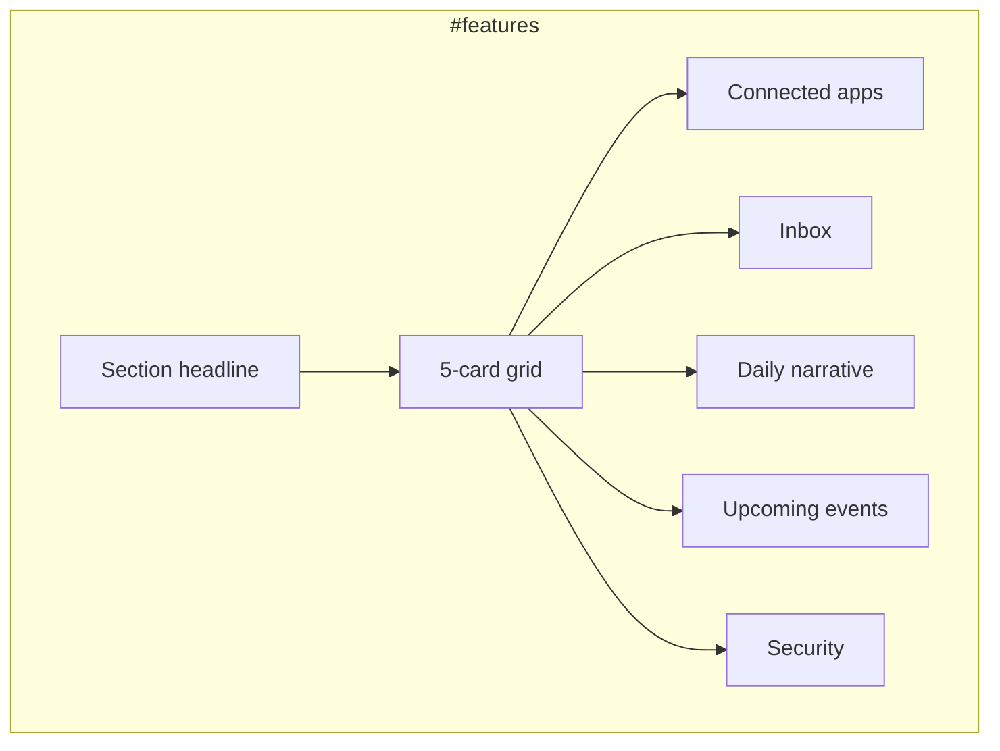

# P1-T09: Feature Grid Cards and Links

**Task ID:** P1-T09  
**Status:** done  
**Type:** Strategy and documentation (no code; Phase 2 is first implementation)  
**Completed:** 2026-07-03  
**Parent:** [phase-1-tasks.md](../phase-1-tasks.md) | [phase-1-foundation.md](../phase-1-foundation.md)  
**Depends on:** [P1-T02-section-map.md](./P1-T02-section-map.md) (Section 7)  
**Blocks:** Phase 2 `FeatureGridSection.tsx`

---

## Quick reference

| Field | Value |
|-------|-------|
| **Anchor** | `#features` |
| **Headline** | Go deeper on what MindMesh does. |
| **Subhead** | Explore the features that power connect, prioritize, and execute. |
| **Card count** | **7** (Sensor + Mascot added in Phase 8; see amendment below) |
| **Nav link** | Sticky nav "Features" → `#features` |
| **Component** | `components/marketing/sections/FeatureGridSection.tsx` |

---

## Decision: Sensor & mascot card

**Originally excluded** from the homepage feature grid (Phase 1).

Per [P1-T01-narrative.md](./P1-T01-narrative.md) decision log: mascot and sensor bar lived on a dedicated combined page only (`/sensor&mascot`), not on the primary marketing funnel. That kept the grid focused on core product value (Connect / Prioritize / Execute / Trust).

### Amendment (P8-T01 / P8-T13)

**Superseded for discovery cards only.** Phase 8 ships `/sensor` and `/mascot` depth pages with scroll theaters. The homepage feature grid now includes both cards (7 total), after Upcoming events and before Security. Homepage narrative still must not **lead** with Sensor or Mascot (hero / theaters unchanged). See [P8-T01-ia-decision.md](../../phase-8/tasks/P8-T01-ia-decision.md) and [P8-T13-discovery-links.md](../../phase-8/tasks/P8-T13-discovery-links.md).

---

## Section copy (outside grid)

| Element | Approved copy |
|---------|---------------|
| **Headline** | Go deeper on what MindMesh does. |
| **Subhead** | Explore the features that power connect, prioritize, and execute. |
| **Optional eyebrow** | Features |

No section-level CTA. Each card links to its depth page.

---

## Final card list (5 cards)

| # | Title | Description (1 line) | Href | Pillar | Source page |
|---|-------|-------------------|------|--------|-------------|
| 1 | Inbox | One inbox for email across every connected account, without tab chaos. | `/inbox` | Prioritize + Execute | [`app/inbox/page.tsx`](../../../app/inbox/page.tsx) |
| 2 | Connected apps | Plug in Gmail, Slack, Jira, calendars, and more as sources MindMesh can read. | `/connected-apps` | Connect | [`app/connected-apps/page.tsx`](../../../app/connected-apps/page.tsx) |
| 3 | Daily narrative | A clear recap of yesterday so you start today with context, not clutter. | `/yesterdays-narrative` | Prioritize | [`app/yesterdays-narrative/page.tsx`](../../../app/yesterdays-narrative/page.tsx) |
| 4 | Upcoming events | See what is ahead before it takes over your afternoon. | `/upcoming-events` | Prioritize + Execute | [`app/upcoming-events/page.tsx`](../../../app/upcoming-events/page.tsx) |
| 5 | Security | Private by design: local-first architecture and clear data boundaries. | `/security` | Conversion / Trust | [`app/security/page.tsx`](../../../app/security/page.tsx) |

**Display order:** Connect first (Connected apps), then Prioritize pair (Inbox, Daily narrative, Upcoming events), then Trust (Security). Reorders the table above for homepage:

1. Connected apps  
2. Inbox  
3. Daily narrative  
4. Upcoming events  
5. Security  

Rationale: Lead with Connect pillar after theaters; group Prioritize features; end with trust before Integrations + Trust sections below.

---

## Per-card spec (implementation)

### Card 1 — Connected apps

| Field | Value |
|-------|-------|
| **Title** | Connected apps |
| **Description** | Plug in Gmail, Slack, Jira, calendars, and more as sources MindMesh can read. |
| **Href** | `/connected-apps` |
| **Link label** | Explore connected apps → |
| **Icon (optional)** | `Link2` or `Plug` (lucide-react) |

### Card 2 — Inbox

| Field | Value |
|-------|-------|
| **Title** | Inbox |
| **Description** | One inbox for email across every connected account, without tab chaos. |
| **Href** | `/inbox` |
| **Link label** | Explore inbox → |
| **Icon (optional)** | `Inbox` |

### Card 3 — Daily narrative

| Field | Value |
|-------|-------|
| **Title** | Daily narrative |
| **Description** | A clear recap of yesterday so you start today with context, not clutter. |
| **Href** | `/yesterdays-narrative` |
| **Link label** | See daily narrative → |
| **Icon (optional)** | `BookOpen` or `ScrollText` |

Note: Page title is "Yesterday's Narrative"; card uses shorter **Daily narrative** for grid brevity. Matches theater depth link language from Focus brief.

### Card 4 — Upcoming events

| Field | Value |
|-------|-------|
| **Title** | Upcoming events |
| **Description** | See what is ahead before it takes over your afternoon. |
| **Href** | `/upcoming-events` |
| **Link label** | View upcoming events → |
| **Icon (optional)** | `Calendar` |

### Card 5 — Security

| Field | Value |
|-------|-------|
| **Title** | Security |
| **Description** | Private by design: local-first architecture and clear data boundaries. |
| **Href** | `/security` |
| **Link label** | Read about security → |
| **Icon (optional)** | `Shield` |

---

## Layout and interaction



| Rule | Value |
|------|-------|
| Grid desktop | 3 columns (row 1: 3 cards, row 2: 2 cards centered or 2+1 layout) |
| Grid tablet | 2 columns |
| Grid mobile | 1 column stack |
| Card anatomy | Icon (optional) + title + description + arrow link |
| Card interaction | Entire card clickable via `<Link>` wrapper |
| Hover | Subtle border brighten (`--mm-border` → `--mm-accent`), `translateY(-2px)` |
| Lazy load | Yes (`next/dynamic` or `content-visibility: auto`) |
| Section padding | `py-24` / `py-32` |

**Alternative 2+1 bottom row (desktop):** Row 1: Connected apps, Inbox, Daily narrative. Row 2: Upcoming events, Security (centered pair).

---

## Typography

| Element | Token | Size |
|---------|-------|------|
| Section headline | display-lg | 48px / 32px mobile |
| Subhead | body-lg | 20px / 18px mobile |
| Card title | heading | 20–24px |
| Card description | body | 16px, `--mm-text-muted` |
| Card link | body | 14–16px, `--mm-accent` |

---

## Copy constraints

### Do

- One line per card (≤ 20 words)
- Link to existing routes only
- Mention Slack/Jira on Connected apps card (production-ready)
- Align with Connect / Prioritize / Execute story

### Do not

- Include Sensor & mascot card on homepage
- Link to `/dashboard`, `/billing`, or Hero-only routes
- Duplicate theater section headlines verbatim
- Use em dashes in new copy (workspace rule)

---

## Phase 2 data shape

```ts
// lib/marketing-feature-cards.ts or inline in FeatureGridSection.tsx
export const FEATURE_GRID_CARDS = [
  {
    title: 'Connected apps',
    description: 'Plug in Gmail, Slack, Jira, calendars, and more as sources MindMesh can read.',
    href: '/connected-apps',
    linkLabel: 'Explore connected apps',
    icon: 'Link2',
  },
  // ... 4 more
] as const;
```

---

## Phase 2 implementation snippet

```tsx
<section id="features" aria-labelledby="features-heading" className="...">
  <h2 id="features-heading">Go deeper on what MindMesh does.</h2>
  <p className="features-subhead">
    Explore the features that power connect, prioritize, and execute.
  </p>
  <div className="features-grid">
    {FEATURE_GRID_CARDS.map((card) => (
      <Link key={card.href} href={card.href} className="feature-card">
        <h3>{card.title}</h3>
        <p>{card.description}</p>
        <span>{card.linkLabel} →</span>
      </Link>
    ))}
  </div>
</section>
```

---

## Acceptance criteria checklist

- [x] Final list of 5 cards with title, description, href
- [x] Sensor & mascot excluded (decision documented)
- [x] Section headline + subhead defined
- [x] Every card links to existing route
- [x] Display order rationale documented
- [x] Layout and typography spec included

---

## Stakeholder sign-off

| Role | Name | Decision | Date |
|------|------|----------|------|
| Product / founder | Rohit | Approved 5-card grid, no mascot | 2026-07-03 |

**P1-T09 status:** Done. Proceed to [P1-T10](../phase-1-tasks.md#p1-t10--define-integrations-section-7-apps) or Phase 2 `FeatureGridSection.tsx`.

---

## Downstream handoff

| Consumer | Uses from this doc |
|----------|-------------------|
| Phase 2 `FeatureGridSection.tsx` | Cards array + layout |
| Sticky nav | `#features` target |
| P1-T10 Integrations | Adjacent section below; Connected apps card overlaps thematically |
| `/connected-apps` page | Should eventually list Slack + Jira (website lag vs product) |
