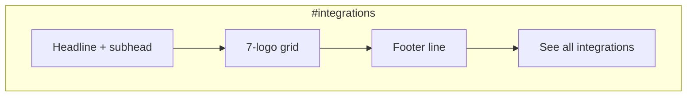

# P1-T10: Integrations Section (7 Apps)

**Task ID:** P1-T10  
**Status:** done  
**Type:** Strategy and documentation (no code; Phase 2 is first implementation)  
**Completed:** 2026-07-03  
**Parent:** [phase-1-tasks.md](../phase-1-tasks.md) | [phase-1-foundation.md](../phase-1-foundation.md)  
**Depends on:** [P1-T02-section-map.md](./P1-T02-section-map.md) (Section 8), [P1-T06-theater-connect.md](./P1-T06-theater-connect.md) (app order)  
**Blocks:** Phase 2 `IntegrationsSection.tsx`

---

## Quick reference

| Field | Value |
|-------|-------|
| **Anchor** | `#integrations` |
| **Headline** | Connect what you already use. |
| **Subhead** | MindMesh reads your email, calendar, messaging, and tasks as sources without replacing them. |
| **Footer line** | More integrations added regularly. |
| **Depth CTA** | See all integrations → `/connected-apps` |
| **App count** | **7** |
| **Layout** | Static logo grid (default); CSS marquee deferred to Phase 6 performance test |
| **Component** | `components/marketing/sections/IntegrationsSection.tsx` |

---

## Section copy

| Element | Approved copy |
|---------|---------------|
| **Optional eyebrow** | Integrations |
| **Headline** | Connect what you already use. |
| **Subhead** | MindMesh reads your email, calendar, messaging, and tasks as sources without replacing them. |
| **Footer line** | More integrations added regularly. |
| **Depth CTA label** | See all integrations → |

No per-logo links. Section CTA is the only outbound link (to `/connected-apps`).

Aligns with Connect pillar language from [P1-T06](./P1-T06-theater-connect.md) without repeating the theater headline ("Bring every app into one place.").

---

## Final 7-app list

**Display order** matches Connect theater animation order ([P1-T06 § Apps in animation order](./P1-T06-theater-connect.md#apps-in-animation-order-7-total)).

| # | Display name | Type | Icon asset | Size | Product ready | On website today |
|---|--------------|------|------------|------|---------------|------------------|
| 1 | Gmail | Email | `public/images/icons/gmail.png` | 512×512 | Yes | Yes |
| 2 | Google Calendar | Calendar | `public/images/icons/google-calendar.png` | 512×512 | Yes | Yes |
| 3 | Outlook Email | Email | `public/images/icons/outlook.png` | 512×512 | Yes | Yes |
| 4 | Outlook Calendar | Calendar | `public/images/icons/outlook-calendar.png` | 48×48 ⚠️ | Yes | Yes (icon only; not in all UI lists) |
| 5 | SMTP Mailbox | Email | `public/images/icons/smtp.png` | 512×512 | Yes | Yes |
| 6 | Slack | Messaging | `public/images/icons/slack.png` | 512×512 | **Yes** | **Yes** |
| 7 | Jira | Tasks | `public/images/icons/jira.png` | 512×512 | **Yes** | **Yes** |

### Display name rules

| Rule | Detail |
|------|--------|
| Canonical names | Use **Google Calendar** (not "Gmail Calendar"), **Outlook Email** (not "Outlook" alone in this section), **SMTP Mailbox** (not "SMTP") |
| Logo alt text | `{Display name} integration` (e.g. "Slack integration") |
| Consistency | Same names across homepage `#integrations`, Connect theater, and `/connected-apps` after Phase 5/6 update |

---

## Per-app spec

### 1 — Gmail

| Field | Value |
|-------|-------|
| **Display name** | Gmail |
| **Category label** (optional, below logo) | Email |
| **Icon** | `/images/icons/gmail.png` |
| **Import path** | `@/public/images/icons/gmail.png` |

### 2 — Google Calendar

| Field | Value |
|-------|-------|
| **Display name** | Google Calendar |
| **Category label** | Calendar |
| **Icon** | `/images/icons/google-calendar.png` |
| **Import path** | `@/public/images/icons/google-calendar.png` |

### 3 — Outlook Email

| Field | Value |
|-------|-------|
| **Display name** | Outlook Email |
| **Category label** | Email |
| **Icon** | `/images/icons/outlook.png` |
| **Import path** | `@/public/images/icons/outlook.png` |
| **Note** | [`StaticConnectedApps.tsx`](../../../components/dashboard/StaticConnectedApps.tsx) shows "Outlook"; marketing uses full name for clarity vs Outlook Calendar |

### 4 — Outlook Calendar

| Field | Value |
|-------|-------|
| **Display name** | Outlook Calendar |
| **Category label** | Calendar |
| **Icon** | `/images/icons/outlook-calendar.png` |
| **Import path** | `@/public/images/icons/outlook-calendar.png` |
| **Asset note** | Normalized to 512×512 in [P1-T21](./P1-T21-slack-jira-assets.md) |

### 5 — SMTP Mailbox

| Field | Value |
|-------|-------|
| **Display name** | SMTP Mailbox |
| **Category label** | Email |
| **Icon** | `/images/icons/smtp.png` |
| **Import path** | `@/public/images/icons/smtp.png` |

### 6 — Slack

| Field | Value |
|-------|-------|
| **Display name** | Slack |
| **Category label** | Messaging |
| **Icon** | `/images/icons/slack.png` |
| **Source reference** | [`slack.png`](../../../public/images/icons/slack.png) from [P1-T21](./P1-T21-slack-jira-assets.md) (rasterized from desktop `AppBrandIcon.tsx` SVG) |
| **Product status** | Production-ready (OAuth + sync live) |

### 7 — Jira

| Field | Value |
|-------|-------|
| **Display name** | Jira |
| **Category label** | Tasks |
| **Icon** | `/images/icons/jira.png` |
| **Source reference** | [`jira.png`](../../../public/images/icons/jira.png) from [P1-T21](./P1-T21-slack-jira-assets.md) (desktop app `public/img/apps/jira.png`) |
| **Product status** | Production-ready (OAuth + sync live) |

---

## Layout decision: grid vs marquee

**Decision: Static logo grid (Phase 2 default).**

| Option | Verdict | Rationale |
|--------|---------|-----------|
| **Static grid** | ✅ Default | 7 logos fit cleanly; no motion cost; accessible; matches Linear-style restraint |
| **CSS marquee** | ⏸ Phase 6 only | Allow only if performance-tested and does not hurt INP on mid-tier mobile |
| **Infinite scroll row** | ❌ Rejected | Overclaims "many integrations"; 7 apps is a credible baseline, not a logo wall |

### Grid layout spec



| Breakpoint | Columns | Notes |
|------------|---------|-------|
| Desktop (≥1024px) | 7 in one row, or 4+3 centered | Prefer single row if logos stay legible at ~64px |
| Tablet (768–1023px) | 4 columns | Row 1: 4, Row 2: 3 centered |
| Mobile (<768px) | 2 columns | Per [P1-T02](./P1-T02-section-map.md); 4 rows |

### Logo tile anatomy

| Element | Spec |
|---------|------|
| Tile size | 80–96px square hit area |
| Icon render | 48–64px via `next/image`, `object-fit: contain` |
| Background | Transparent or subtle `rgba(255,255,255,0.04)` pill on `#060e20` |
| Label | Display name below icon, 14px, `--mm-text-muted` (optional; icons-only also valid) |
| Gap | `gap-6` desktop, `gap-4` mobile |
| Section padding | `py-20` / `py-24` |

**Recommendation:** Show display name under each logo for clarity (Outlook Email vs Outlook Calendar, SMTP vs Gmail).

---

## Typography

| Element | Token | Size |
|---------|-------|------|
| Section headline | display-lg | 48px / 32px mobile |
| Subhead | body-lg | 20px / 18px mobile |
| Logo label | body-sm | 14px, `--mm-text-muted` |
| Footer line | body | 16px, `--mm-text-muted` |
| CTA link | body | 16px, `--mm-accent` |

---

## Integrations audit (full doc)

See [P1-T20-integrations-audit.md](./P1-T20-integrations-audit.md) for website vs product side-by-side and Phase 5/6 follow-up checklist.

**Summary:** Product has 7 production-ready connectors; website UI surfaces mostly show 4–5. Slack and Jira are live in the app, not on the marketing site yet.

---

## Copy constraints

### Do

- Show exactly 7 apps (no "and more" logos in the grid itself)
- Use "More integrations added regularly" as the forward-looking footer
- Link once to `/connected-apps` for depth
- Match product connector list (Slack and Jira are live, not "coming soon")

### Do not

- Imply integrations we do not ship (Notion, Linear, Teams, etc.)
- Use "unlimited integrations" or similar overclaim
- Animate logos on scroll by default (static grid first)
- Use em dashes in new copy (workspace rule)

---

## Phase 2 data shape

```ts
// lib/marketing-integrations.ts
export const MARKETING_INTEGRATIONS = [
  {
    id: 'gmail',
    displayName: 'Gmail',
    category: 'Email',
    iconSrc: '/images/icons/gmail.png',
  },
  {
    id: 'google-calendar',
    displayName: 'Google Calendar',
    category: 'Calendar',
    iconSrc: '/images/icons/google-calendar.png',
  },
  {
    id: 'outlook-email',
    displayName: 'Outlook Email',
    category: 'Email',
    iconSrc: '/images/icons/outlook.png',
  },
  {
    id: 'outlook-calendar',
    displayName: 'Outlook Calendar',
    category: 'Calendar',
    iconSrc: '/images/icons/outlook-calendar.png',
  },
  {
    id: 'smtp-mailbox',
    displayName: 'SMTP Mailbox',
    category: 'Email',
    iconSrc: '/images/icons/smtp.png',
  },
  {
    id: 'slack',
    displayName: 'Slack',
    category: 'Messaging',
    iconSrc: '/images/icons/slack.png',
  },
  {
    id: 'jira',
    displayName: 'Jira',
    category: 'Tasks',
    iconSrc: '/images/icons/jira.png',
  },
] as const;
```

Share this constant with Connect theater fixtures (`lib/marketing-demo-data.ts` in Phase 4).

---

## Phase 2 implementation snippet

```tsx
<section id="integrations" aria-labelledby="integrations-heading" className="...">
  <h2 id="integrations-heading">Connect what you already use.</h2>
  <p className="integrations-subhead">
    MindMesh reads your email, calendar, messaging, and tasks as sources without replacing them.
  </p>
  <ul className="integrations-grid" role="list">
    {MARKETING_INTEGRATIONS.map((app) => (
      <li key={app.id} className="integration-tile">
        <Image
          src={app.iconSrc}
          alt={`${app.displayName} integration`}
          width={64}
          height={64}
        />
        <span>{app.displayName}</span>
      </li>
    ))}
  </ul>
  <p className="integrations-footer">More integrations added regularly.</p>
  <Link href="/connected-apps">See all integrations →</Link>
</section>
```

**Lazy load:** Yes (`next/dynamic` or `content-visibility: auto`).

**Reduced motion:** No animation required; static grid is the reduced-motion experience.

---

## Acceptance criteria checklist

- [x] Final 7-app list with display names and icon asset paths
- [x] Section headline + subhead defined
- [x] Footer line defined ("More integrations added regularly.")
- [x] Logo layout spec: static grid default; marquee deferred
- [x] Matches product 7-app connector list (Slack + Jira included)
- [x] Website `/connected-apps` gap flagged for Phase 5/6
- [x] Outlook Calendar icon size mismatch noted for asset pass

---

## Stakeholder sign-off

| Role | Name | Decision | Date |
|------|------|----------|------|
| Product / founder | Rohit | Approved 7-app static grid | 2026-07-03 |

**P1-T10 status:** Done. Proceed to Phase 2 `IntegrationsSection.tsx`. All 7 icons in `public/images/icons/` ([P1-T21](./P1-T21-slack-jira-assets.md)).

---

## Downstream handoff

| Consumer | Uses from this doc |
|----------|-------------------|
| Phase 2 `IntegrationsSection.tsx` | Copy + grid layout + `MARKETING_INTEGRATIONS` |
| Phase 4 Connect theater | Same 7 apps, same order, same icons |
| P1-T20 full audit | [P1-T20-integrations-audit.md](./P1-T20-integrations-audit.md) (done); diff `appsStore.ts` when repo available |
| P1-T21 | Export `slack.png`, `jira.png`; normalize `outlook-calendar.png` to 512×512 | ✅ Done |
| Phase 5/6 | Update `/connected-apps`, FAQ, `StaticConnectedApps`, metadata |
