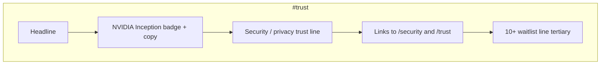
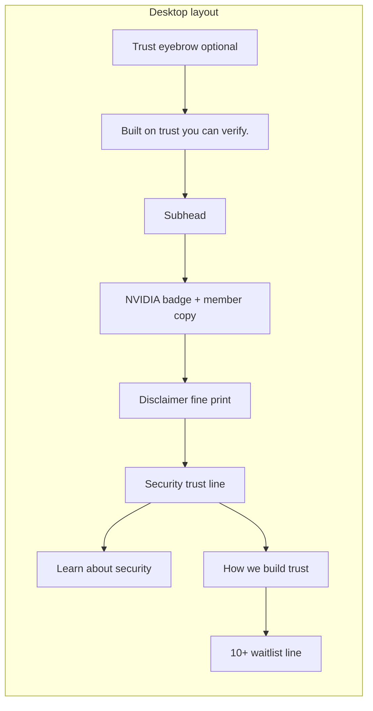

# P1-T11: Social Proof Section (NVIDIA + Trust)

**Task ID:** P1-T11  
**Status:** done  
**Type:** Strategy and documentation (no code; Phase 2 is first implementation)  
**Completed:** 2026-07-03  
**Parent:** [phase-1-tasks.md](../phase-1-tasks.md) | [phase-1-foundation.md](../phase-1-foundation.md)  
**Depends on:** [P1-T02-section-map.md](./P1-T02-section-map.md) (Section 9)  
**Blocks:** Phase 2 `TrustSection.tsx`, [P1-T12-final-cta.md](./P1-T12-final-cta.md) (conversion tone follows trust), [P1-T22](../phase-1-tasks.md#p1-t22--source-nvidia-inception-badgecopy-for-section-9) (badge asset)

---

## Quick reference

| Field | Value |
|-------|-------|
| **Anchor** | `#trust` |
| **Nav label** | Security (scrolls here; not `#security` page) |
| **Headline** | Built on trust you can verify. |
| **Primary proof** | NVIDIA Inception Program member |
| **Secondary proof** | Security / privacy trust line + depth links |
| **Tertiary proof** | 10+ professionals already on the waitlist |
| **Component** | `components/marketing/sections/TrustSection.tsx` |

---

## Content hierarchy

Credibility-first. Vanity metrics are explicitly demoted.



| Tier | Element | Role |
|------|---------|------|
| **1** | Section headline | Frames credibility, not user count |
| **2** | NVIDIA Inception | External program validation |
| **3** | Security / privacy line | Product-native trust (local-first, read-only) |
| **4** | Depth links | `/security`, `/trust` |
| **5** | Waitlist count | Social proof nudge only; smallest visual weight |

---

## Section copy

| Element | Approved copy |
|---------|---------------|
| **Optional eyebrow** | Trust |
| **Headline** | Built on trust you can verify. |
| **Subhead** | MindMesh is built for professionals who want AI orchestration without giving up control of their data. |
| **NVIDIA line** | MindMesh is a member of the NVIDIA Inception Program. |
| **NVIDIA disclaimer** (required, fine print) | NVIDIA Inception membership does not constitute an endorsement by NVIDIA Corporation of MindMesh or its products. |
| **Security trust line** | Private by design: local-first architecture, encrypted connections, and read-only integrations where it matters. |
| **Link 1 label** | Learn about security → |
| **Link 1 href** | `/security` |
| **Link 2 label** | How we build trust → |
| **Link 2 href** | `/trust` |
| **Waitlist line** | 10+ professionals already on the waitlist. |

No form in this section. Waitlist capture stays in Hero and Section 10 (`#cta`).

Aligns with [P1-T01 §7](./P1-T01-narrative.md#7-what-does-not-belong-on-the-homepage): no fake testimonials, no inflated counts as headline.

---

## NVIDIA Inception block

### Approved wording

| Use case | Copy |
|----------|------|
| **Primary (homepage)** | MindMesh is a member of the NVIDIA Inception Program. |
| **Alt (shorter, badge-adjacent)** | NVIDIA Inception Program member |
| **First mention in body copy** | NVIDIA Inception Program® *(trademark on first use only; see guidelines)* |
| **Do not use** | "NVIDIA-backed", "Powered by NVIDIA", "NVIDIA certified", "Official NVIDIA partner" |

### Badge placement

| Rule | Spec |
|------|------|
| **Position** | Above or beside NVIDIA copy; left-aligned on desktop, centered on mobile |
| **Asset source** | [P1-T22-nvidia-inception.md](./P1-T22-nvidia-inception.md) (in repo) |
| **Planned path** | `public/images/badges/nvidia-inception.svg` ([P1-T22](./P1-T22-nvidia-inception.md)) |
| **Render size** | Height 40–56px desktop, 32–40px mobile; preserve aspect ratio |
| **Clear space** | Minimum clear space equal to height of lowercase "n" in NVIDIA wordmark (per NVIDIA partner badge guidelines) |
| **Background** | Dark section bg `#060e20`; use badge variant provided for dark backgrounds if portal offers one |
| **Link** | Optional: badge or text links to [NVIDIA Inception program page](https://www.nvidia.com/en-us/startups/) (`target="_blank"`, `rel="noopener noreferrer"`) |
| **Max badges** | One NVIDIA badge only in this section (do not stack multiple NVIDIA program badges) |

### Brand compliance (must follow)

Sourced from [NVIDIA Trademark and Logo Usage Guidelines](https://www.nvidia.com/content/dam/en-zz/Solutions/about-us/documents/NVIDIA-Trademark-and-Logo-Usage-Guidelines.pdf) and Inception program FAQ:

| Rule | Detail |
|------|--------|
| Use official assets only | Download from Inception portal; do not recreate or stylize |
| No modification | Do not recolor, distort, add effects, or place inside decorative bands |
| No false endorsement | Membership ≠ NVIDIA endorsement of MindMesh products |
| Disclaimer | Include fine-print disclaimer below NVIDIA block |
| Trademark | "NVIDIA" and "NVIDIA Inception" are trademarks of NVIDIA Corporation |
| Permission | Program members may use provided marketing assets per portal terms |

**Asset locked:** [`public/images/badges/nvidia-inception.svg`](../../../public/images/badges/nvidia-inception.svg). Render height 40–48px; mono-black variant for light backgrounds only.

### Fallback (if badge fails to load)

```tsx
<p className="nvidia-trust-line">
  MindMesh is a member of the NVIDIA Inception Program.
</p>
<p className="nvidia-disclaimer">…</p>
```

No placeholder logo or unofficial NVIDIA wordmark. Text-only is acceptable if the SVG fails to load.

---

## Security / privacy trust block

Pulls from product truth on [`/security`](../../../app/security/page.tsx) and [`/trust`](../../../app/trust/page.tsx). One line on homepage; depth pages carry full story.

| Field | Value |
|-------|-------|
| **Trust line** | Private by design: local-first architecture, encrypted connections, and read-only integrations where it matters. |
| **Supporting bullets** | *(optional, max 3 icons below line; omit if section feels crowded)* |
| Bullet 1 | Local-first: indexed context stays on your device by default |
| Bullet 2 | Read-only: Gmail and Google Calendar use read-only permissions in the standard flow |
| Bullet 3 | Encrypted: TLS for cloud traffic; credentials in system keychain |

**Recommendation for Phase 2:** Headline + NVIDIA block + single trust line + two text links. Skip icon bullets to keep Linear-style restraint; Security feature grid already covers depth.

---

## Waitlist secondary line

| Field | Value |
|-------|-------|
| **Copy** | 10+ professionals already on the waitlist. |
| **Visual weight** | Smallest text in section (`body-sm`, `--mm-text-muted`) |
| **Placement** | Below security links; above fold into `#cta` on scroll |
| **Update rule** | Refresh count manually when milestone meaningful (50+, 100+); never round up or inflate |

**Do not:**

- Put waitlist count in the section headline or subhead
- Use "Join thousands" or similar without data
- Make waitlist count the NVIDIA-adjacent primary visual

---

## What we will NOT show

Explicit exclusion list for Section 9 and adjacent homepage trust surfaces:

| Excluded | Reason |
|----------|--------|
| Fake or anonymous testimonials | No verified customer quotes exist |
| Stock-photo "customer" faces | Misleading |
| Inflated user / waitlist counts | Early stage; honesty over hype |
| "Trusted by Fortune 500" (or similar) | Unverifiable |
| Customer logo wall | No paying logo customers to display |
| Star ratings (G2, Capterra, etc.) | None to show |
| Press "As seen in" bar | Unless verifiable placement exists |
| NVIDIA endorsement language | Program membership only |
| Security certifications we do not hold | SOC 2, ISO, etc. unless earned |
| Competitor comparison tables | Belongs on dedicated pages if ever |

If testimonials or logos become available later, add via a new Phase 1 decision doc; do not slip into Section 9 without sign-off.

---

## Layout and interaction

| Rule | Value |
|------|-------|
| Section padding | `py-24` / `py-32` |
| Max content width | `max-w-3xl` centered (trust copy reads better narrow) |
| Desktop layout | Stacked: headline → NVIDIA row (badge + copy) → trust line → links → waitlist line |
| Mobile | Vertical stack; badge centered |
| Lazy load | Yes |
| CTAs | Text links only (`/security`, `/trust`); no primary button (reserved for `#cta`) |
| Reduced motion | Static content; no scroll animation required |



---

## Typography

| Element | Token | Size |
|---------|-------|------|
| Section headline | display-lg | 48px / 32px mobile |
| Subhead | body-lg | 20px / 18px mobile |
| NVIDIA line | body | 16–18px |
| Security trust line | body | 16px, `--mm-text-muted` |
| Depth links | body | 16px, `--mm-accent` |
| Disclaimer | body-sm | 12–13px, `--mm-text-muted`, max-width constrained |
| Waitlist line | body-sm | 14px, `--mm-text-muted` |

---

## Phase 2 data shape

```ts
// lib/marketing-trust-content.ts
export const TRUST_SECTION = {
  eyebrow: 'Trust',
  headline: 'Built on trust you can verify.',
  subhead:
    'MindMesh is built for professionals who want AI orchestration without giving up control of their data.',
  nvidia: {
    memberLine: 'MindMesh is a member of the NVIDIA Inception Program.',
    badgeSrc: '/images/badges/nvidia-inception.svg', // P1-T22
    badgeAlt: 'NVIDIA Inception Program member',
    programUrl: 'https://www.nvidia.com/en-us/startups/',
    disclaimer:
      'NVIDIA Inception membership does not constitute an endorsement by NVIDIA Corporation of MindMesh or its products.',
  },
  securityLine:
    'Private by design: local-first architecture, encrypted connections, and read-only integrations where it matters.',
  links: [
    { label: 'Learn about security', href: '/security' },
    { label: 'How we build trust', href: '/trust' },
  ],
  waitlistLine: '10+ professionals already on the waitlist.',
} as const;
```

---

## Phase 2 implementation snippet

```tsx
<section id="trust" aria-labelledby="trust-heading" className="...">
  <p className="trust-eyebrow">Trust</p>
  <h2 id="trust-heading">Built on trust you can verify.</h2>
  <p className="trust-subhead">{TRUST_SECTION.subhead}</p>

  <div className="nvidia-block">
    {badgeAvailable ? (
      <Image
        src={TRUST_SECTION.nvidia.badgeSrc}
        alt={TRUST_SECTION.nvidia.badgeAlt}
        height={48}
        width={200}
      />
    ) : null}
    <p>{TRUST_SECTION.nvidia.memberLine}</p>
    <p className="nvidia-disclaimer">{TRUST_SECTION.nvidia.disclaimer}</p>
  </div>

  <p className="security-trust-line">{TRUST_SECTION.securityLine}</p>

  <div className="trust-links">
    {TRUST_SECTION.links.map((link) => (
      <Link key={link.href} href={link.href}>
        {link.label} →
      </Link>
    ))}
  </div>

  <p className="waitlist-secondary">{TRUST_SECTION.waitlistLine}</p>
</section>
```

---

## Relationship to sticky nav

| Nav label | Target | Note |
|-----------|--------|------|
| **Security** | `#trust` | Scrolls to this section, not `/security` page |
| `/security` page | Linked from trust line CTA | Full security story |
| `/trust` page | Linked from second CTA | FAQ-style trust narrative |

Do not rename nav to "Trust" without updating [P1-T02 § Minimal nav](./P1-T02-section-map.md#minimal-nav-frozen) in a dedicated decision.

---

## Acceptance criteria checklist

- [x] Section headline defined (credibility-first, not vanity metrics)
- [x] NVIDIA Inception badge placement and approved wording documented
- [x] NVIDIA brand compliance rules and disclaimer included
- [x] Text-only fallback if badge asset delayed (P1-T22)
- [x] Security/privacy trust line with links to `/security` and `/trust`
- [x] Waitlist line secondary ("10+ professionals already on the waitlist.")
- [x] Explicit list of excluded social proof patterns
- [x] Waitlist count is tertiary, not headline claim

---

## Stakeholder sign-off

| Role | Name | Decision | Date |
|------|------|----------|------|
| Product / founder | Rohit | Approved NVIDIA + trust hierarchy, 10+ secondary | 2026-07-03 |

**P1-T11 status:** Done. NVIDIA badge: [P1-T22](./P1-T22-nvidia-inception.md). Proceed to [P1-T12](../phase-1-tasks.md#p1-t12--define-final-cta-section) or Phase 2 `TrustSection.tsx`.

---

## Downstream handoff

| Consumer | Uses from this doc |
|----------|-------------------|
| Phase 2 `TrustSection.tsx` | Copy hierarchy + layout |
| P1-T22 | [P1-T22-nvidia-inception.md](./P1-T22-nvidia-inception.md) (badge in repo) |
| P1-T12 Final CTA | Conversion follows trust; no duplicate NVIDIA block in `#cta` |
| Sticky nav "Security" | Scroll target `#trust` |
| `/security`, `/trust` pages | Depth destinations; keep messaging aligned |
