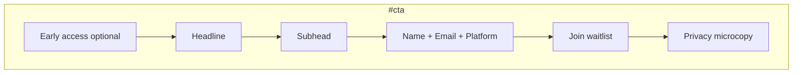

# P1-T12: Final CTA Section

**Task ID:** P1-T12  
**Status:** done  
**Type:** Strategy and documentation (no code; Phase 2 is first implementation)  
**Completed:** 2026-07-03  
**Parent:** [phase-1-tasks.md](../phase-1-tasks.md) | [phase-1-foundation.md](../phase-1-foundation.md)  
**Depends on:** [P1-T03-hero-copy.md](./P1-T03-hero-copy.md), [P1-T11-social-proof.md](./P1-T11-social-proof.md)  
**Blocks:** Phase 2 `FinalCTASection.tsx`

---

## Quick reference

| Field | Value |
|-------|-------|
| **Anchor** | `#cta` |
| **Headline** | Connect your apps. Find what matters. Get it done. |
| **Subhead** | Join the waitlist for early access to MindMesh, the cognitive layer for modern work. |
| **Primary action** | Join waitlist (form submit) |
| **Form fields** | Name (optional), Email (required), Platform (required) |
| **API** | `POST /api/waitlist` |
| **Lazy load** | No (nav and hero link here directly) |
| **Component** | `components/marketing/sections/FinalCTASection.tsx` |

---

## Section copy

| Element | Approved copy |
|---------|---------------|
| **Optional eyebrow** | Early access |
| **Headline** | Connect your apps. Find what matters. Get it done. |
| **Subhead** | Join the waitlist for early access to MindMesh, the cognitive layer for modern work. |
| **Submit button** | Join waitlist |
| **Loading state** | Joining waitlist… |
| **Success headline** | You're on the list. |
| **Success body** | We'll notify you when early access opens. |
| **Privacy microcopy** | We'll email you about MindMesh early access only. See our [Privacy Policy](/privacy). |

Restates the functional thesis from [P1-T01](./P1-T01-narrative.md) in conversion tone (imperative verbs, shorter clauses). Does not repeat hero H1 verbatim.

**Do not include in this section:**

- NVIDIA badge (lives in `#trust`, [P1-T11](./P1-T11-social-proof.md))
- "10+ professionals" waitlist count (tertiary line in `#trust` only)
- Secondary CTA buttons (single primary action)

---

## Form field decision

**Decision: Name (optional) + Email (required) + Platform (required).**

Email-only is **not** viable: [`app/api/waitlist/route.ts`](../../../app/api/waitlist/route.ts) returns `400` if `platform` is missing or not `windows` / `macos`.

| Field | ID | Type | Required | API field | Placeholder / options |
|-------|-----|------|----------|-----------|------------------------|
| Name | `cta-name` | text | No | `name` (empty string OK) | Your name |
| Email | `cta-email` | email | Yes | `email` | you@company.com |
| Platform | `cta-platform` | select | Yes | `platform` | Select → Windows (`windows`) / macOS (`macos`) |

### Validation (client + server)

| Rule | Client message | Server message |
|------|----------------|----------------|
| Email empty | Email is required | Email is required |
| Email invalid | Please enter a valid email address | Invalid email address |
| Platform empty | Please select a platform | Please select Windows or macOS |
| Success | — | Joined waitlist successfully |

Match validation copy from [`WaitlistModal.tsx`](../../../components/WaitlistModal.tsx) for consistency.

### API contract

```http
POST /api/waitlist
Content-Type: application/json

{
  "email": "alex@acme.co",
  "name": "Alex Chen",
  "platform": "macos"
}
```

Spreadsheet row: `[email, name, timestamp, platform]` (Sheet1 columns A–D).

---

## Reuse strategy

| Asset | Reuse approach |
|-------|----------------|
| [`app/api/waitlist/route.ts`](../../../app/api/waitlist/route.ts) | **Reuse as-is.** No API changes for Phase 2. |
| [`WaitlistModal.tsx`](../../../components/WaitlistModal.tsx) | **Do not embed** macOS window chrome on the marketing homepage. |
| Form logic | **Extract** shared hook or `WaitlistForm` component in Phase 2 refactor (validation + fetch + states). |
| `/waitlist` page | Keep standalone route; can use same extracted form with marketing layout. |

**Phase 2 recommendation:**

1. Create `components/marketing/WaitlistForm.tsx` (or `hooks/useWaitlistSubmit.ts`) with form fields, validation, and POST logic.
2. `FinalCTASection.tsx` renders inline form with `--mm-*` tokens (dark bg, no draggable modal).
3. Refactor `WaitlistModal.tsx` to use the shared form internally (Phase 2 or 6 cleanup).

Hero primary CTA ("Join the waitlist") smooth-scrolls to `#cta` where this inline form lives. Modal remains optional fallback on legacy routes only until Hero is fully retired.

---

## Layout and interaction



| Rule | Value |
|------|-------|
| Section padding | `py-24` / `py-32` |
| Max form width | `max-w-md` centered under headline |
| Text block max-width | `max-w-2xl` for headline + subhead |
| Alignment | Center (conversion pattern; contrast with left-aligned hero) |
| Lazy load | **No** (user may jump from nav or hero) |
| Primary action | Single submit button; no competing CTAs |
| Mobile | Full-width fields and button; stack name → email → platform |
| Focus management | On success, announce to screen readers; focus success message |
| Reduced motion | No animation on form; success checkmark may use simple opacity fade |

### Form layout (desktop)

| Row | Fields |
|-----|--------|
| 1 | Name (full width) |
| 2 | Email (full width) |
| 3 | Platform select (full width) |
| 4 | Submit button (full width) |
| 5 | Privacy microcopy (centered, muted) |

Optional compact variant (Phase 2 polish): email + platform side-by-side on `md+` if it stays readable; default to stacked for clarity.

---

## Typography

| Element | Token | Size |
|---------|-------|------|
| Section headline | display-lg | 48px / 32px mobile |
| Subhead | body-lg | 20px / 18px mobile |
| Field labels | body-sm | 14px, `--mm-text` |
| Inputs | body | 16px |
| Submit button | button | 16px / 600, `--mm-accent-strong` bg |
| Privacy microcopy | body-sm | 13–14px, `--mm-text-muted` |
| Success headline | heading | 24–32px |

---

## Hero and nav integration

| Source | Behavior |
|--------|----------|
| Hero primary CTA | Scroll to `#cta` ([P1-T03](./P1-T03-hero-copy.md)) |
| Sticky nav "Join waitlist" | Scroll to `#cta` ([P1-T02](./P1-T02-section-map.md)) |
| `#cta` in URL | Page loads with form in view; optional `scroll-margin-top` for sticky nav offset |

No duplicate waitlist forms above the fold on the new homepage. One conversion surface at section 10.

---

## Privacy microcopy

| Field | Value |
|-------|-------|
| **Copy** | We'll email you about MindMesh early access only. See our Privacy Policy. |
| **Link** | `/privacy` |
| **Link label** | Privacy Policy |
| **Placement** | Directly under submit button, 8–12px gap |

**Do not:**

- Require checkbox consent for Phase 2 (keep friction low; privacy link is informational)
- Link to `/security` here (trust section covers that)
- Promise specific launch dates

---

## Success and error states

| State | UI |
|-------|-----|
| **Default** | Form visible |
| **Loading** | Submit disabled; button text "Joining waitlist…" or inline spinner |
| **Success** | Replace form with success message (headline + body); no close button needed (inline, not modal) |
| **Error** | Inline alert above form; preserve field values; re-enable submit |

Success copy aligns with `WaitlistModal` ("You're on the list.") but uses marketing tone for body: "We'll notify you when early access opens."

---

## Copy constraints

### Do

- One obvious primary action (Join waitlist submit)
- Match API required fields (email + platform)
- Restate thesis in conversion imperative voice
- Link Privacy Policy under form

### Do not

- Email-only form (API incompatible)
- Mac-style draggable window on homepage
- Multiple CTAs ("Book a demo", "Try free", etc.)
- Fake urgency ("Only 3 spots left")
- Repeat hero H1 or full thesis paragraph verbatim
- Duplicate NVIDIA or "10+" lines from `#trust`
- Use em dashes in new copy (workspace rule)

---

## Phase 2 data shape

```ts
// lib/marketing-cta-content.ts
export const FINAL_CTA = {
  eyebrow: 'Early access',
  headline: 'Connect your apps. Find what matters. Get it done.',
  subhead:
    'Join the waitlist for early access to MindMesh, the cognitive layer for modern work.',
  submitLabel: 'Join waitlist',
  loadingLabel: 'Joining waitlist…',
  success: {
    headline: "You're on the list.",
    body: "We'll notify you when early access opens.",
  },
  privacy: {
    text: "We'll email you about MindMesh early access only. See our",
    linkLabel: 'Privacy Policy',
    href: '/privacy',
  },
  fields: {
    name: { label: 'Name', placeholder: 'Your name', required: false },
    email: { label: 'Email', placeholder: 'you@company.com', required: true },
    platform: {
      label: 'Platform',
      placeholder: 'Select',
      required: true,
      options: [
        { value: 'windows', label: 'Windows' },
        { value: 'macos', label: 'macOS' },
      ],
    },
  },
} as const;
```

---

## Phase 2 implementation snippet

```tsx
<section id="cta" aria-labelledby="cta-heading" className="final-cta ...">
  <p className="cta-eyebrow">{FINAL_CTA.eyebrow}</p>
  <h2 id="cta-heading">{FINAL_CTA.headline}</h2>
  <p className="cta-subhead">{FINAL_CTA.subhead}</p>

  {state === 'success' ? (
    <div role="status">
      <h3>{FINAL_CTA.success.headline}</h3>
      <p>{FINAL_CTA.success.body}</p>
    </div>
  ) : (
    <form onSubmit={handleSubmit} className="cta-form">
      {/* name, email, platform — see WaitlistModal validation */}
      <button type="submit" disabled={state === 'loading'}>
        {state === 'loading' ? FINAL_CTA.loadingLabel : FINAL_CTA.submitLabel}
      </button>
      <p className="cta-privacy">
        {FINAL_CTA.privacy.text}{' '}
        <Link href={FINAL_CTA.privacy.href}>{FINAL_CTA.privacy.linkLabel}</Link>.
      </p>
    </form>
  )}
</section>
```

**Analytics:** Reuse `trackButtonClick('Join Waitlist')` from WaitlistModal on submit.

---

## Acceptance criteria checklist

- [x] Section headline restates thesis in conversion tone
- [x] Form fields defined: name (optional), email + platform (required)
- [x] Matches waitlist API expectations
- [x] Reuse note for API + refactor path from WaitlistModal
- [x] Privacy microcopy under form with `/privacy` link
- [x] Single obvious primary action
- [x] Hero and nav scroll targets documented

---

## Stakeholder sign-off

| Role | Name | Decision | Date |
|------|------|----------|------|
| Product / founder | Rohit | Approved 3-field form + inline marketing layout | 2026-07-03 |

**P1-T12 status:** Done. All 10 homepage section copy decks (P1-T03 through P1-T12) are complete. Next: design tokens (P1-T13) or Phase 2 implementation.

---

## Downstream handoff

| Consumer | Uses from this doc |
|----------|-------------------|
| Phase 2 `FinalCTASection.tsx` | Copy + form spec + layout |
| Phase 2 `WaitlistForm` extract | Shared validation and API POST |
| Hero + sticky nav | Scroll target `#cta` |
| P1-T24 sign-off | Section 10 copy complete |
| `/waitlist` page | Align fields and success copy when migrated |
