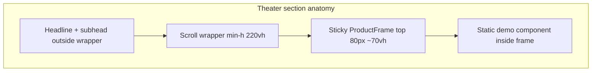

# P1-T15: Spacing, Radius, and Layout Rules

**Task ID:** P1-T15  
**Status:** done  
**Type:** Strategy and documentation (no code; Phase 2 applies in `MarketingLayout` and sections)  
**Completed:** 2026-07-03  
**Parent:** [phase-1-tasks.md](../phase-1-tasks.md) | [phase-1-foundation.md](../phase-1-foundation.md) §3.4  
**Depends on:** [P1-T13-color-tokens.md](./P1-T13-color-tokens.md), [P1-T14-typography.md](./P1-T14-typography.md)  
**Blocks:** P1-T16, Phase 2 `components/marketing/*`, Phase 3 scroll kit

---

## Quick reference

| Field | Value |
|-------|-------|
| **Max content width** | 1120px (`max-w-[1120px]`) |
| **Section padding Y** | `py-24` mobile → `py-32` desktop |
| **Section padding X** | `px-6` (24px) all breakpoints |
| **Grid gutter** | 24px (`gap-6`) |
| **Button radius** | 6px (`rounded-md`) |
| **Card radius** | 8px (`rounded-lg`) |
| **Sticky nav height** | 64px (`h-16`) |
| **Theater sticky offset** | `top: 80px` (nav + 16px gap) |
| **Theater frame height** | ~70vh (`min-h-[70vh]`, cap `max-h-[720px]`) |

---

## Layout container

### Marketing shell

Every homepage section uses the same horizontal container pattern:

```tsx
<section id="…" className="py-24 lg:py-32">
  <div className="mx-auto w-full max-w-[1120px] px-6">
    {/* section content */}
  </div>
</section>
```

| Token | Value | Tailwind | Notes |
|-------|-------|----------|-------|
| `--mm-layout-max` | 1120px | `max-w-[1120px]` | Locked (foundation range 1120–1200px) |
| `--mm-layout-gutter` | 24px | `px-6` | Horizontal inset; no wider gutters on desktop |
| `--mm-section-py-sm` | 96px | `py-24` | Default section vertical padding |
| `--mm-section-py-lg` | 128px | `lg:py-32` | Desktop section vertical padding |

**Hero exception:** `min-h-screen` full bleed background; inner text block still uses `max-w-[1120px] px-6` with **text block** capped at 720px ([P1-T03](./P1-T03-hero-copy.md)).

### Narrow text blocks

| Section | Inner max-width | Tailwind |
|---------|-----------------|----------|
| Hero copy | 720px | `max-w-[720px]` |
| Problem statement | 640px | `max-w-[640px]` |
| Trust section | 768px | `max-w-3xl` |
| Final CTA headline | 672px | `max-w-2xl` |
| Final CTA form | 448px | `max-w-md` |

---

## Grid system

12-column logical grid on the 1120px container. Implement with CSS Grid or Tailwind `grid-cols-*`; no custom 12-col class required in Phase 2.

| Breakpoint | Min width | Columns (typical) | Gutter |
|------------|-----------|-------------------|--------|
| Default (mobile) | <640px | 1 | `gap-4` (16px) |
| `sm` | 640px | 2 (feature grid) | `gap-4` |
| `md` | 768px | 2–3 | `gap-6` (24px) |
| `lg` | 1024px | 3 (feature grid), 7-col integrations | `gap-6` |
| `xl` | 1280px | Same as lg; container stays 1120px centered | `gap-6` |

**Feature grid ([P1-T09](./P1-T09-feature-grid.md)):** `grid-cols-1 sm:grid-cols-2 lg:grid-cols-3 gap-6`

**Integrations ([P1-T10](./P1-T10-integrations.md)):** `grid-cols-2 md:grid-cols-4 lg:grid-cols-7 gap-4 md:gap-6`

**How it works steps ([P1-T05](./P1-T05-how-it-works-copy.md)):** `grid-cols-1 md:grid-cols-3 gap-8 md:gap-6`

---

## Spacing scale (Tailwind-aligned)

Use Tailwind spacing scale exclusively on marketing routes. Avoid arbitrary pixel gaps unless listed below.

| Token | px | rem | Tailwind | Usage |
|-------|-----|-----|----------|-------|
| `space-2xs` | 4 | 0.25 | `gap-1`, `p-1` | Tight icon gaps |
| `space-xs` | 8 | 0.5 | `gap-2`, `p-2` | Badge padding |
| `space-sm` | 12 | 0.75 | `gap-3`, `p-3` | Compact stacks |
| `space-md` | 16 | 1 | `gap-4`, `p-4` | Eyebrow → headline, form field gaps |
| `space-lg` | 24 | 1.5 | `gap-6`, `p-6` | Grid gutter, card padding, section grid |
| `space-xl` | 32 | 2 | `gap-8`, `p-8` | Headline block → content, hero body → CTAs |
| `space-2xl` | 48 | 3 | `gap-12` | Large section internal breaks (rare) |
| `space-3xl` | 64 | 4 | `gap-16` | Theater headline → sticky wrapper |

### Vertical rhythm inside sections

| Pattern | Spacing |
|---------|---------|
| Eyebrow → headline | `gap-4` (16px) |
| Headline → subhead | `gap-4` (16px) |
| Subhead → body / content | `gap-6` (24px) |
| Copy block → primary content (grid, form, frame) | `gap-8` or `gap-12` (32–48px) |
| Section headline block → theater sticky wrapper | `mb-12` or `mb-16` (48–64px) |

---

## Border radius

Linear-style: crisp, not pill-shaped.

| Element | Radius | Tailwind | Notes |
|---------|--------|----------|-------|
| Primary / ghost buttons | 6px | `rounded-md` | CTAs, nav button, form submit |
| Text inputs, selects | 6px | `rounded-md` | Waitlist form |
| Feature / trust cards | 8px | `rounded-lg` | Hover lift on cards |
| Product theater frame | 8px | `rounded-lg` | `ProductFrame.tsx` outer chrome |
| Integration logo tile | 8px | `rounded-lg` | Optional subtle bg pill |
| Nav bar | 0 | `rounded-none` | Full-width sticky bar |
| Modals (legacy) | 12px | `rounded-xl` | Not used on new homepage |

**Do not** use `rounded-full` on marketing buttons (reserved for legacy dashboard / icon buttons).

---

## Breakpoints (Tailwind defaults)

No custom breakpoints. Use Tailwind v3 defaults:

| Token | Min width | Marketing usage |
|-------|-----------|-----------------|
| `sm` | 640px | 2-col feature grid |
| `md` | 768px | 3-col how-it-works; theater simplification boundary |
| `lg` | 1024px | 3-col feature grid; `py-32`; full desktop theater |
| `xl` | 1280px | Optional integrations single-row |
| `2xl` | 1536px | No layout change; container stays 1120px |

---

## Sticky marketing nav

Per [P1-T02 § Minimal nav](./P1-T02-section-map.md#minimal-nav-frozen):

| Property | Value | Tailwind / CSS |
|----------|-------|----------------|
| Height | 64px | `h-16` |
| Position | Fixed after scroll past `#hero` | JS toggle or `position: sticky` on wrapper |
| Z-index | Above content, below modals | `z-50` |
| Horizontal padding | Match section gutter | `px-6` inside `max-w-[1120px]` |
| Background | `--mm-surface` with blur | `bg-mm-surface-container/90 backdrop-blur-md` |

### Anchor scroll offset

Section IDs (`#hero`, `#connect`, `#cta`, …) need offset for fixed nav:

```css
[data-marketing-theme='dark'] [id] {
  scroll-margin-top: 80px;
}
```

80px = 64px nav + 16px breathing room. Matches theater sticky `top`.

---

## Product theater layout (Phase 3)

Consolidated from [P1-T06](./P1-T06-theater-connect.md), [P1-T07](./P1-T07-theater-focus.md), [P1-T08](./P1-T08-theater-execute.md), and [P1-T02 § Sections 4–6](./P1-T02-section-map.md).

### Scroll wrapper heights

| Section | Desktop wrapper | Mobile wrapper (`<md`) |
|---------|-----------------|-------------------------|
| Connect `#connect` | `min-h-[220vh]` | `min-h-[120vh]` |
| Focus `#focus` | `min-h-[240vh]` | `min-h-[120vh]` |
| Execute `#execute` | `min-h-[220vh]` | `min-h-[120vh]` |

Wrapper holds scroll distance; headline + subhead sit **above** the wrapper.

### Sticky frame (shared `ProductFrame.tsx`)

| Property | Desktop | Mobile |
|----------|---------|--------|
| `position` | `sticky` | `sticky` or static fallback |
| `top` | `80px` | `80px` |
| Height | `min-h-[70vh]` | `min-h-[60vh]` |
| Max height | `max-h-[720px]` | `max-h-[560px]` |
| Width | 100% of container | 100% |
| Padding (inner) | `p-6 md:p-8` | `p-4` |
| Border | 1px `--mm-border` | same |
| Radius | `rounded-lg` (8px) | same |
| Background | `--mm-surface-raised` | same |



### Mobile theater simplification (`<md`, 768px)

| Rule | Behavior |
|------|----------|
| Scroll wrapper | `min-h-[120vh]` (shorter path) |
| Animation | Fewer beats or jump to final frame |
| Connect | Show final 7-app frame; optional skip fly-in |
| Focus / Execute | Static final frame acceptable |
| Sticky frame height | `min-h-[60vh]`, `max-h-[560px]` |
| `prefers-reduced-motion: reduce` | **Always** static final frame; no scroll-linked motion |

### Performance layout rules (from P1-T02)

| Rule | Value |
|------|-------|
| Page root | No `h-screen overflow-hidden` |
| Theater pause | `IntersectionObserver` when off-screen |
| Scroll animations | `transform` and `opacity` only |
| Below-fold sections 4–9 | `content-visibility: auto` optional in Phase 6 |

---

## Component-specific layout

### Hero (`#hero`)

| Property | Value |
|----------|-------|
| Min height | `min-h-screen` (100vh) |
| Inner alignment | Flex col, justify center |
| Text max-width | 720px |
| CTA stack mobile | `flex-col gap-4 w-full sm:flex-row` |

### Feature grid (`#features`)

| Property | Value |
|----------|-------|
| Grid | `grid-cols-1 sm:grid-cols-2 lg:grid-cols-3` |
| Gap | `gap-6` |
| Card padding | `p-6` |
| Bottom row (2 cards) | `lg:col-span-3 lg:flex lg:justify-center lg:gap-6` or centered 2-col subgrid |

### Final CTA (`#cta`)

| Property | Value |
|----------|-------|
| Alignment | Center (`text-center`, `mx-auto`) |
| Form width | `max-w-md` |
| Field stack | `space-y-4` |
| Lazy load | **No** |

---

## Phase 2 CSS custom properties

Add under `[data-marketing-theme="dark"]` in [`app/globals.css`](../../../app/globals.css) (Phase 2 implementation):

```css
[data-marketing-theme='dark'] {
  --mm-layout-max: 70rem; /* 1120px */
  --mm-layout-gutter: 1.5rem; /* 24px */
  --mm-section-py: 6rem; /* py-24 */
  --mm-section-py-lg: 8rem; /* py-32 */
  --mm-radius-button: 0.375rem; /* 6px */
  --mm-radius-card: 0.5rem; /* 8px */
  --mm-nav-height: 4rem; /* 64px */
  --mm-scroll-offset: 5rem; /* 80px */
  --mm-theater-height: 70vh;
  --mm-theater-height-max: 720px;
}

[data-marketing-theme='dark'] [id] {
  scroll-margin-top: var(--mm-scroll-offset);
}
```

### Optional Tailwind extension

```ts
// tailwind.config.ts theme.extend
maxWidth: {
  marketing: '1120px',
},
spacing: {
  nav: '4rem',
  'scroll-offset': '5rem',
},
borderRadius: {
  button: '6px',
  card: '8px',
},
```

---

## Acceptance criteria checklist

- [x] Max width, section padding, grid gutter documented (Tailwind-friendly)
- [x] Button radius 6px, card radius 8px locked
- [x] Breakpoints for mobile theater simplification (`<md`)
- [x] Product theater sticky frame dimensions for Phase 3 (top 80px, ~70vh, max 720px)
- [x] Per-theater scroll wrapper heights consolidated
- [x] Sticky nav height and scroll-margin-top documented

---

## Stakeholder sign-off

| Role | Name | Decision | Date |
|------|------|----------|------|
| Product / founder | Rohit | Approved 1120px container, py-24/32, theater frame spec | 2026-07-03 |

**P1-T15 status:** Done. Unblocks P1-T16 (token reference sheet) and Phase 2 `MarketingLayout.tsx`.

---

## Downstream handoff

| Consumer | Uses from this doc |
|----------|-------------------|
| P1-T16 token reference | Spacing + radius consolidated with colors and type |
| Phase 2 `MarketingLayout.tsx` | Container + section padding |
| Phase 2 `MarketingNav.tsx` | `h-16`, scroll offset |
| Phase 3 `ProductFrame.tsx` | Sticky dimensions + radius |
| Phase 3 `useScrollSection` | Wrapper vh heights per theater |
| P1-T06–T08 | Cross-reference for theater-specific beats |
