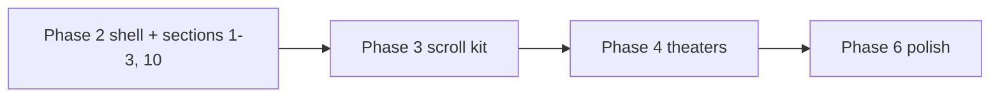

# P1-T17: Performance Budget (Phase 2+ Gate)

**Task ID:** P1-T17  
**Status:** done  
**Type:** Strategy and documentation (measurement workflow in [P1-T18](./P1-T18-perf-workflow.md))  
**Completed:** 2026-07-03  
**Parent:** [phase-1-tasks.md](../phase-1-tasks.md) | [phase-1-foundation.md](../phase-1-foundation.md) §4  
**Depends on:** nothing  
**Blocks:** Phase 2+ implementation, [P1-T18](./P1-T18-perf-workflow.md), [P1-T24](../phase-1-tasks.md#p1-t24--phase-1-sign-off-checklist)

---

## Quick reference

| Field | Value |
|-------|-------|
| **Policy** | Failing a budget metric **blocks merge** until fixed or budget is formally revised |
| **LCP target** | < 2.5s (mobile, throttled mid-tier) |
| **INP target** | < 200ms |
| **CLS target** | < 0.1 |
| **Initial JS** | Hero + marketing layout only; theaters code-split |
| **Measurement** | Lighthouse mobile + `next build` bundle review ([P1-T18](./P1-T18-perf-workflow.md)) |

---

## Gate policy (team agreement)

| Rule | Detail |
|------|--------|
| **Merge blocker** | Any homepage PR that regresses a budget metric below target blocks merge |
| **Fix first** | Optimize before weakening the budget |
| **Budget revision** | Requires update to this doc + explicit sign-off (same process as P1-T17 amendment) |
| **Scope** | Applies to `/` and `components/marketing/*` from Phase 2 onward |
| **Exceptions** | Document in PR description with before/after Lighthouse scores and justification |

**Signed:** Performance is a product requirement, not a nice-to-have. Linear-style sites feel fast; the macOS Hero homepage is the anti-pattern we are replacing.

---

## Core Web Vitals budget

| Metric | Target | Poor (blocks merge) | Tool | When to run |
|--------|--------|---------------------|------|-------------|
| **LCP** | < 2.5s | ≥ 2.5s | Lighthouse (Mobile, Slow 4G) | Before merge on homepage changes |
| **INP** | < 200ms | ≥ 200ms | Lighthouse or Chrome DevTools Performance | Before merge if interaction-heavy changes |
| **CLS** | < 0.1 | ≥ 0.1 | Lighthouse | Before merge on layout/copy changes |
| **TBT** (advisory) | < 300ms | ≥ 600ms | Lighthouse | Investigate if LCP/INP fail |
| **Performance score** (advisory) | ≥ 85 mobile | < 70 mobile | Lighthouse | Trend only; CWV targets are authoritative |

**LCP element (Phase 2):** Hero H1 or largest text block. No hero image required at launch; if OG/hero image added later, it must be optimized and not block text LCP.

**Test environment:** Production build (`next build && next start`), Chrome Incognito, Lighthouse mobile preset, 3 runs median.

---

## JavaScript budget

### Initial route JS (first paint / critical path)

**Allowed on `/` first load:**

| Category | Includes |
|----------|----------|
| Framework | Next.js + React runtime (unavoidable) |
| Fonts | Manrope (600–800) + Inter (400–600) via `next/font` |
| Layout | `MarketingLayout`, `MarketingNav`, `MarketingFooter` |
| Above-fold sections | `HeroSection`, `ProblemSection`, `HowItWorksSection` |
| Conversion (light) | Waitlist form logic in `FinalCTASection` (small fetch handler; no modal chrome) |
| Icons | `lucide-react` tree-shaken imports only |

**Rule (foundation):** Homepage initial JS = **Hero + layout only**. Theater sections are **code-split**.

### Must NOT load on first paint (block list)

| Asset / module | Why | Load instead |
|----------------|-----|--------------|
| `ProductTheaterConnect/Focus/Execute` | Heavy scroll + Framer Motion | `next/dynamic({ ssr: false })` when near viewport |
| `FeatureGridSection`, `IntegrationsSection`, `TrustSection` | Below fold | `next/dynamic` or lazy import |
| `framer-motion` (theater path) | Large bundle | Inside dynamic theater chunks only |
| `@lottiefiles/dotlottie-react` | Lottie runtime + network | Never on marketing `/` |
| Canvas / WebGL / `AnimatedBackground` | Main-thread paint cost | Remove from marketing routes |
| [`CustomCursorFollower.tsx`](../../../components/CustomCursorFollower.tsx) | Continuous mousemove | Exclude from `MarketingLayout` |
| [`CustomContextMenu.tsx`](../../../components/CustomContextMenu.tsx) | Global listeners | Exclude from marketing routes |
| [`ConditionalOverlays.tsx`](../../../components/ConditionalOverlays.tsx) | Mascot + sensor | Gate off `/` and marketing routes |
| [`MascotChatbot.tsx`](../../../components/MascotChatbot.tsx) | Lottie + chat UI | `/sensor&mascot` only |
| [`SensorBarSpotlight.tsx`](../../../components/SensorBarSpotlight.tsx) | Motion overlay | Dedicated pages only |
| Legacy [`Hero.tsx`](../../../components/Hero.tsx) | macOS windows + motion | Remove from `/` Phase 2 |
| `FeaturesWindow`, `DocsWindow`, `MovieWindow`, etc. | Hero window stack | Not on new homepage |
| [`DashboardDesktopShell.tsx`](../../../components/dashboard/view-shells/DashboardDesktopShell.tsx) Lottie/canvas | Dashboard only | Not imported by marketing |
| `HomeSectionProvider`, `OnboardingTourProvider`, `CustomCursorProvider` | Legacy Hero state | Strip from marketing layout Phase 2 |

### Code-splitting requirements (by section)

From [P1-T02-section-map.md](./P1-T02-section-map.md):

| Section | Lazy load JS | SSR | Notes |
|---------|--------------|-----|-------|
| 1 Hero | **No** | Yes | No Framer Motion above fold |
| 2 Problem | **No** | Yes | Text only |
| 3 How it works | **No** | Yes | Text + icons |
| 4–6 Theaters | **Yes** | `ssr: false` | Framer Motion allowed inside chunk |
| 7 Feature grid | **Yes** | Yes or dynamic | |
| 8 Integrations | **Yes** | Yes or dynamic | Static logos only |
| 9 Trust | **Yes** | Yes or dynamic | |
| 10 Final CTA | **No** (in document) | Yes | Form must work from nav jump; keep bundle minimal |

**Verification:** After `next build`, the main `/` page chunk must **not** import theater or Lottie modules. Confirm via `@next/bundle-analyzer` ([P1-T18](./P1-T18-perf-workflow.md)).

---

## Animation and scroll rules

| Rule | Requirement | Phase |
|------|-------------|-------|
| Scroll-linked animations | `transform` and `opacity` only | 3–4 |
| No layout thrash | No animating `width`, `height`, `top`, `left`, `margin`, `padding` in scroll paths | 3–4 |
| Page root | No `h-screen overflow-hidden` on homepage | 2 |
| Theater off-screen | Pause via `IntersectionObserver` when not visible | 3 |
| Reduced motion | Static final frame for theaters | 3–4 |
| Hero | **No scroll-linked motion** above fold | 2 |
| CSS marquee (integrations) | Only if perf-tested; default static grid | 6 |
| `will-change` | Sparingly; remove when animation completes | 3+ |

---

## Images and fonts

| Item | Phase 2 | Phase 6 |
|------|---------|---------|
| Hero / section images | Prefer none above fold; if added, `next/image` with explicit `width`/`height` | — |
| Integration logos | Static PNG/SVG, lazy below fold | — |
| OG image | Existing asset; regenerate after new hero | Phase 6 |
| `images.unoptimized: true` in [`next.config.js`](../../../next.config.js) | Known debt; marketing logos still use explicit dimensions | Enable optimization |
| Font subset | Manrope 600–800, Inter 400–600 only | — |
| `display: swap` | Required on all marketing fonts | — |

---

## Layout and rendering rules

| Rule | Target |
|------|--------|
| Below-fold sections 4–9 | `content-visibility: auto` where safe (Phase 6) |
| Third-party scripts | GA already in layout; no new blocking scripts on homepage |
| JSON-LD | Inline in page; negligible cost |
| Sticky nav | CSS + small scroll listener; no heavy observers on hero |
| Waitlist API | POST on submit only; no prefetch |

---

## Phase gates (what to check when)



| Phase | Gate checklist |
|-------|----------------|
| **Phase 2** | LCP/CLS on hero + problem + how-it-works; no Lottie/cursor/mascot on `/`; theater chunks absent from main bundle |
| **Phase 3** | Scroll hooks code-split; INP spot-check on nav scroll |
| **Phase 4** | Theaters lazy-loaded; reduced-motion path; off-screen pause |
| **Phase 5** | Feature page alignment (optional perf pass) |
| **Phase 6** | `images.unoptimized` fix; `content-visibility`; Lighthouse ≥ 85 mobile trend |

---

## Legacy homepage baseline (context)

Current [`app/page.tsx`](../../../app/page.tsx) renders legacy [`Hero.tsx`](../../../components/Hero.tsx), which pulls:

- `framer-motion`, draggable windows, `AnimatedBackground`
- Multiple window components statically imported
- Root layout: `ConditionalOverlays`, cursor providers, `#0a0a14` canvas

**Expectation:** New marketing homepage should **score better** than legacy Hero on mobile Lighthouse once Phase 2 ships. Capture legacy baseline in [P1-T18](./P1-T18-perf-workflow.md) before swap.

---

## PR review checklist (copy into Phase 2+ PRs)

```markdown
## Performance budget (P1-T17)

- [ ] Lighthouse mobile (production build): LCP < 2.5s, CLS < 0.1
- [ ] No new imports from block list on critical `/` path
- [ ] Theaters / below-fold sections use `next/dynamic` where required
- [ ] Scroll animations use transform/opacity only (if applicable)
- [ ] No Lottie, canvas, custom cursor, or mascot on marketing routes
- [ ] Fonts: Manrope/Inter subsets only; display: swap
- [ ] If budget missed: fix or link to approved budget revision
```

---

## Acceptance criteria checklist

- [x] Signed performance budget table (LCP, INP, CLS, JS, animation rules)
- [x] Checklist of what Phase 2 must **not** load on first paint
- [x] Team agrees failing a budget blocks merge until fixed or budget revised
- [x] Per-section lazy-load rules aligned with P1-T02
- [x] Phase gates documented for Phases 2–6

---

## Stakeholder sign-off

| Role | Name | Decision | Date |
|------|------|----------|------|
| Product / founder | Rohit | Accepted budget as merge gate for Phase 2+ | 2026-07-03 |

**P1-T17 status:** Done. Proceed to [P1-T18](./P1-T18-perf-workflow.md) (measurement workflow + baseline capture).

---

## Downstream handoff

| Consumer | Uses from this doc |
|----------|-------------------|
| P1-T18 | How to measure; baseline before Phase 2 swap |
| Phase 2 `app/page.tsx` | Dynamic imports + stripped providers |
| Phase 2 PR template | Review checklist |
| P1-T24 sign-off | Performance budget accepted |
| Phase 3–4 theaters | Animation + lazy-load rules |
