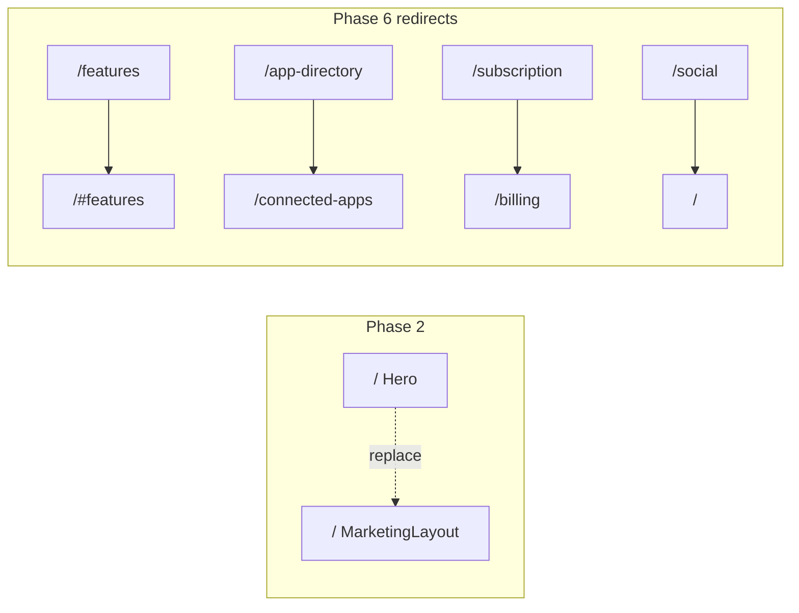

# P1-T19: Deprecation and Reuse Inventory

**Task ID:** P1-T19  
**Status:** done  
**Type:** Strategy and documentation (execution in Phases 2 and 6)  
**Completed:** 2026-07-03  
**Parent:** [phase-1-tasks.md](../phase-1-tasks.md) | [phase-1-foundation.md](../phase-1-foundation.md) §5  
**Depends on:** [P1-T02-section-map.md](./P1-T02-section-map.md)  
**Blocks:** Phase 2 `MarketingLayout`, [P1-T23](../phase-1-tasks.md#p1-t23--define-product-theater-reuse-map-static-components), [P1-T24](../phase-1-tasks.md#p1-t24--phase-1-sign-off-checklist)

---

## Quick reference

| Category | Count | Phase |
|----------|-------|-------|
| **Remove from `/` (Phase 2)** | Hero + macOS shell | Phase 2 |
| **Gate off marketing routes** | Mascot, sensor, custom cursor, context menu | Phase 2 |
| **Delete after redirects** | Hero routes file, window components | Phase 6 |
| **Reuse in theaters / CTA** | 8 Static* / UI components + waitlist API | Phase 3–4 |
| **Keep as plain pages** | 12+ routes already on `SiteNav` | Now |

---

## Confirmed: remove or relocate

### Tier 1 — Remove from new homepage (Phase 2)

Do **not** import these in `components/marketing/*` or new `app/page.tsx`.

| Item | Path | Disposition | Phase |
|------|------|-------------|-------|
| macOS Hero shell | [`components/Hero.tsx`](../../../components/Hero.tsx) | Remove from `/`; replace with `MarketingLayout` + sections | **2** |
| Hero side dock | [`components/layout/DesktopNav.tsx`](../../../components/layout/DesktopNav.tsx) | Not on marketing homepage; legacy Hero only | **2** off `/` |
| Animated background | [`components/layout/AnimatedBackground.tsx`](../../../components/layout/AnimatedBackground.tsx) | Hero only; no marketing equivalent | **2** off `/` |
| View mode switcher | [`components/ui/ViewSwitcherButton.tsx`](../../../components/ui/ViewSwitcherButton.tsx) | Hero/dashboard chrome | **2** off `/` |
| Dashboard full bleed | [`components/DashboardFullBleedPortal.tsx`](../../../components/DashboardFullBleedPortal.tsx) | Not on `/` marketing | **2** |
| Legacy `#0a0a14` canvas | `app/page.tsx`, root layout body | Use `--mm-bg` `#060e20` ([P1-T13](./P1-T13-color-tokens.md)) | **2** |

### Tier 2 — Gate off primary marketing funnel (Phase 2)

Keep code for dedicated/legacy routes until Phase 6; **exclude from** `/` and plain marketing pages.

| Item | Path | Disposition | Allowed on |
|------|------|-------------|------------|
| Mascot + sensor overlays | [`components/ConditionalOverlays.tsx`](../../../components/ConditionalOverlays.tsx) | Do not render on marketing routes | Legacy Hero routes + `/sensor&mascot` context only |
| Mascot chatbot | [`components/MascotChatbot.tsx`](../../../components/MascotChatbot.tsx) | Dedicated pages only | `/sensor&mascot` (via overlays today) |
| Sensor bar spotlight | [`components/SensorBarSpotlight.tsx`](../../../components/SensorBarSpotlight.tsx) | Dedicated pages only | Same |
| Custom cursor | [`components/CustomCursorFollower.tsx`](../../../components/CustomCursorFollower.tsx) | Remove from marketing | Legacy Hero only until delete |
| Custom context menu | [`components/CustomContextMenu.tsx`](../../../components/CustomContextMenu.tsx) | Remove from marketing | Legacy Hero only until delete |
| Cursor providers | [`components/CursorProvider.tsx`](../../../components/CursorProvider.tsx), [`context/CustomCursorContext.tsx`](../../../context/CustomCursorContext.tsx) | Strip from `MarketingLayout` tree | Legacy only |

**Marketing routes (no mascot/sensor/cursor):** `/`, `/inbox`, `/connected-apps`, `/yesterdays-narrative`, `/upcoming-events`, `/security`, `/trust`, `/billing`, `/faq`, `/privacy`, `/terms`, `/contact` (after plain migration), `/waitlist` (after plain migration).

**Mascot/sensor allowed:** [`app/sensor&mascot/page.tsx`](../../../app/sensor&mascot/page.tsx) only for primary funnel; legacy Hero windows may still show mascot until Phase 6.

### Tier 3 — Hero window components (delete after route migration)

Imported only by [`Hero.tsx`](../../../components/Hero.tsx). **Do not reuse** in `MarketingLayout`.

| Window component | Path | Content today | Replacement |
|------------------|------|---------------|---------------|
| FeaturesWindow | [`components/FeaturesWindow.tsx`](../../../components/FeaturesWindow.tsx) | Feature marketing copy | Homepage `#features` + depth pages |
| DocsWindow | [`components/DocsWindow.tsx`](../../../components/DocsWindow.tsx) | Docs FAQ | [`app/faq/page.tsx`](../../../app/faq/page.tsx), [`app/docs/page.tsx`](../../../app/docs/page.tsx) TBD |
| SocialWindow | [`components/SocialWindow.tsx`](../../../components/SocialWindow.tsx) | Social links | Footer / retire |
| PricingWindow | [`components/PricingWindow.tsx`](../../../components/PricingWindow.tsx) | Plans | [`app/billing/page.tsx`](../../../app/billing/page.tsx) |
| ContactWindow | [`components/ContactWindow.tsx`](../../../components/ContactWindow.tsx) | Contact form | Plain [`app/contact/page.tsx`](../../../app/contact/page.tsx) (Phase 6) |
| AppDirectoryWindow | [`components/AppDirectoryWindow.tsx`](../../../components/AppDirectoryWindow.tsx) | 5 integrations | [`app/connected-apps/page.tsx`](../../../app/connected-apps/page.tsx) |
| MovieWindow | [`components/MovieWindow.tsx`](../../../components/MovieWindow.tsx) | Demo video | Retire or external link |
| MindMeshUI (home window) | [`components/mindmeshui.tsx`](../../../components/mindmeshui.tsx) | Legacy home content | New homepage sections |

**Phase:** Remove with Hero when all [`MINDMESH_HERO_COMPONENT_ROUTES`](../../../lib/mindmesh-hero-routes.ts) have redirects (Phase 6).

### Tier 4 — Config and routing cleanup (Phase 6)

| Item | Path | Disposition |
|------|------|-------------|
| Hero route registry | [`lib/mindmesh-hero-routes.ts`](../../../lib/mindmesh-hero-routes.ts) | Delete after redirects in `next.config.js` |
| Home section context | [`context/HomeSectionContext.tsx`](../../../context/HomeSectionContext.tsx) | Hero scroll sections; remove if unused |
| UI overlay / onboarding | [`context/UIOverlayContext.tsx`](../../../context/UIOverlayContext.tsx), [`context/OnboardingTourContext.tsx`](../../../context/OnboardingTourContext.tsx) | Legacy Hero; not on marketing layout |

---

## Confirmed: reuse as-is (or adapt)

### Product theater (Phase 3–4)

| Component | Path | Theater | Notes |
|-----------|------|---------|-------|
| Connected apps panel | [`StaticConnectedApps.tsx`](../../../components/dashboard/StaticConnectedApps.tsx) | Connect `#connect` | **Refactor:** add Slack, Jira, Outlook Calendar; marketing variant props |
| Daily summary | [`StaticDailySummaryPanel.tsx`](../../../components/dashboard/StaticDailySummaryPanel.tsx) | Focus (optional) | Noise/context layer |
| Inbox list | [`StaticInboxList.tsx`](../../../components/dashboard/StaticInboxList.tsx) | Focus `#focus` | Acme fixture threads |
| Calendar events | [`StaticCalendarEvents.tsx`](../../../components/dashboard/StaticCalendarEvents.tsx) | Focus | Collapse into priority |
| Daily narrative card | [`StaticDailyNarrativeCard.tsx`](../../../components/dashboard/StaticDailyNarrativeCard.tsx) | Execute `#execute` | Adapt for draft/schedule/done beats |
| Typing text | [`TypingText.tsx`](../../../components/ui/TypingText.tsx) | Execute | Draft reply typing beat |
| Hover typing tooltip | [`HoverTypingTooltip.tsx`](../../../components/ui/HoverTypingTooltip.tsx) | Optional | Only if theater needs tooltips; avoid extra motion cost |

**Not for homepage theater:** [`StaticWeatherCard.tsx`](../../../components/dashboard/StaticWeatherCard.tsx) (dashboard demo only).

Detail matrix: [P1-T23](../phase-1-tasks.md#p1-t23--define-product-theater-reuse-map-static-components) (Phase 1 follow-up).

### Conversion (Phase 2)

| Component | Path | Use | Notes |
|-----------|------|-----|-------|
| Waitlist modal logic | [`WaitlistModal.tsx`](../../../components/WaitlistModal.tsx) | Extract form hook | **Do not** embed macOS modal on homepage; inline form per [P1-T12](./P1-T12-final-cta.md) |
| Waitlist API | [`app/api/waitlist/route.ts`](../../../app/api/waitlist/route.ts) | `#cta` POST | Reuse as-is |

### Layout / chrome (keep on plain pages)

| Component | Path | Use |
|-----------|------|-----|
| Site nav | [`components/layout/SiteNav.tsx`](../../../components/layout/SiteNav.tsx) | Feature pages today; reference for `MarketingNav` |
| Site footer | [`components/layout/SiteFooter.tsx`](../../../components/layout/SiteFooter.tsx), [`GlobalSiteFooter.tsx`](../../../components/layout/GlobalSiteFooter.tsx) | Global footer; align with marketing footer Phase 2 |
| Logo | [`components/Logo.tsx`](../../../components/Logo.tsx) | Floating wordmark on legacy Hero only; hide on new `/` |
| SEO helpers | [`lib/seo.ts`](../../../lib/seo.ts) | OG images across pages |

---

## Current route inventory

### Routes still rendering `<Hero />` (macOS shell)

From codebase audit ([`lib/mindmesh-hero-routes.ts`](../../../lib/mindmesh-hero-routes.ts)):

| Route | Page file | Window / behavior |
|-------|-----------|-------------------|
| `/` | [`app/page.tsx`](../../../app/page.tsx) | Full Hero stack |
| `/features` | [`app/features/page.tsx`](../../../app/features/page.tsx) | FeaturesWindow |
| `/docs` | [`app/docs/page.tsx`](../../../app/docs/page.tsx) | DocsWindow |
| `/app-directory` | [`app/app-directory/page.tsx`](../../../app/app-directory/page.tsx) | AppDirectoryWindow |
| `/demo` | [`app/demo/page.tsx`](../../../app/demo/page.tsx) | MovieWindow |
| `/subscription` | [`app/subscription/page.tsx`](../../../app/subscription/page.tsx) | PricingWindow |
| `/social` | [`app/social/page.tsx`](../../../app/social/page.tsx) | SocialWindow |
| `/contact` | [`app/contact/page.tsx`](../../../app/contact/page.tsx) | ContactWindow |
| `/waitlist` | [`app/waitlist/page.tsx`](../../../app/waitlist/page.tsx) | WaitlistModal via Hero |

Also in hero route list: `/dashboard` uses view-mode portal (not `<Hero />` in page, but shares Hero ecosystem).

### Plain pages (no Hero — marketing-aligned)

Already use `SiteNav` + Manrope-style layouts:

| Route | Page | Role |
|-------|------|------|
| `/inbox` | [`app/inbox/page.tsx`](../../../app/inbox/page.tsx) | Feature depth |
| `/connected-apps` | [`app/connected-apps/page.tsx`](../../../app/connected-apps/page.tsx) | Feature depth |
| `/yesterdays-narrative` | [`app/yesterdays-narrative/page.tsx`](../../../app/yesterdays-narrative/page.tsx) | Feature depth |
| `/upcoming-events` | [`app/upcoming-events/page.tsx`](../../../app/upcoming-events/page.tsx) | Feature depth |
| `/security` | [`app/security/page.tsx`](../../../app/security/page.tsx) | Trust depth |
| `/trust` | [`app/trust/page.tsx`](../../../app/trust/page.tsx) | Trust depth |
| `/billing` | [`app/billing/page.tsx`](../../../app/billing/page.tsx) | Pricing |
| `/faq` | [`app/faq/page.tsx`](../../../app/faq/page.tsx) | FAQ |
| `/privacy` | [`app/privacy/page.tsx`](../../../app/privacy/page.tsx) | Legal |
| `/terms` | [`app/terms/page.tsx`](../../../app/terms/page.tsx) | Legal |
| `/sensor&mascot` | [`app/sensor&mascot/page.tsx`](../../../app/sensor&mascot/page.tsx) | Mascot/sensor **only** dedicated page |
| `/dashboard` | [`app/dashboard/page.tsx`](../../../app/dashboard/page.tsx) | Product demo shell |

---

## Route migration sketch (Phase 6 redirects)

Apply in [`next.config.js`](../../../next.config.js) `redirects()` after plain targets exist. Phase 2 only migrates `/`.

| Legacy Hero URL | Phase 2 | Phase 6 redirect target | Notes |
|-----------------|--------|-------------------------|-------|
| `/` | **New marketing homepage** | — | Replace `Hero` with `MarketingLayout` |
| `/features` | Keep Hero temporarily | `/#features` | Homepage section 7 |
| `/app-directory` | Keep Hero temporarily | `/connected-apps` | Plain page exists |
| `/subscription` | Keep Hero temporarily | `/billing` | Plain page exists |
| `/waitlist` | Keep Hero or plain page | `/#cta` (optional) | Standalone waitlist OK with extracted form |
| `/docs` | Keep Hero temporarily | `/faq` | Or rebuild `/docs` as plain page |
| `/contact` | Keep Hero temporarily | `/contact` | Migrate to plain contact form (no Hero) |
| `/social` | Keep Hero temporarily | `/` | Low traffic; retire window |
| `/demo` | Keep Hero temporarily | `/` or external URL | Retire MovieWindow |
| `/dashboard` | No change | No redirect | Separate product demo |



After Phase 6: delete [`Hero.tsx`](../../../components/Hero.tsx), window components, [`mindmesh-hero-routes.ts`](../../../lib/mindmesh-hero-routes.ts).

---

## Root layout: marketing vs legacy split (Phase 2)

Today [`app/layout.tsx`](../../../app/layout.tsx) wraps **all** routes with legacy providers:

```
HomeSectionProvider → UIOverlayProvider → OnboardingTourProvider →
CustomCursorProvider → CursorProvider → DashboardViewModeRoot →
  children + Logo + ConditionalOverlays + GlobalSiteFooter
```

**Phase 2 target for `/`:**

- Use `MarketingLayout` with **minimal** providers (no overlay/cursor/onboarding/home-section).
- Option A: Conditional wrapper in root layout by pathname.
- Option B: Route group `app/(marketing)/layout.tsx` with clean tree.

**Keep on legacy Hero routes until Phase 6:** Full provider stack above.

---

## Anti-patterns (marketing layout)

Phase 2 engineers must **not**:

| Anti-pattern | Why |
|--------------|-----|
| Import `Hero.tsx` or any `*Window.tsx` | macOS metaphor retired |
| Import `ConditionalOverlays` on `/` | Mascot/sensor gated off funnel |
| Import `CustomCursorFollower` / `CustomContextMenu` | Perf + Linear style ([P1-T17](./P1-T17-performance-budget.md)) |
| Import `DesktopNav` / `AnimatedBackground` | Hero chrome |
| Reuse draggable `framer-motion` window pattern | Theater uses sticky frame only ([P1-T15](./P1-T15-layout-rules.md)) |
| Mount `DashboardViewModeRoot` behaviors on `/` | Dashboard is separate route |

**Allowed:** New `components/marketing/*`, `Static*` via dynamic theater chunks, `WaitlistForm` extract, `SiteNav` patterns.

---

## Mascot / sensor gating (confirmed)

Per [P1-T01](./P1-T01-narrative.md) and [P1-T02](./P1-T02-section-map.md):

| Surface | Mascot | Sensor bar |
|---------|--------|------------|
| Homepage `/` | **No** | **No** |
| Homepage sections 1–10 | **No** | **No** |
| `/sensor&mascot` | **Yes** | **Yes** |
| Feature pages (inbox, security, …) | **No** | **No** |
| Legacy Hero routes (until Phase 6) | May show (existing behavior) | May show |

**Implementation note:** Update [`ConditionalOverlays.tsx`](../../../components/ConditionalOverlays.tsx) or root layout so `MINDMESH_HERO_ROUTES` no longer includes `/` after Phase 2, and plain marketing paths never mount overlays.

---

## Acceptance criteria checklist

- [x] Confirmed remove/relocate list (Hero, windows, overlays, custom cursor on marketing)
- [x] Confirmed reuse list (Static*, WaitlistModal/API, TypingText)
- [x] Route migration sketch for Phase 6 redirects
- [x] Mascot/sensor gated to dedicated pages only (policy documented)
- [x] No accidental reuse of Hero window components in new marketing layout (anti-patterns listed)
- [x] Codebase audit: 9 Hero routes + 12 plain pages inventoried

---

## Stakeholder sign-off

| Role | Name | Decision | Date |
|------|------|----------|------|
| Product / founder | Rohit | Confirmed deprecation and reuse inventory | 2026-07-03 |

**P1-T19 status:** Done. Phase 2 may replace `/` without reusing Hero windows; Phase 6 owns redirects and deletion.

---

## Downstream handoff

| Consumer | Uses from this doc |
|----------|-------------------|
| Phase 2 `MarketingLayout` | Provider strip + anti-patterns |
| Phase 2 `app/page.tsx` | No Hero import |
| Phase 3–4 theaters | Reuse table → P1-T23 detail |
| Phase 6 | Redirect table + file deletion list |
| P1-T24 sign-off | Deprecation/reuse confirmed |
