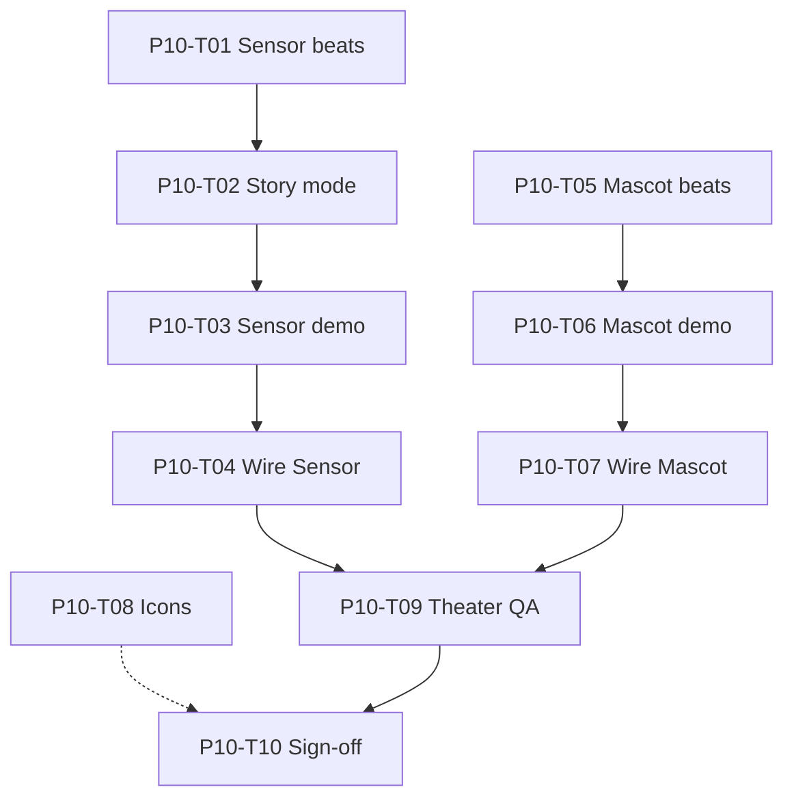

# Phase 10: Task Breakdown

Parent spec: [phase-10-theater-upgrades.md](./phase-10-theater-upgrades.md) · Phase 9: [phase-9-slack-compliance.md](./phase-9-slack-compliance.md) · Sign-off: [P9-T08](./phase-9/tasks/P9-T08-sign-off.md) · Scroll kit: [phase-3-scroll-kit.md](./phase-3-scroll-kit.md) · Phase 8 theaters: [phase-8-sensor-mascot.md](./phase-8-sensor-mascot.md)

This file breaks Phase 10 into tasks for **richer Sensor and Mascot scroll theaters** (calc/definition, attachment search, mascot icons). Expand any task into `docs/phase-10/tasks/P10-T##-*.md` when needed.

**How to use this file**

1. Pick a task by ID (for example `P10-T01`).
2. Read [phase-10-theater-upgrades.md](./phase-10-theater-upgrades.md) for goals and contracts.
3. Implement, then mark status `done` here.
4. Do not mark Phase 10 complete until all **Blocker** tasks are `done` and P10-T10 sign-off is recorded.

**Status values:** `todo` | `in_progress` | `done` | `blocked`

**Prerequisite:** [P9-T08 sign-off](./phase-9/tasks/P9-T08-sign-off.md) (Phase 9 complete, 2026-07-10).

---

## Task index (quick view)

| ID | Task | Status | Blocker? |
|----|------|--------|----------|
| P10-T01 | Lock Sensor calc/definition beat sheet + fixtures | done | Yes |
| P10-T02 | Decide Sensor story mode (second section vs replace Open Cal) | done | Yes |
| P10-T03 | Implement Sensor calc/definition theater demo | done | Yes |
| P10-T04 | Wire Sensor story on `/sensor` | done | Yes |
| P10-T05 | Lock Mascot attachment-search beat sheet + fixtures | done | Yes |
| P10-T06 | Implement Mascot attachment-search theater demo | done | Yes |
| P10-T07 | Wire Mascot attachment story on `/mascot` | done | Yes |
| P10-T08 | Mascot icon / skin inventory + showcase UI | done | No |
| P10-T09 | Theater QA (reduced-motion + off-screen pause) | done | Yes |
| P10-T10 | Phase 10 sign-off checklist | done | Yes |

**Total:** 10 tasks · **Blockers:** 9 · **Phase 10:** complete (P10-T10) · **Prerequisite:** [P9-T08](./phase-9/tasks/P9-T08-sign-off.md)

---

## Workstream A: Sensor calc / definition

### P10-T01 — Lock Sensor calc/definition beat sheet + fixtures

**Status:** done  
**Blocker:** Yes  
**Depends on:** [P8-T05](./phase-8/tasks/P8-T05-sensor-beat-sheet.md), [P8-T09](./phase-8/tasks/P8-T09-sensor-theater-demo.md)  
**Blocks:** P10-T02, P10-T03  
**Doc:** [P10-T01-sensor-calc-beat-sheet.md](./phase-10/tasks/P10-T01-sensor-calc-beat-sheet.md) (completed 2026-07-10)

**Goal:** Freeze scrub beats for a quick calculation or definition query → result card (not only “Open Cal”). Lock fixture copy, reduced-motion final frame, and panel states. No em dashes.

**Done:** Calc primary (`15% of 240` → **36**); six beats; RM 0.90; definition as non-scrubbed alternate only. Story mode deferred to P10-T02.

---

### P10-T02 — Decide Sensor story mode

**Status:** done  
**Blocker:** Yes  
**Depends on:** P10-T01  
**Blocks:** P10-T03, P10-T04  
**Doc:** [P10-T02-sensor-story-mode.md](./phase-10/tasks/P10-T02-sensor-story-mode.md) (completed 2026-07-10)

**Goal:** Choose product approach: (A) second theater section on `/sensor`, (B) replace primary Open Cal story, or (C) alternate demo mode toggled carefully so reduced-motion finals stay clear. Document the choice.

**Done:** Mode **A** locked. Keep Open Cal; add second section with `TheaterId` `sensorCalc`. Order: Open Cal → calc.

---

### P10-T03 — Implement Sensor calc/definition theater demo

**Status:** done  
**Blocker:** Yes  
**Depends on:** P10-T01, P10-T02, scroll kit (`sensor` TheaterId)  
**Blocks:** P10-T04, P10-T09  
**Doc:** [P10-T03-sensor-calc-demo.md](./phase-10/tasks/P10-T03-sensor-calc-demo.md) (completed 2026-07-10)

**Goal:** Coded UI + local fixtures; `transform` / `opacity` only; reuse `ProductFrame` / scroll section patterns from Phase 8. No live Sensor overlay, Lottie, or remote images.

**Done:** `sensorCalc` in scroll kit; `SensorCalcTheaterDemo` + `MarketingSensorCalcPanel`; fixtures/section chrome. Page wire = P10-T04.

---

### P10-T04 — Wire Sensor story on `/sensor`

**Status:** done  
**Blocker:** Yes  
**Depends on:** P10-T03  
**Blocks:** P10-T09  
**Doc:** [P10-T04-wire-sensor-calc.md](./phase-10/tasks/P10-T04-wire-sensor-calc.md) (completed 2026-07-10)

**Goal:** Mount the new (or replaced) demo on `/sensor` with captions/copy aligned to P10-T01. Keep page on `MarketingDepthLayout`.

**Done:** `ProductTheaterSensorCalc` after Open Cal; `#sensor-calc-theater` / `sensorCalc`.

---

## Workstream B: Mascot attachment search

### P10-T05 — Lock Mascot attachment-search beat sheet + fixtures

**Status:** done  
**Blocker:** Yes  
**Depends on:** [P8-T06](./phase-8/tasks/P8-T06-mascot-beat-sheet.md), [P8-T11](./phase-8/tasks/P8-T11-mascot-theater-demo.md)  
**Blocks:** P10-T06  
**Doc:** [P10-T05-mascot-attachment-beat-sheet.md](./phase-10/tasks/P10-T05-mascot-attachment-beat-sheet.md) (completed 2026-07-10)

**Goal:** Freeze story: “Find the attachment from Acme last year” → grounded hit + open affordance. Fixtures, reduced-motion final, panel states. Stronger product signal than email-count alone.

**Done:** Mode A + `mascotAttachment`; ask → typing → reply → hit card (`Acme_Q3_Plan.pdf`) → Open attachment; RM 0.88.

---

### P10-T06 — Implement Mascot attachment-search theater demo

**Status:** done  
**Blocker:** Yes  
**Depends on:** P10-T05  
**Blocks:** P10-T07, P10-T09  
**Doc:** [P10-T06-mascot-attachment-demo.md](./phase-10/tasks/P10-T06-mascot-attachment-demo.md) (completed 2026-07-10)

**Goal:** Coded UI + local fixtures; same motion contracts as Phase 8. No live `MascotChatbot` / Lottie / remote CDN.

**Done:** `mascotAttachment` in scroll kit; `MascotAttachmentTheaterDemo` + panel; fixtures/section chrome. Page wire = P10-T07.

---

### P10-T07 — Wire Mascot attachment story on `/mascot`

**Status:** done  
**Blocker:** Yes  
**Depends on:** P10-T06  
**Blocks:** P10-T09  
**Doc:** [P10-T07-wire-mascot-attachment.md](./phase-10/tasks/P10-T07-wire-mascot-attachment.md) (completed 2026-07-10)

**Goal:** Mount attachment-search demo on `/mascot` as second section (`mascotAttachment` per [P10-T05](./phase-10/tasks/P10-T05-mascot-attachment-beat-sheet.md)). Keep marketing shell.

**Done:** `ProductTheaterMascotAttachment` after email-count; `#mascot-attachment-theater` / `mascotAttachment`.

---

## Workstream C: Mascot icons (recommended)

### P10-T08 — Mascot icon / skin inventory + showcase UI

**Status:** done  
**Blocker:** No  
**Depends on:** Local assets under `public/`  
**Blocks:** —  
**Doc:** [P10-T08-mascot-icons.md](./phase-10/tasks/P10-T08-mascot-icons.md) (completed 2026-07-10)

**Goal:** Inventory offered mascot icons/skins; ship a small showcase chrome on `/mascot` (or theater chrome) using local assets only. Not Marketplace-blocking.

**Done:** Approach A: 7 product companions (Sherpa–Whiskers) as local stills under `public/images/mascot-skins/`; `#mascot-icons` showcase after attachment theater. No live Lottie on `/mascot`.

---

## Workstream D: QA + sign-off

### P10-T09 — Theater QA (reduced-motion + off-screen pause)

**Status:** done  
**Blocker:** Yes  
**Depends on:** P10-T04, P10-T07  
**Blocks:** P10-T10  
**Doc:** [P10-T09-theater-qa.md](./phase-10/tasks/P10-T09-theater-qa.md) (completed 2026-07-10)

**Goal:** CDP or manual QA: reduced-motion finals clear; off-screen pause; no overlays/scroll-lock regressions on `/sensor` and `/mascot`. Record notes under `docs/phase-10/tasks/`.

**Done:** All four theaters (`sensor`, `sensorCalc`, `mascot`, `mascotAttachment`) passed RM finals + off-screen pause/resume. Follow-up manual review shortened depth runways to 170vh and isolated sticky layers so each story finishes before the next section enters.

---

### P10-T10 — Phase 10 sign-off checklist

**Status:** done  
**Blocker:** Yes  
**Depends on:** All blockers through P10-T09  
**Blocks:** —  
**Doc:** [P10-T10-sign-off.md](./phase-10/tasks/P10-T10-sign-off.md) (completed 2026-07-10)

**Goal:** Formal gate: Sensor calc/definition and Mascot attachment-search ship; QA passed; icon showcase done or explicitly deferred.

**Done:** All blockers + recommended P10-T08 complete; Phase 10 signed off.

---

## Dependency graph

---

## Phase 10 definition of done

- [x] Sensor shows calc/definition value clearly in scroll theater  
- [x] Mascot shows attachment-search value clearly  
- [x] Mascot icons/skins visible with local assets (or deferred in sign-off)  
- [x] Theater QA (pause + reduced motion) passed  
- [x] P10-T10 sign-off recorded  

---

## Explicit non-goals (reminder)

- Live API data in demos  
- Rewriting homepage Connect / Focus / Execute  
- Slack compliance pages (Phase 9)  
- Live overlays on marketing funnel  
- `/dashboard` redesign  
