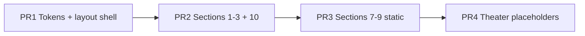

# Phase 2: Marketing Shell

**Status:** Ready to start  
**Prerequisite:** [Phase 1 sign-off](./phase-1/tasks/P1-T24-sign-off.md) (2026-07-03)  
**Task breakdown:** [phase-2-tasks.md](./phase-2-tasks.md) (27 tasks)  
**Parent plan:** [phase-1-foundation.md](./phase-1-foundation.md)  
**First code landing here:** `components/marketing/*`, new `app/page.tsx`

Phase 2 replaces the legacy macOS Hero on `/` with a Linear-style marketing homepage. All copy, tokens, section order, and performance gates are locked in Phase 1 docs. **Use [phase-2-tasks.md](./phase-2-tasks.md) as the implementation checklist**; this file is the overview and definition of done.

---

## Goal

Ship a **working marketing homepage** at `/` with:

1. Dark marketing theme (`#060e20`, semantic `--mm-*` tokens)
2. `MarketingLayout` (nav, footer, no Hero chrome)
3. All **10 sections** composed in order (theaters may ship as static placeholders first)
4. No mascot, sensor bar, custom cursor, or Lottie on `/`

Theaters gain scroll animation in **Phase 3–4**. Legacy Hero deletion and redirects happen in **Phase 6**.

---

## Phase 1 inputs (read before coding)

| Topic | Doc |
|-------|-----|
| Section order + component names | [P1-T02-section-map.md](./phase-1/tasks/P1-T02-section-map.md) |
| Copy decks (sections 1–3, 7–10) | [P1-T03](./phase-1/tasks/P1-T03-hero-copy.md) – [P1-T05](./phase-1/tasks/P1-T05-how-it-works-copy.md), [P1-T09](./phase-1/tasks/P1-T09-feature-grid.md) – [P1-T12](./phase-1/tasks/P1-T12-final-cta.md) |
| Theater briefs (static frames OK in Phase 2) | [P1-T06](./phase-1/tasks/P1-T06-theater-connect.md) – [P1-T08](./phase-1/tasks/P1-T08-theater-execute.md) |
| Design tokens (copy CSS block) | [P1-T16-token-reference.md](./phase-1/tasks/P1-T16-token-reference.md) |
| What to remove from `/` | [P1-T19-deprecation-reuse.md](./phase-1/tasks/P1-T19-deprecation-reuse.md) |
| Performance gates | [P1-T17-performance-budget.md](./phase-1/tasks/P1-T17-performance-budget.md) |
| Integrations constant + icons | [P1-T10-integrations.md](./phase-1/tasks/P1-T10-integrations.md) |
| Trust + NVIDIA | [P1-T11-social-proof.md](./phase-1/tasks/P1-T11-social-proof.md), [P1-T22-nvidia-inception.md](./phase-1/tasks/P1-T22-nvidia-inception.md) |

---

## Recommended PR sequence

Maps to [phase-2-tasks.md](./phase-2-tasks.md) workstreams. See the task file for full dependencies and acceptance criteria.



| PR | Scope | Tasks | Exit criteria |
|----|-------|-------|---------------|
| **PR1** | Tokens + layout shell | P2-T01–T06, T08 | `/` renders empty shell on `#060e20`; no Hero imports |
| **PR2** | Sections 1–3 + 10 | P2-T12–T16, T24 | Copy matches P1-T03–05, P1-T12; waitlist form works |
| **PR3** | Sections 7–9 | P2-T09–T10, T21–T23 | 5 cards, 7 logos, NVIDIA badge visible |
| **PR4** | Theater placeholders + compose | P2-T11, T17–T20, T07 | All anchors work; theaters code-split |
| **PR5** | Perf + sign-off | P2-T25–T27 | Lighthouse gates pass; P2-T27 signed |

Phase 3 adds `ProductFrame`, `useScrollSection`, and scroll choreography ([P1-T23](./phase-1/tasks/P1-T23-theater-reuse-map.md)).

---

## File structure

```
components/marketing/
  MarketingLayout.tsx       # data-marketing-theme="dark" root
  MarketingNav.tsx          # Product · Features · Security · Join waitlist
  MarketingFooter.tsx
  sections/
    HeroSection.tsx
    ProblemSection.tsx
    HowItWorksSection.tsx
    ProductTheaterConnect.tsx   # dynamic, ssr: false (Phase 2 placeholder OK)
    ProductTheaterFocus.tsx
    ProductTheaterExecute.tsx
    FeatureGridSection.tsx
    IntegrationsSection.tsx
    TrustSection.tsx
    FinalCTASection.tsx
lib/
  marketing-integrations.ts     # MARKETING_INTEGRATIONS from P1-T10
  marketing-trust-content.ts    # NVIDIA block from P1-T11
  marketing-demo-data.ts        # Acme fixtures (Phase 3–4; stub OK in Phase 2)
```

`ProductFrame.tsx` lives under `components/marketing/` in **Phase 3** ([P1-T02 § Phase 2 file structure](./phase-1/tasks/P1-T02-section-map.md#phase-2-file-structure)).

---

## Homepage composition

Replace legacy Hero in [`app/page.tsx`](../app/page.tsx):

```tsx
import { MarketingLayout } from '@/components/marketing/MarketingLayout';
import { HeroSection } from '@/components/marketing/sections/HeroSection';
// ... other sections
// Theaters: next/dynamic({ ssr: false })

export default function HomePage() {
  return (
    <MarketingLayout>
      <HeroSection />
      <ProblemSection />
      <HowItWorksSection />
      <ProductTheaterConnect />
      <ProductTheaterFocus />
      <ProductTheaterExecute />
      <FeatureGridSection />
      <IntegrationsSection />
      <TrustSection />
      <FinalCTASection />
    </MarketingLayout>
  );
}
```

---

## MarketingLayout requirements

From [P1-T19](./phase-1/tasks/P1-T19-deprecation-reuse.md) and [P1-T16](./phase-1/tasks/P1-T16-token-reference.md):

| Rule | Detail |
|------|--------|
| Root attribute | `data-marketing-theme="dark"` on layout wrapper |
| Background | `--mm-bg` `#060e20` (not legacy `#0a0a14`) |
| Fonts | Manrope (display) + Inter (body) per [P1-T14](./phase-1/tasks/P1-T14-typography.md) |
| **Exclude providers** | `HomeSectionProvider`, `OnboardingTourProvider`, `CustomCursorProvider`, `UIOverlayContext` |
| **Exclude components** | `Hero`, `ConditionalOverlays`, `CustomCursorFollower`, `AnimatedBackground`, `ViewSwitcherButton` |
| Max width | `max-w-[1120px]` content container per [P1-T15](./phase-1/tasks/P1-T15-layout-rules.md) |
| Nav | Sticky after scroll past `#hero`; links per [P1-T02 nav spec](./phase-1/tasks/P1-T02-section-map.md#sticky-nav-spec-minimal-linear-style) |

---

## Sticky nav (locked)

| Label | Target |
|-------|--------|
| Product | `#connect` |
| Features | `#features` |
| Security | `#trust` |
| Join waitlist | `#cta` (primary button) |

---

## Section implementation priority

| # | Section | Phase 2 minimum | Full animation |
|---|---------|-----------------|----------------|
| 1 | Hero | Full copy + CTAs | N/A |
| 2 | Problem | Full copy | N/A |
| 3 | How it works | 3 steps + icons | N/A |
| 4 | Connect theater | Static 7-app grid frame | Phase 3–4 |
| 5 | Focus theater | Static priority card | Phase 3–4 |
| 6 | Execute theater | Static success frame | Phase 3–4 |
| 7 | Feature grid | 5 linked cards | N/A |
| 8 | Integrations | 7-logo grid | Optional marquee Phase 6 |
| 9 | Trust | NVIDIA badge + disclaimer | N/A |
| 10 | Final CTA | Inline waitlist form | N/A |

Theater placeholders should use **reduced-motion final frames** from P1-T06–08 so the story reads end-to-end before scroll animation lands.

---

## Reuse (do not rebuild)

| Existing | Use for |
|----------|---------|
| [`WaitlistModal.tsx`](../components/WaitlistModal.tsx) + [`app/api/waitlist/route.ts`](../app/api/waitlist/route.ts) | Final CTA form logic ([P1-T12](./phase-1/tasks/P1-T12-final-cta.md)) |
| `public/images/icons/*` (7 PNGs) | Integrations + theater app cards |
| `public/images/badges/nvidia-inception.svg` | Trust section |

Extract shared `WaitlistForm` in Phase 2 if modal and inline CTA duplicate validation.

---

## Performance checklist (every PR)

Copy from [P1-T17](./phase-1/tasks/P1-T17-performance-budget.md):

- [ ] LCP target: hero text, no blocking hero image
- [ ] No Lottie, mascot, sensor, custom cursor on `/`
- [ ] Theater chunks: `next/dynamic({ ssr: false })`
- [ ] Below-fold sections: consider `content-visibility: auto`
- [ ] Animations: `transform` + `opacity` only
- [ ] Run Lighthouse mobile before merge ([P1-T18](./phase-1/tasks/P1-T18-perf-workflow.md))
- [ ] Capture legacy baseline before swap if not done ([baseline template](./phase-1/baselines/homepage-legacy-lighthouse.md))

---

## Explicit non-goals (Phase 2)

- Scroll-linked theater animation (Phase 3–4)
- Refactoring `StaticConnectedApps` for 7 apps (Phase 4 per [P1-T23](./phase-1/tasks/P1-T23-theater-reuse-map.md))
- Updating `/connected-apps`, FAQ, privacy for 7-app copy (Phase 5–6)
- Deleting `Hero.tsx` or Hero window components (Phase 6)
- Enabling Next.js image optimization (`unoptimized: true` stays until Phase 6)
- Regenerating OG image (Phase 6)

---

## Definition of done (Phase 2)

Phase 2 is complete when:

- [ ] `/` uses `MarketingLayout`; legacy Hero not imported
- [ ] All 10 sections render in frozen order with approved copy
- [ ] Marketing tokens active under `[data-marketing-theme="dark"]`
- [ ] Waitlist CTA works (inline form → existing API)
- [ ] Mobile Lighthouse: LCP < 2.5s, CLS < 0.1 on throttled mobile ([P1-T17](./phase-1/tasks/P1-T17-performance-budget.md))
- [ ] No mascot/sensor/cursor on marketing `/`

---

## After Phase 2

| Phase | Focus |
|-------|-------|
| **3** | `ProductFrame`, `useScrollSection`, scroll pause/off-screen behavior |
| **4** | Theater animations + Static* marketing variants ([P1-T23](./phase-1/tasks/P1-T23-theater-reuse-map.md)) |
| **5** | Depth pages aligned to 7-app story |
| **6** | Hero deletion, redirects, OG refresh, image optimization |
