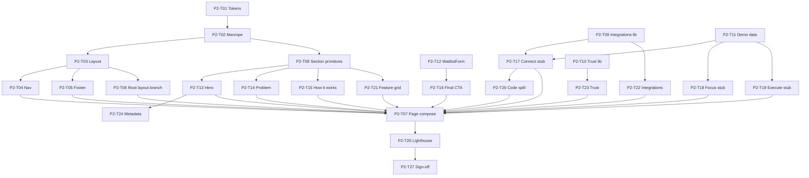

# Phase 2: Task Breakdown

Parent spec: [phase-2-shell.md](./phase-2-shell.md) · Phase 1: [phase-1-foundation.md](./phase-1-foundation.md)

This file breaks Phase 2 into individual implementation tasks. Each task maps to concrete files in `components/marketing/*`, `lib/marketing-*.ts`, and `app/page.tsx`. Expand any task into `docs/phase-2/tasks/P2-T##-*.md` when you need a longer implementation checklist.

**How to use this file**

1. Pick a task by ID (for example `P2-T13`).
2. Read the linked Phase 1 spec for copy and design rules.
3. Implement, then mark status `done` here.
4. Do not mark Phase 2 complete until all **Blocker** tasks are `done` and [P2-T27](./phase-2-tasks.md#p2-t27--phase-2-sign-off-checklist) is signed off.

**Status values:** `todo` | `in_progress` | `done` | `blocked`

**Prerequisite:** [P1-T24 sign-off](./phase-1/tasks/P1-T24-sign-off.md) (Phase 1 complete)

---

## Task index (quick view)

| ID | Task | Status | Blocker? |
|----|------|--------|----------|
| P2-T01 | Wire marketing tokens in `globals.css` | done | Yes |
| P2-T02 | Add Manrope display font | done | Yes |
| P2-T03 | Build `MarketingLayout` shell | done | Yes |
| P2-T04 | Build `MarketingNav` (sticky + anchor scroll) | done | Yes |
| P2-T05 | Build `MarketingFooter` | done | No |
| P2-T06 | Root layout: hide legacy chrome on `/` | done | Yes |
| P2-T07 | Compose `app/page.tsx` (replace Hero) | done | Yes |
| P2-T08 | Shared section primitives | done | Yes |
| P2-T09 | `lib/marketing-integrations.ts` | done | No |
| P2-T10 | `lib/marketing-trust-content.ts` | done | No |
| P2-T11 | `lib/marketing-demo-data.ts` (Acme stubs) | done | No |
| P2-T12 | Extract shared `WaitlistForm` | done | No |
| P2-T13 | Implement `HeroSection` | done | Yes |
| P2-T14 | Implement `ProblemSection` | done | Yes |
| P2-T15 | Implement `HowItWorksSection` | done | Yes |
| P2-T16 | Implement `FinalCTASection` | done | Yes |
| P2-T17 | Implement `ProductTheaterConnect` (static) | done | Yes |
| P2-T18 | Implement `ProductTheaterFocus` (static) | done | Yes |
| P2-T19 | Implement `ProductTheaterExecute` (static) | done | Yes |
| P2-T20 | Theater `next/dynamic` code-splitting | done | Yes |
| P2-T21 | Implement `FeatureGridSection` | done | Yes |
| P2-T22 | Implement `IntegrationsSection` | done | Yes |
| P2-T23 | Implement `TrustSection` | done | Yes |
| P2-T24 | Update homepage metadata + JSON-LD | done | Yes |
| P2-T25 | Capture legacy Lighthouse baseline | done | No |
| P2-T26 | Phase 2 Lighthouse verification | done | Yes |
| P2-T27 | Phase 2 sign-off checklist | todo | Yes |

**Total:** 27 tasks · **Blockers:** 20 · **Recommended first task:** P2-T01

---

## Workstream A: Foundation (theme + layout)

### P2-T01 — Wire marketing tokens in `globals.css`

**Status:** done  
**Blocker:** Yes  
**Depends on:** P1-T16  
**Deliverable:** [P2-T01-marketing-tokens.md](./phase-2/tasks/P2-T01-marketing-tokens.md) (completed 2026-07-03) · [`app/globals.css`](../app/globals.css)

---

### P2-T02 — Add Manrope display font

**Status:** done  
**Blocker:** Yes  
**Depends on:** P1-T14  
**Deliverable:** [P2-T02-manrope-font.md](./phase-2/tasks/P2-T02-manrope-font.md) (completed 2026-07-03) · [`app/layout.tsx`](../app/layout.tsx), [`tailwind.config.ts`](../tailwind.config.ts)

---

### P2-T03 — Build `MarketingLayout` shell

**Status:** done  
**Blocker:** Yes  
**Depends on:** P2-T01, P2-T02  
**Deliverable:** [P2-T03-marketing-layout.md](./phase-2/tasks/P2-T03-marketing-layout.md) (completed 2026-07-03) · [`MarketingLayout.tsx`](../../components/marketing/MarketingLayout.tsx)

---

### P2-T04 — Build `MarketingNav` (sticky + anchor scroll)

**Status:** done  
**Blocker:** Yes  
**Depends on:** P2-T03, P1-T02  
**Deliverable:** [P2-T04-marketing-nav.md](./phase-2/tasks/P2-T04-marketing-nav.md) (completed 2026-07-03) · [`MarketingNav.tsx`](../../components/marketing/MarketingNav.tsx)

---

### P2-T05 — Build `MarketingFooter`

**Status:** done  
**Blocker:** No  
**Depends on:** P2-T03  
**Deliverable:** [P2-T05-marketing-footer.md](./phase-2/tasks/P2-T05-marketing-footer.md) (completed 2026-07-03) · [`MarketingFooter.tsx`](../../components/marketing/MarketingFooter.tsx)

---

### P2-T06 — Root layout: hide legacy chrome on `/`

**Status:** done  
**Blocker:** Yes  
**Depends on:** P2-T03, P1-T19  
**Deliverable:** [P2-T06-root-layout-marketing-branch.md](./phase-2/tasks/P2-T06-root-layout-marketing-branch.md) (completed 2026-07-03) · [`RootAppShell.tsx`](../../components/layout/RootAppShell.tsx)

---

### P2-T07 — Compose `app/page.tsx` (replace Hero)

**Status:** done  
**Blocker:** Yes  
**Depends on:** P2-T03–T06, P2-T13–T23, P2-T20  
**Blocks:** P2-T26, P2-T27  
**Deliverable:** [P2-T07-homepage-composition.md](./phase-2/tasks/P2-T07-homepage-composition.md) (completed 2026-07-03) · [`app/page.tsx`](../app/page.tsx), [`MarketingTheaterSections.tsx`](../components/marketing/MarketingTheaterSections.tsx)

---

## Workstream B: Shared primitives and data

### P2-T08 — Shared section primitives

**Status:** todo  
**Blocker:** Yes  
**Depends on:** P2-T01, P2-T02  
**Blocks:** P2-T13–T23

**Goal:** DRY section shell so all 10 sections share spacing, width, and heading styles.

**Deliverable**

- [`components/marketing/MarketingSection.tsx`](../components/marketing/MarketingSection.tsx) (or equivalent)
- Props: `id`, `eyebrow?`, `title?`, `subtitle?`, `children`
- Applies: `max-w-[1120px] mx-auto`, `py-24 lg:py-32`, `px-6` per [P1-T15](./phase-1/tasks/P1-T15-layout-rules.md)
- Optional: `MarketingEyebrow`, `MarketingHeading` subcomponents

**Acceptance criteria**

- [ ] All section components use shared primitive (no one-off padding drift)
- [ ] Heading sizes match P1-T14 scale (`display-lg` for section headlines)

**Expand into:** `docs/phase-2/tasks/P2-T08-section-primitives.md`

---

### P2-T09 — `lib/marketing-integrations.ts`

**Status:** todo  
**Blocker:** No  
**Depends on:** P1-T10, P1-T21  
**Blocks:** P2-T17, P2-T22

**Goal:** Single source for 7-app integration list.

**Deliverable**

- [`lib/marketing-integrations.ts`](../lib/marketing-integrations.ts)
- Export `MARKETING_INTEGRATIONS` constant (shape from [P1-T10](./phase-1/tasks/P1-T10-integrations.md))
- All `iconSrc` paths point to existing PNGs in `public/images/icons/`

**Acceptance criteria**

- [ ] 7 apps in Connect theater order
- [ ] Canonical display names (Google Calendar, Outlook Email, SMTP Mailbox)
- [ ] Used by `IntegrationsSection` and Connect theater stub

**Expand into:** `docs/phase-2/tasks/P2-T09-marketing-integrations.md`

---

### P2-T10 — `lib/marketing-trust-content.ts`

**Status:** todo  
**Blocker:** No  
**Depends on:** P1-T11, P1-T22  
**Blocks:** P2-T23

**Goal:** Centralize trust section copy and NVIDIA asset paths.

**Deliverable**

- [`lib/marketing-trust-content.ts`](../lib/marketing-trust-content.ts)
- NVIDIA member line, disclaimer, badge src, link URL from [P1-T22](./phase-1/tasks/P1-T22-nvidia-inception.md)
- Trust bullets from [P1-T11](./phase-1/tasks/P1-T11-social-proof.md)

**Acceptance criteria**

- [ ] `badgeSrc: '/images/badges/nvidia-inception.svg'`
- [ ] Disclaimer text matches P1-T22 exactly
- [ ] Waitlist count secondary ("10+ early users") if shown

**Expand into:** `docs/phase-2/tasks/P2-T10-marketing-trust-content.md`

---

### P2-T11 — `lib/marketing-demo-data.ts` (Acme stubs)

**Status:** todo  
**Blocker:** No  
**Depends on:** P1-T06–08, P1-T23  
**Blocks:** P2-T17–T19

**Goal:** Minimal fixture data for static theater placeholders (full set expanded in Phase 3–4).

**Deliverable**

- [`lib/marketing-demo-data.ts`](../lib/marketing-demo-data.ts)
- Phase 2 minimum exports:
  - `PRIORITY_FIXTURE_ACME`
  - `CONNECTED_APP_FIXTURES_ACME` (or re-export from integrations)
  - `DRAFT_BODY_ACME`, `CALENDAR_PREP_FIXTURE_ACME`, `JIRA_FIXTURE_ACME` (Execute stub)

**Acceptance criteria**

- [ ] Priority title matches P1-T07: "Prepare for 2pm client call"
- [ ] Same persona across Focus + Execute stubs
- [ ] No live API calls

**Expand into:** `docs/phase-2/tasks/P2-T11-marketing-demo-data.md`

---

### P2-T12 — Extract shared `WaitlistForm`

**Status:** todo  
**Blocker:** No  
**Depends on:** P1-T12  
**Blocks:** P2-T16

**Goal:** Reuse waitlist validation + API POST for inline CTA and existing modal.

**Deliverable**

- [`components/marketing/WaitlistForm.tsx`](../components/marketing/WaitlistForm.tsx) (or `components/WaitlistForm.tsx`)
- Fields: name, email, platform (from [P1-T12](./phase-1/tasks/P1-T12-final-cta.md))
- POST to [`app/api/waitlist/route.ts`](../app/api/waitlist/route.ts)
- Optional: refactor [`WaitlistModal.tsx`](../components/WaitlistModal.tsx) to use shared form

**Acceptance criteria**

- [ ] Successful submit shows confirmation state
- [ ] Error handling for duplicate / validation
- [ ] No macOS modal required on homepage

**Expand into:** `docs/phase-2/tasks/P2-T12-waitlist-form.md`

---

## Workstream C: Above-the-fold + conversion sections

### P2-T13 — Implement `HeroSection`

**Status:** todo  
**Blocker:** Yes  
**Depends on:** P2-T08, P1-T03  
**Blocks:** P2-T07, P2-T24, P2-T26

**Deliverable:** [`components/marketing/sections/HeroSection.tsx`](../components/marketing/sections/HeroSection.tsx)

**Must include**

- `id="hero"`
- Locked copy from [P1-T03](./phase-1/tasks/P1-T03-hero-copy.md): H1, taglines, functional thesis
- Primary CTA: Join waitlist → `#cta`
- Secondary CTA: See how it works → `#connect`
- Typography: `display-xl` desktop / mobile breakpoints

**Acceptance criteria**

- [ ] Copy matches P1-T03 approved strings
- [ ] LCP element is text (no blocking hero image)
- [ ] No Lottie, video, or macOS window chrome

**Expand into:** `docs/phase-2/tasks/P2-T13-hero-section.md`

---

### P2-T14 — Implement `ProblemSection`

**Status:** todo  
**Blocker:** Yes  
**Depends on:** P2-T08, P1-T04  

**Deliverable:** [`components/marketing/sections/ProblemSection.tsx`](../components/marketing/sections/ProblemSection.tsx)

**Reference:** [P1-T04-problem-copy.md](./phase-1/tasks/P1-T04-problem-copy.md)

**Acceptance criteria**

- [ ] `id="problem"`
- [ ] Wide hook + 3 wedge lines (Slack/Jira/email sprawl)
- [ ] Does not duplicate hero thesis verbatim

---

### P2-T15 — Implement `HowItWorksSection`

**Status:** todo  
**Blocker:** Yes  
**Depends on:** P2-T08, P1-T05  

**Deliverable:** [`components/marketing/sections/HowItWorksSection.tsx`](../components/marketing/sections/HowItWorksSection.tsx)

**Reference:** [P1-T05-how-it-works-copy.md](./phase-1/tasks/P1-T05-how-it-works-copy.md)

**Acceptance criteria**

- [ ] `id="how-it-works"`
- [ ] Three numbered steps: Connect → Prioritize → Execute
- [ ] Text + icons only (no embedded demo)
- [ ] In nav: not linked (Product nav goes to `#connect`)

---

### P2-T16 — Implement `FinalCTASection`

**Status:** todo  
**Blocker:** Yes  
**Depends on:** P2-T08, P2-T12, P1-T12  

**Deliverable:** [`components/marketing/sections/FinalCTASection.tsx`](../components/marketing/sections/FinalCTASection.tsx)

**Reference:** [P1-T12-final-cta.md](./phase-1/tasks/P1-T12-final-cta.md)

**Acceptance criteria**

- [ ] `id="cta"`
- [ ] Inline waitlist form (name + email + platform)
- [ ] Restates one-sentence thesis
- [ ] Form submits via shared `WaitlistForm`

---

## Workstream D: Theater placeholders (static frames)

Scroll animation is **Phase 3–4**. Phase 2 ships reduced-motion final frames only.

### P2-T17 — Implement `ProductTheaterConnect` (static)

**Status:** todo  
**Blocker:** Yes  
**Depends on:** P2-T08, P2-T09, P2-T11, P1-T06  
**Blocks:** P2-T20

**Deliverable:** [`components/marketing/sections/ProductTheaterConnect.tsx`](../components/marketing/sections/ProductTheaterConnect.tsx)

**Phase 2 scope (static only)**

- `id="connect"`
- Section headline + subhead from [P1-T06](./phase-1/tasks/P1-T06-theater-connect.md)
- Simple product frame chrome (inline div OK; full `ProductFrame` is Phase 3)
- 7 connected app cards from `MARKETING_INTEGRATIONS` / demo data
- Depth link: See all integrations → `/connected-apps`
- Caption for reduced-motion state

**Out of scope:** Scroll beat sheet, fly-in animation, `StaticConnectedApps` refactor

**Acceptance criteria**

- [ ] All 7 apps visible with correct icons
- [ ] Dark marketing theme (not dashboard white cards)
- [ ] `next/dynamic` wrapper applied in page (P2-T20)

---

### P2-T18 — Implement `ProductTheaterFocus` (static)

**Status:** todo  
**Blocker:** Yes  
**Depends on:** P2-T08, P2-T11, P1-T07  

**Deliverable:** [`components/marketing/sections/ProductTheaterFocus.tsx`](../components/marketing/sections/ProductTheaterFocus.tsx)

**Phase 2 scope**

- `id="focus"`
- Priority card with `PRIORITY_FIXTURE_ACME` copy
- Optional ghost placeholders for inbox/calendar (static screenshots or simplified markup)
- Depth link → `/yesterdays-narrative`

**Out of scope:** `MarketingPriorityCard` animation, cross-highlight lines, signal chips motion

---

### P2-T19 — Implement `ProductTheaterExecute` (static)

**Status:** todo  
**Blocker:** Yes  
**Depends on:** P2-T08, P2-T11, P1-T08  

**Deliverable:** [`components/marketing/sections/ProductTheaterExecute.tsx`](../components/marketing/sections/ProductTheaterExecute.tsx)

**Phase 2 scope**

- `id="execute"`
- Success frame: full draft text (no typing), calendar prep block, Jira PROD-142 checked
- Banner: "Done. Ready for your 2pm call."
- Depth links → `/inbox`, `/upcoming-events`

**Out of scope:** Scroll-synced `TypingText`, panel cross-fade

---

### P2-T20 — Theater `next/dynamic` code-splitting

**Status:** todo  
**Blocker:** Yes  
**Depends on:** P2-T17–T19, P1-T17  

**Goal:** Keep theater JS off the critical path per performance budget.

**Deliverable**

- Dynamic imports in [`app/page.tsx`](../app/page.tsx) for sections 4–6 (and optionally 7–9)
- `next/dynamic(() => import('...'), { ssr: false })` for theater components
- Loading fallback: minimal skeleton or `null` (no layout shift)

**Reference:** [P1-T17](./phase-1/tasks/P1-T17-performance-budget.md), [P1-T02 lazy-load flags](./phase-1/tasks/P1-T02-section-map.md)

**Acceptance criteria**

- [ ] Theater chunks absent from main homepage bundle (verify with bundle analyzer)
- [ ] `content-visibility: auto` on below-fold sections where practical
- [ ] No SSR for theater client components

**Expand into:** `docs/phase-2/tasks/P2-T20-theater-code-splitting.md`

---

## Workstream E: Depth + trust sections

### P2-T21 — Implement `FeatureGridSection`

**Status:** todo  
**Blocker:** Yes  
**Depends on:** P2-T08, P1-T09  

**Deliverable:** [`components/marketing/sections/FeatureGridSection.tsx`](../components/marketing/sections/FeatureGridSection.tsx)

**Reference:** [P1-T09-feature-grid.md](./phase-1/tasks/P1-T09-feature-grid.md)

**Acceptance criteria**

- [ ] `id="features"`
- [ ] 5 cards (no mascot card)
- [ ] Connect-first card order
- [ ] Each card links to existing depth page

---

### P2-T22 — Implement `IntegrationsSection`

**Status:** todo  
**Blocker:** Yes  
**Depends on:** P2-T08, P2-T09, P1-T10  

**Deliverable:** [`components/marketing/sections/IntegrationsSection.tsx`](../components/marketing/sections/IntegrationsSection.tsx)

**Reference:** [P1-T10-integrations.md](./phase-1/tasks/P1-T10-integrations.md)

**Acceptance criteria**

- [ ] `id="integrations"`
- [ ] Static 7-logo grid (no marquee in Phase 2)
- [ ] Footer line + depth CTA to `/connected-apps`
- [ ] Alt text: `{name} integration`

---

### P2-T23 — Implement `TrustSection`

**Status:** todo  
**Blocker:** Yes  
**Depends on:** P2-T08, P2-T10, P1-T11, P1-T22  

**Deliverable:** [`components/marketing/sections/TrustSection.tsx`](../components/marketing/sections/TrustSection.tsx)

**Reference:** [P1-T11](./phase-1/tasks/P1-T11-social-proof.md), [P1-T22](./phase-1/tasks/P1-T22-nvidia-inception.md)

**Acceptance criteria**

- [ ] `id="trust"`
- [ ] NVIDIA badge image + member line + required disclaimer
- [ ] Security/privacy trust bullets
- [ ] Nav label "Security" scrolls here

---

## Workstream F: SEO, performance, sign-off

### P2-T24 — Update homepage metadata + JSON-LD

**Status:** todo  
**Blocker:** Yes  
**Depends on:** P2-T13, P1-T03  

**Goal:** Replace legacy "AI productivity assistant" SEO with cognitive layer positioning.

**Deliverable**

- Update [`app/page.tsx`](../app/page.tsx) `metadata` export per [P1-T03 § Metadata](./phase-1/tasks/P1-T03-hero-copy.md)
- Update JSON-LD `SoftwareApplication.description`
- OG image: keep existing `og-image.png` until Phase 6 (note in expansion doc)

**Locked strings (from P1-T03)**

| Field | Value |
|-------|-------|
| `<title>` | MindMesh - The Cognitive Layer for modern work |
| `meta description` | Purpose-built for the modern professional. Connect your apps, find what matters most right now, get it done. |

**Acceptance criteria**

- [ ] Title and description match P1-T03
- [ ] JSON-LD description updated
- [ ] No false NVIDIA endorsement language in metadata

**Expand into:** `docs/phase-2/tasks/P2-T24-homepage-metadata.md`

---

### P2-T25 — Capture legacy Lighthouse baseline

**Status:** done  
**Blocker:** No  
**Depends on:** P1-T18  
**Blocks:** P2-T26 (recommended before swap)  
**Deliverable:** [P2-T25-legacy-lighthouse-baseline.md](./phase-2/tasks/P2-T25-legacy-lighthouse-baseline.md) (completed 2026-07-03) · [`homepage-legacy-lighthouse.md`](../phase-1/baselines/homepage-legacy-lighthouse.md)

---

### P2-T26 — Phase 2 Lighthouse verification

**Status:** done (LCP gate **open** — 4.81s vs 2.5s target)  
**Blocker:** Yes  
**Depends on:** P2-T07, P1-T17, P1-T18  
**Deliverable:** [P2-T26-lighthouse-verification.md](./phase-2/tasks/P2-T26-lighthouse-verification.md) (completed 2026-07-03) · [`homepage-marketing-lighthouse.md`](./phase-2/baselines/homepage-marketing-lighthouse.md)

---

### P2-T27 — Phase 2 sign-off checklist

**Status:** todo  
**Blocker:** Yes  
**Depends on:** P2-T01–T24, P2-T26  

**Goal:** Formal gate before Phase 3 (scroll kit).

**Checklist**

- [ ] All blocker tasks P2-T01–T24 done
- [ ] `/` uses `MarketingLayout`; Hero not imported
- [ ] All 10 sections with correct anchors and P1 copy
- [ ] Waitlist form works end-to-end
- [ ] Performance gates passed (P2-T26)
- [ ] Phase 3 entry ready: [phase-3-scroll-kit.md](./phase-3-scroll-kit.md) · [phase-3-tasks.md](./phase-3-tasks.md)

**Expand into:** `docs/phase-2/tasks/P2-T27-sign-off.md`

---

## Suggested implementation order



**Parallel tracks after T08:**

| Track | Tasks |
|-------|-------|
| Copy sections | T13 → T14 → T15 → T16 |
| Lib + theaters | T09, T10, T11 → T17, T18, T19 → T20 |
| Grid + trust | T21, T22, T23 |
| Integration | T07 composes all → T24, T26 → T27 |

---

## Child doc folder

```
docs/phase-2/
  tasks/
    P2-T01-marketing-tokens.md
    P2-T02-manrope-font.md
    ...
  baselines/
    homepage-marketing-lighthouse.md   # created in P2-T26
```

When a child doc is created, link it from this file and update status here.

---

## Phase 2 definition of done

From [phase-2-shell.md](./phase-2-shell.md):

- [ ] `/` uses `MarketingLayout`; legacy Hero not imported
- [ ] All 10 sections render in frozen order with approved copy
- [ ] Marketing tokens active under `[data-marketing-theme="dark"]`
- [ ] Waitlist CTA works (inline form → existing API)
- [ ] Mobile Lighthouse: LCP < 2.5s, CLS < 0.1
- [ ] No mascot/sensor/cursor on marketing `/`
- [ ] P2-T27 sign-off recorded

**After Phase 2:** [Phase 3 scroll kit](./phase-3-scroll-kit.md) · [Phase 3 tasks](./phase-3-tasks.md)

---

## Explicit non-goals (reminder)

Do not implement in Phase 2:

- Scroll-linked theater animation ([P1-T06](./phase-1/tasks/P1-T06-theater-connect.md)–[P1-T08](./phase-1/tasks/P1-T08-theater-execute.md) beat sheets)
- `ProductFrame.tsx`, `useScrollSection` (Phase 3)
- `StaticConnectedApps` marketing variant refactor (Phase 4, [P1-T23](./phase-1/tasks/P1-T23-theater-reuse-map.md))
- `/connected-apps` 7-app copy alignment (Phase 5/6)
- Hero deletion and redirects (Phase 6)
- OG image regeneration (Phase 6)
- `next/image` optimization flag change (Phase 6)
