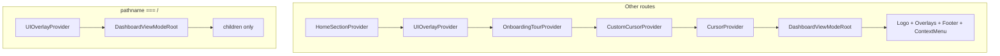

# P2-T06: Root Layout — Hide Legacy Chrome on `/`

**Task ID:** P2-T06  
**Status:** done  
**Type:** Implementation  
**Completed:** 2026-07-03  
**Parent:** [phase-2-tasks.md](../phase-2-tasks.md)  
**Depends on:** [P2-T03](./P2-T03-marketing-layout.md), [P1-T19](../phase-1/tasks/P1-T19-deprecation-reuse.md)  
**Blocks:** P2-T07, P2-T26

---

## Quick reference

| Field | Value |
|-------|-------|
| **Approach** | Option B: pathname gate in client shell |
| **Shell component** | [`components/layout/RootAppShell.tsx`](../../../components/layout/RootAppShell.tsx) |
| **Route helper** | [`lib/marketing-routes.ts`](../../../lib/marketing-routes.ts) |
| **Gated path** | `/` only (Phase 5 can expand) |

---

## Approach decision

| Option | Verdict |
|--------|---------|
| **A** Route group `(marketing)/layout.tsx` | Deferred; larger file moves |
| **B** `usePathname()` conditional shell | **Chosen** for Phase 2 |

Option B avoids moving `app/page.tsx` before P2-T07 and keeps a single integration point.

---

## What changes on `/`

### Hidden (legacy chrome)

| Component | Path |
|-----------|------|
| Floating Logo | `components/Logo.tsx` |
| Mascot + sensor overlays | `components/ConditionalOverlays.tsx` |
| Global site footer | `components/layout/GlobalSiteFooter.tsx` |
| Custom context menu | `components/CustomContextMenu.tsx` |
| Custom cursor providers | `CustomCursorProvider`, `CursorProvider` |

### Providers removed on `/`

| Provider | Reason |
|----------|--------|
| `HomeSectionProvider` | Hero section hover; not used by marketing |
| `OnboardingTourProvider` | Legacy Hero tour |
| `CustomCursorProvider` | Marketing has no custom cursor |
| `CursorProvider` | Same |

### Providers removed on `/` (completed in P2-T07)

| Provider | Reason |
|----------|--------|
| `UIOverlayProvider` | Legacy Hero removed |
| `DashboardViewModeRoot` | Legacy Hero removed |

**P2-T07 follow-up:** Done. Marketing branch returns `{children}` only.

---

## Slim shell diagram



---

## `lib/marketing-routes.ts`

```ts
export const MARKETING_HOMEPAGE_PATH = '/';
export function isMarketingHomepage(pathname: string | null | undefined): boolean;
```

Phase 5 can extend to `/inbox`, `/security`, etc. per [P1-T19](../phase-1/tasks/P1-T19-deprecation-reuse.md).

---

## Acceptance criteria checklist

- [x] `/` has no mascot, sensor bar, custom cursor, or floating Logo
- [x] Other routes unchanged (full legacy provider tree)
- [x] `HomeSectionProvider` not mounted on `/`
- [x] `MarketingFooter` via `MarketingLayout` is the footer on `/` after P2-T07

---

## Verification

On `/` before P2-T07 (legacy Hero still mounted):

- No floating MindMesh Logo
- No mascot chatbot or sensor bar
- No custom context menu
- Hero macOS shell may still render (removed in P2-T07)

After P2-T07:

- `MarketingLayout` + `MarketingFooter` only on `/`

---

## Stakeholder sign-off

| Role | Name | Decision | Date |
|------|------|----------|------|
| Product / founder | Rohit | Root layout marketing branch approved | 2026-07-03 |

**P2-T06 status:** Done. Proceed to [P2-T07](./P2-T07-homepage-composition.md) or [P2-T08](./P2-T08-section-primitives.md).

---

## Downstream handoff

| Task | Action |
|------|--------|
| P2-T07 | Swap `Hero` for `MarketingLayout`; then remove `UIOverlayProvider` from `/` branch |
| P2-T26 | Confirm no legacy JS on marketing `/` |
