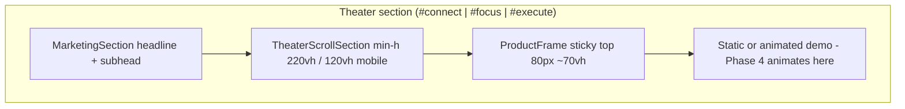

# Phase 3: Scroll Kit

**Status:** Complete (2026-07-04) · Sign-off: [P3-T18-sign-off.md](./phase-3/tasks/P3-T18-sign-off.md)  
**Prerequisite:** Phase 2 marketing shell ([phase-2-tasks.md](./phase-2-tasks.md); P2-T07+ done; P2-T27 sign-off optional while LCP gate is deferred)  
**Task breakdown:** [phase-3-tasks.md](./phase-3-tasks.md) (18 tasks, all done)  
**Parent plan:** [phase-1-foundation.md](./phase-1-foundation.md) · [phase-2-shell.md](./phase-2-shell.md)  
**Next phase:** [phase-4-theater-animation.md](./phase-4-theater-animation.md) · [phase-4-tasks.md](./phase-4-tasks.md)  
**First code landing here:** `hooks/useScrollSection.ts`, `components/marketing/theater/*`, theater section refactors

Phase 3 adds **scroll infrastructure** for product theaters (sections 4–6). It does **not** ship beat-sheet animations; those land in **Phase 4** ([P1-T23](./phase-1/tasks/P1-T23-theater-reuse-map.md)).

---

## Goal

Ship reusable scroll kit so Phase 4 can implement Connect, Focus, and Execute animations without re-solving layout or scroll math:

1. Sticky `ProductFrame` chrome per [P1-T15](./phase-1/tasks/P1-T15-layout-rules.md)
2. `useScrollSection` hook (`scrollYProgress`, step index, off-screen pause)
3. `TheaterScrollSection` wrapper (`min-h-[220vh]` / mobile `120vh`, headline outside frame)
4. `prefers-reduced-motion` → static final frame per [P1-T06](./phase-1/tasks/P1-T06-theater-connect.md)–[P1-T08](./phase-1/tasks/P1-T08-theater-execute.md)
5. Three theater sections refactored to scroll anatomy (content may remain static final frame until Phase 4)

---

## Phase 2 starting point

| Asset | Location | Phase 3 change |
|-------|----------|----------------|
| Static theater sections | `components/marketing/sections/ProductTheater*.tsx` | Wrap in scroll kit |
| Inline `ProductFrame` | `components/marketing/ProductFrame.tsx` | Upgrade + move to `theater/` |
| Acme fixtures | `lib/marketing-demo-data.ts` | Add scroll step constants |
| Dynamic import shell | `MarketingTheaterSections.tsx` | Keep; Framer Motion stays inside theater chunks |

---

## Phase 1 inputs (read before coding)

| Topic | Doc |
|-------|-----|
| Theater layout (wrapper vh, sticky frame) | [P1-T15-layout-rules.md](./phase-1/tasks/P1-T15-layout-rules.md) § Product theater |
| Connect beat sheet + reduced motion | [P1-T06-theater-connect.md](./phase-1/tasks/P1-T06-theater-connect.md) |
| Focus beat sheet | [P1-T07-theater-focus.md](./phase-1/tasks/P1-T07-theater-focus.md) |
| Execute beat sheet | [P1-T08-theater-execute.md](./phase-1/tasks/P1-T08-theater-execute.md) |
| Reuse map + Phase 3/4 split | [P1-T23-theater-reuse-map.md](./phase-1/tasks/P1-T23-theater-reuse-map.md) |
| Performance gates (Phase 3 row) | [P1-T17-performance-budget.md](./phase-1/tasks/P1-T17-performance-budget.md) |
| Measurement workflow | [P1-T18-perf-workflow.md](./phase-1/tasks/P1-T18-perf-workflow.md) |

---

## Target file structure

```
components/marketing/
  theater/
    ProductFrame.tsx           # sticky chrome (upgrade from Phase 2 inline)
    TheaterScrollSection.tsx   # wrapper + sticky slot
  sections/
    ProductTheaterConnect.tsx  # composes TheaterScrollSection + frame
    ProductTheaterFocus.tsx
    ProductTheaterExecute.tsx
hooks/
  useScrollSection.ts
  usePrefersReducedMotion.ts   # or lib hook colocated with scroll kit
lib/
  marketing-theater-scroll.ts  # vh heights, progress thresholds, final-step constants
```

---

## Scroll anatomy (all three theaters)



---

## `useScrollSection` contract (locked for Phase 4)

| Return | Type | Purpose |
|--------|------|---------|
| `progress` | `number` 0–1 | Raw `scrollYProgress` within wrapper |
| `step` | `number` | Discrete beat index from theater threshold table |
| `isInView` | `boolean` | Section intersecting viewport (pause driver) |
| `isPaused` | `boolean` | Off-screen or reduced motion |
| `ref` | `RefObject` | Attach to scroll wrapper |

**Reduced-motion final progress:**

| Theater | Jump to progress |
|---------|------------------|
| Connect | 0.90 |
| Focus | 0.85 |
| Execute | 0.92 |

**Animation rules (Phase 4 consumes):** `transform` and `opacity` only; pause when `!isInView`.

---

## Recommended PR sequence

| PR | Scope | Tasks | Exit criteria |
|----|-------|-------|---------------|
| **PR1** | Constants + frame | P3-T02–T04 | Sticky `ProductFrame` renders in isolation |
| **PR2** | Scroll hook | P3-T05–T06 | Hook returns progress/step; reduced motion works |
| **PR3** | Theater integration | P3-T07–T10 | All 3 sections use scroll anatomy; static final frames |
| **PR4** | Perf + sign-off | P3-T11–T14, T18 | INP spot-check; P3-T18 signed |

---

## Performance checklist (Phase 3)

From [P1-T17](./phase-1/tasks/P1-T17-performance-budget.md):

- [ ] Framer Motion imported only inside theater dynamic chunks (not hero path)
- [ ] Scroll hooks code-split with theaters
- [ ] INP spot-check: nav anchor scroll to `#connect`, `#focus`, `#execute`
- [ ] No new Lottie, mascot, or cursor on `/`

**Deferred from Phase 2:** Homepage LCP < 2.5s ([P2-T26](./phase-2/baselines/homepage-marketing-lighthouse.md) recorded 4.81s). Revisit in Phase 6 polish or ad-hoc perf PR; not a Phase 3 blocker.

---

## Explicit non-goals (Phase 3)

- Beat-sheet fly-in animations ([P1-T06](./phase-1/tasks/P1-T06-theater-connect.md)–[P1-T08](./phase-1/tasks/P1-T08-theater-execute.md) motion tables)
- `StaticConnectedApps` / dashboard component refactors ([P1-T23](./phase-1/tasks/P1-T23-theater-reuse-map.md) Phase 4)
- New marketing subcomponents (`MarketingPriorityCard`, `TypingText` scrub, etc.)
- Depth page copy updates (Phase 5)
- Hero deletion, OG refresh, `images.unoptimized` (Phase 6)

---

## Definition of done (Phase 3)

Phase 3 is complete when:

- [x] `ProductFrame` matches P1-T15 sticky dimensions and tokens
- [x] `useScrollSection` exported and used by all three theaters
- [x] Scroll wrappers use correct desktop/mobile vh heights
- [x] Reduced motion renders static final frame on all three theaters
- [x] Off-screen pause stops scroll-driven updates (manual QA)
- [x] Framer Motion absent from non-theater `/` chunks
- [x] P3-T18 sign-off recorded ([P3-T18-sign-off.md](./phase-3/tasks/P3-T18-sign-off.md))
- [x] Phase 4 entry ready: [phase-4-theater-animation.md](./phase-4-theater-animation.md) ([P3-T17](./phase-3/tasks/P3-T17-phase-4-entry-doc.md))

---

## After Phase 3

| Phase | Focus |
|-------|-------|
| **4** | Theater animations + `Static*` marketing variants |
| **5** | Depth pages aligned to 7-app story |
| **6** | Hero deletion, LCP polish, OG, image optimization |
