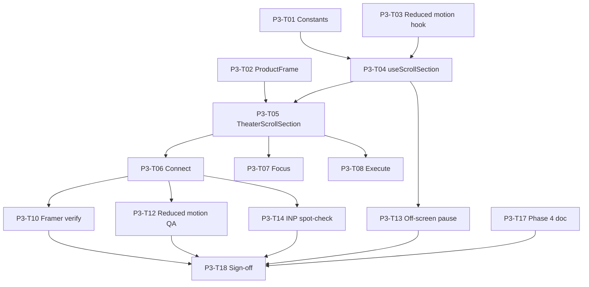

# Phase 3: Task Breakdown

Parent spec: [phase-3-scroll-kit.md](./phase-3-scroll-kit.md) · Phase 2: [phase-2-shell.md](./phase-2-shell.md) · Phase 1: [phase-1-foundation.md](./phase-1-foundation.md)

This file breaks Phase 3 into individual implementation tasks. Each task maps to `hooks/useScrollSection.ts`, `components/marketing/theater/*`, and refactors of `ProductTheater*.tsx`. Expand any task into `docs/phase-3/tasks/P3-T##-*.md` when you need a longer checklist.

**How to use this file**

1. Pick a task by ID (for example `P3-T05`).
2. Read the linked Phase 1 theater brief for beat-sheet thresholds.
3. Implement, then mark status `done` here.
4. Do not mark Phase 3 complete until all **Blocker** tasks are `done` and [P3-T18](./phase-3-tasks.md#p3-t18--phase-3-sign-off-checklist) is signed off.

**Status values:** `todo` | `in_progress` | `done` | `blocked`

**Prerequisite:** Phase 2 marketing homepage composed ([P2-T07](./phase-2/tasks/P2-T07-homepage-composition.md)). P2-T27 sign-off and LCP gate may remain open; see [P3-T16](#p3-t16--revisit-homepage-lcp-deferred).

---

## Task index (quick view)

| ID | Task | Status | Blocker? |
|----|------|--------|----------|
| P3-T01 | `lib/marketing-theater-scroll.ts` constants | done | Yes |
| P3-T02 | Upgrade sticky `ProductFrame` | done | Yes |
| P3-T03 | `usePrefersReducedMotion` hook | done | Yes |
| P3-T04 | `useScrollSection` hook | done | Yes |
| P3-T05 | `TheaterScrollSection` wrapper | done | Yes |
| P3-T06 | Wire scroll kit into `ProductTheaterConnect` | done | Yes |
| P3-T07 | Wire scroll kit into `ProductTheaterFocus` | done | Yes |
| P3-T08 | Wire scroll kit into `ProductTheaterExecute` | done | Yes |
| P3-T09 | `components/marketing/theater/` folder reorg | done | No |
| P3-T10 | Verify Framer Motion only in theater chunks | done | Yes |
| P3-T11 | Step index helpers + demo-data coupling | done | No |
| P3-T12 | Reduced-motion QA (all 3 theaters) | done | Yes |
| P3-T13 | Off-screen pause QA | done | Yes |
| P3-T14 | INP spot-check (nav anchor scroll) | done | Yes |
| P3-T15 | Mobile theater scroll QA (`<md`) | done | No |
| P3-T16 | Revisit homepage LCP (deferred) | done | No |
| P3-T17 | Create Phase 4 entry doc stub | done | No |
| P3-T18 | Phase 3 sign-off checklist | done | Yes |

**Total:** 18 tasks · **Blockers:** 12 · **Phase 3 complete** (2026-07-04)

---

## Workstream A: Scroll kit foundation

### P3-T01 — `lib/marketing-theater-scroll.ts` constants

**Status:** done  
**Blocker:** Yes  
**Depends on:** P1-T06–08, P1-T15  
**Blocks:** P3-T04, P3-T05, P3-T11  
**Deliverable:** [P3-T01-theater-scroll-constants.md](./phase-3/tasks/P3-T01-theater-scroll-constants.md) (completed 2026-07-04) · [`lib/marketing-theater-scroll.ts`](../lib/marketing-theater-scroll.ts)

---

### P3-T02 — Upgrade sticky `ProductFrame`

**Status:** done  
**Blocker:** Yes  
**Depends on:** P2-T08, P1-T15, P1-T16, P3-T01  
**Blocks:** P3-T05, P3-T06–T08  
**Deliverable:** [P3-T02-product-frame.md](./phase-3/tasks/P3-T02-product-frame.md) (completed 2026-07-04) · [`components/marketing/theater/ProductFrame.tsx`](../components/marketing/theater/ProductFrame.tsx)

---

### P3-T03 — `usePrefersReducedMotion` hook

**Status:** done  
**Blocker:** Yes  
**Depends on:** P1-T06–08  
**Blocks:** P3-T04, P3-T12  
**Deliverable:** [P3-T03-prefers-reduced-motion.md](./phase-3/tasks/P3-T03-prefers-reduced-motion.md) (completed 2026-07-04) · [`hooks/usePrefersReducedMotion.ts`](../hooks/usePrefersReducedMotion.ts)

---

### P3-T04 — `useScrollSection` hook

**Status:** done  
**Blocker:** Yes  
**Depends on:** P3-T01, P3-T03, P1-T06–08  
**Blocks:** P3-T05, P3-T06–T08, P3-T13  
**Deliverable:** [P3-T04-use-scroll-section.md](./phase-3/tasks/P3-T04-use-scroll-section.md) (completed 2026-07-04) · [`hooks/useScrollSection.ts`](../hooks/useScrollSection.ts), [`TheaterScrollContext.tsx`](../components/marketing/theater/TheaterScrollContext.tsx)

---

### P3-T05 — `TheaterScrollSection` wrapper

**Status:** done  
**Blocker:** Yes  
**Depends on:** P3-T02, P3-T04, P1-T15  
**Blocks:** P3-T06–T08  
**Deliverable:** [P3-T05-theater-scroll-section.md](./phase-3/tasks/P3-T05-theater-scroll-section.md) (completed 2026-07-04) · [`TheaterScrollSection.tsx`](../components/marketing/theater/TheaterScrollSection.tsx)

---

## Workstream B: Theater integration

### P3-T06 — Wire scroll kit into `ProductTheaterConnect`

**Status:** done  
**Blocker:** Yes  
**Depends on:** P3-T05, P2-T17, P1-T06  
**Blocks:** P3-T12, P3-T18  
**Deliverable:** [P3-T06-08-theater-scroll-wiring.md](./phase-3/tasks/P3-T06-08-theater-scroll-wiring.md) (completed 2026-07-04) · [`ProductTheaterConnect.tsx`](../components/marketing/sections/ProductTheaterConnect.tsx)

---

### P3-T07 — Wire scroll kit into `ProductTheaterFocus`

**Status:** done  
**Blocker:** Yes  
**Depends on:** P3-T05, P2-T18, P1-T07  
**Deliverable:** [P3-T06-08-theater-scroll-wiring.md](./phase-3/tasks/P3-T06-08-theater-scroll-wiring.md) · [`ProductTheaterFocus.tsx`](../components/marketing/sections/ProductTheaterFocus.tsx)

---

### P3-T08 — Wire scroll kit into `ProductTheaterExecute`

**Status:** done  
**Blocker:** Yes  
**Depends on:** P3-T05, P2-T19, P1-T08  
**Deliverable:** [P3-T06-08-theater-scroll-wiring.md](./phase-3/tasks/P3-T06-08-theater-scroll-wiring.md) · [`ProductTheaterExecute.tsx`](../components/marketing/sections/ProductTheaterExecute.tsx)

---

### P3-T09 — `components/marketing/theater/` folder reorg

**Status:** done  
**Blocker:** No  
**Depends on:** P3-T02, P3-T05  

**Goal:** Move scroll kit modules under `theater/`; update imports.

**Deliverable:** [P3-T09-theater-folder-reorg.md](./phase-3/tasks/P3-T09-theater-folder-reorg.md) · [`components/marketing/theater/index.ts`](../components/marketing/theater/index.ts)

**Acceptance criteria**

- [x] No duplicate `ProductFrame` implementations
- [x] All theater sections import from `theater/`

---

### P3-T11 — Step index helpers + demo-data coupling

**Status:** done  
**Blocker:** No  
**Depends on:** P3-T01, P2-T11  

**Goal:** Optional helpers so Phase 4 reads fixtures + step together.

**Deliverable:** [P3-T11-step-helpers-demo-data.md](./phase-3/tasks/P3-T11-step-helpers-demo-data.md) · [`lib/marketing-demo-data.ts`](../lib/marketing-demo-data.ts), [`lib/marketing-theater-scroll.ts`](../lib/marketing-theater-scroll.ts)

**Acceptance criteria**

- [x] `getTheaterStep(theaterId, progress)` returns integer step index
- [x] Acme persona unchanged across Focus + Execute

---

## Workstream C: Performance and QA

### P3-T10 — Verify Framer Motion only in theater chunks

**Status:** done  
**Blocker:** Yes  
**Depends on:** P3-T04, P3-T06–T08, P1-T17  

**Goal:** Confirm scroll kit did not pull Framer into hero/main bundle.

**Deliverable:** [P3-T10-framer-chunk-verify.md](./phase-3/tasks/P3-T10-framer-chunk-verify.md) · [`LegacyAppShell.tsx`](../components/layout/LegacyAppShell.tsx) (bundle split fix)

**Acceptance criteria**

- [x] `/` page entry chunk has no `framer-motion` import
- [x] `Hero.tsx`, `dotlottie` absent from `/` treemap
- [x] Framer present only in theater async chunks

---

### P3-T12 — Reduced-motion QA (all 3 theaters)

**Status:** done  
**Blocker:** Yes  
**Depends on:** P3-T06–T08, P3-T03  

**Goal:** Manual QA with OS "Reduce motion" enabled.

**Deliverable:** [P3-T12-reduced-motion-qa.md](./phase-3/tasks/P3-T12-reduced-motion-qa.md)

**Checklist**

- [x] Connect: 7 connected apps + caption, no scroll animation required
- [x] Focus: priority card final state
- [x] Execute: success state with banner copy
- [x] No scroll jank or forced scroll to see content

---

### P3-T13 — Off-screen pause QA

**Status:** done  
**Blocker:** Yes  
**Depends on:** P3-T04, P3-T06–T08  

**Goal:** Confirm scroll-driven state freezes when theater is off-screen.

**Deliverable:** [P3-T13-off-screen-pause-qa.md](./phase-3/tasks/P3-T13-off-screen-pause-qa.md)

**Checklist**

- [x] Scroll past theater quickly: no runaway RAF / motion work in Performance panel
- [x] Re-enter section: progress resumes from current scroll position

---

### P3-T14 — INP spot-check (nav anchor scroll)

**Status:** done  
**Blocker:** Yes  
**Depends on:** P2-T04, P3-T06–T08, P1-T17  

**Goal:** Phase 3 perf gate from P1-T17.

**Deliverable:** [P3-T14-inp-nav-spot-check.md](./phase-3/tasks/P3-T14-inp-nav-spot-check.md)

**Checklist**

- [x] Tap Product → `#connect`: smooth scroll, no long tasks > 200ms
- [x] Repeat for Features, Security, Join waitlist targets
- [x] Record note in sign-off doc (pass/fail + browser)

---

### P3-T15 — Mobile theater scroll QA (`<md`)

**Status:** done  
**Blocker:** No  
**Depends on:** P3-T06–T08, P1-T15  

**Deliverable:** [P3-T15-mobile-theater-qa.md](./phase-3/tasks/P3-T15-mobile-theater-qa.md) · [`app/globals.css`](../app/globals.css) (theater vh CSS)

**Checklist**

- [x] Wrapper uses `min-h-[120vh]` on mobile
- [x] Sticky frame `min-h-[60vh]`, readable without horizontal scroll
- [x] Acceptable fallback: static final frame if sticky jank on iOS Safari (document if seen)

---

### P3-T16 — Revisit homepage LCP (deferred)

**Status:** done  
**Blocker:** No  
**Depends on:** P2-T26  
**Doc:** [P3-T16-homepage-lcp-revisit.md](./phase-3/tasks/P3-T16-homepage-lcp-revisit.md)

**Goal:** Optional follow-up from Phase 2 gate miss (median LCP 4.81s). **Not required for Phase 3 sign-off.**

**Applied:** Deferred GA on `/`, trimmed Inter/Manrope weights. H1 LCP alignment deferred (P1-T03 copy order).

**Result:** Median LCP **4.06s** (-0.75s vs P2); gate still fails. CLS/TBT improved.

**Deliverable:** Updated [`homepage-marketing-lighthouse.md`](./phase-2/baselines/homepage-marketing-lighthouse.md)

---

## Workstream D: Handoff

### P3-T17 — Create Phase 4 entry doc stub

**Status:** done  
**Blocker:** No  
**Depends on:** P3-T01–T08  
**Blocks:** P3-T18 (recommended)  
**Doc:** [P3-T17-phase-4-entry-doc.md](./phase-3/tasks/P3-T17-phase-4-entry-doc.md)

**Deliverable:** [`phase-4-theater-animation.md`](./phase-4-theater-animation.md) (overview + link to P1-T23 + Phase 3 handoff)

**Note:** `phase-4-tasks.md` task breakdown deferred to P3-T18 sign-off.

---

### P3-T18 — Phase 3 sign-off checklist

**Status:** done  
**Blocker:** Yes  
**Depends on:** P3-T01–T15, P3-T17  
**Doc:** [P3-T18-sign-off.md](./phase-3/tasks/P3-T18-sign-off.md) (completed 2026-07-04)

**Goal:** Formal gate before Phase 4 beat-sheet animation.

**Result:** Phase 3 approved. All 18 tasks done. [phase-4-tasks.md](./phase-4-tasks.md) created at sign-off.

---

## Dependency graph



**Parallel tracks after T05:**

| Track | Tasks |
|-------|-------|
| Theater wiring | T06 → T07 → T08 |
| QA + perf | T10, T12, T13, T14 → T18 |
| Optional | T09, T11, T15, T16 |

---

## Child doc folder

```
docs/phase-3/
  tasks/
    P3-T01-theater-scroll-constants.md   # expand when starting T01
    P3-T04-use-scroll-section.md
    P3-T12-reduced-motion-qa.md
    P3-T16-homepage-lcp-revisit.md
    P3-T17-phase-4-entry-doc.md
    P3-T18-sign-off.md
```

When a child doc is created, link it from this file and update status here.

---

## Phase 3 definition of done

From [phase-3-scroll-kit.md](./phase-3-scroll-kit.md):

- [x] Sticky `ProductFrame` + `useScrollSection` + `TheaterScrollSection` shipped
- [x] Connect, Focus, Execute use scroll wrappers (static content OK)
- [x] Reduced motion + off-screen pause verified
- [x] Framer Motion not in hero/main `/` chunk
- [x] P3-T18 sign-off recorded ([P3-T18-sign-off.md](./phase-3/tasks/P3-T18-sign-off.md))

**Phase 3 complete:** 2026-07-04 · **Next:** [Phase 4 theater animation](./phase-4-theater-animation.md) · [phase-4-tasks.md](./phase-4-tasks.md)

---

## Explicit non-goals (reminder)

Do not implement in Phase 3:

- App fly-in, priority dimming, typing scrub animations (Phase 4)
- `StaticConnectedApps` marketing variant refactor (Phase 4, [P1-T23](./phase-1/tasks/P1-T23-theater-reuse-map.md))
- Homepage LCP fix (optional P3-T16; Phase 6 polish)
- Depth pages, Hero deletion, OG refresh (Phase 5–6)
