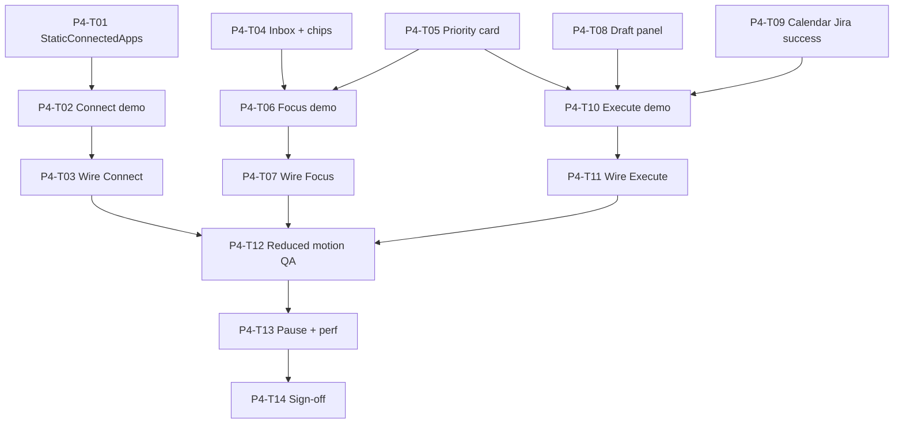

# Phase 4: Task Breakdown

Parent spec: [phase-4-theater-animation.md](./phase-4-theater-animation.md) · Phase 3: [phase-3-scroll-kit.md](./phase-3-scroll-kit.md) · Reuse map: [P1-T23](./phase-1/tasks/P1-T23-theater-reuse-map.md)

This file breaks Phase 4 into individual implementation tasks. Each task maps to animated theater demos, `Static*` marketing refactors, and new marketing micro-components. Expand any task into `docs/phase-4/tasks/P4-T##-*.md` when you need a longer checklist.

**How to use this file**

1. Pick a task by ID (for example `P4-T04`).
2. Read the linked Phase 1 beat sheet and [P1-T23](./phase-1/tasks/P1-T23-theater-reuse-map.md) matrix row.
3. Implement, then mark status `done` here.
4. Do not mark Phase 4 complete until all **Blocker** tasks are `done` and P4-T14 sign-off is recorded.

**Status values:** `todo` | `in_progress` | `done` | `blocked`

**Prerequisite:** [P3-T18 sign-off](./phase-3/tasks/P3-T18-sign-off.md) (Phase 3 complete, 2026-07-04)

---

## Task index (quick view)

| ID | Task | Status | Blocker? |
|----|------|--------|----------|
| P4-T01 | `StaticConnectedApps` marketing variant | done | Yes |
| P4-T02 | `ConnectTheaterDemo` + beat animation | done | Yes |
| P4-T03 | Wire Connect demo into `ProductTheaterConnect` | done | Yes |
| P4-T04 | `MarketingSignalChips` + inbox/calendar marketing variants | done | Yes |
| P4-T05 | `MarketingPriorityCard` | done | Yes |
| P4-T06 | `FocusTheaterDemo` + beat animation | done | Yes |
| P4-T07 | Wire Focus demo into `ProductTheaterFocus` | done | Yes |
| P4-T08 | `MarketingDraftPanel` + scroll-scrubbed typing | done | Yes |
| P4-T09 | Calendar block, Jira row, execute success panels | done | Yes |
| P4-T10 | `ExecuteTheaterDemo` + beat animation | done | Yes |
| P4-T11 | Wire Execute demo into `ProductTheaterExecute` | done | Yes |
| P4-T12 | Reduced-motion QA (animated theaters) | done | Yes |
| P4-T13 | Off-screen pause + perf spot-check | done | Yes |
| P4-T14 | Phase 4 sign-off checklist | done | Yes |

**Total:** 14 tasks · **Blockers:** 14 · **Phase 4 complete** · **Next:** [Phase 5](./phase-5-tasks.md) P5-T01

---

## Workstream A: Connect theater

### P4-T01 — `StaticConnectedApps` marketing variant

**Status:** done  
**Blocker:** Yes  
**Depends on:** P3-T18, [P1-T23](./phase-1/tasks/P1-T23-theater-reuse-map.md)  
**Blocks:** P4-T02, P4-T03  
**Doc:** [P4-T01-static-connected-apps-marketing.md](./phase-4/tasks/P4-T01-static-connected-apps-marketing.md) (completed 2026-07-04)

**Goal:** 7-app grid, marketing theme, `step`/`progress` props, no dashboard context deps.

**Deliverable:** [`StaticConnectedApps.tsx`](../components/dashboard/StaticConnectedApps.tsx) · [`getConnectVisualStateFromProgress`](../lib/marketing-theater-scroll.ts)

---

### P4-T02 — `ConnectTheaterDemo` + beat animation

**Status:** done  
**Blocker:** Yes  
**Depends on:** P4-T01, P3-T11  
**Blocks:** P4-T03  
**Doc:** [P4-T02-connect-theater-demo.md](./phase-4/tasks/P4-T02-connect-theater-demo.md) (completed 2026-07-04)

**Goal:** Client component consuming `useTheaterScroll` / `progress` + scroll-scrub helpers.

**Deliverable:** [`ConnectTheaterDemo.tsx`](../components/marketing/theater/demos/ConnectTheaterDemo.tsx) · card/badge/banner motion helpers in `marketing-theater-scroll.ts`

---

### P4-T03 — Wire Connect demo into `ProductTheaterConnect`

**Status:** done  
**Blocker:** Yes  
**Depends on:** P4-T02  
**Doc:** [P4-T03-wire-connect-theater.md](./phase-4/tasks/P4-T03-wire-connect-theater.md) (completed 2026-07-04)

**Goal:** Replace inline static grid with `ConnectTheaterDemo` inside `TheaterScrollSection`.

---

## Workstream B: Focus theater

### P4-T04 — `MarketingSignalChips` + inbox/calendar marketing variants

**Status:** done  
**Blocker:** Yes  
**Depends on:** P3-T18, [P1-T23](./phase-1/tasks/P1-T23-theater-reuse-map.md)  
**Blocks:** P4-T06  
**Doc:** [P4-T04-marketing-signal-inbox-calendar.md](./phase-4/tasks/P4-T04-marketing-signal-inbox-calendar.md) (completed 2026-07-04)

**Goal:** Refactor `StaticInboxList`, `StaticCalendarEvents` for marketing fixtures; add signal chip overlay.

**Deliverable:** [`MarketingSignalChips.tsx`](../components/marketing/theater/marketing/MarketingSignalChips.tsx) · marketing variants in `StaticInboxList` / `StaticCalendarEvents`

---

### P4-T05 — `MarketingPriorityCard`

**Status:** done  
**Blocker:** Yes  
**Depends on:** P3-T11 ([`PRIORITY_FIXTURE_ACME`](../../lib/marketing-demo-data.ts))  
**Blocks:** P4-T06, P4-T10  
**Doc:** [P4-T05-marketing-priority-card.md](./phase-4/tasks/P4-T05-marketing-priority-card.md) (completed 2026-07-04)

**Goal:** New component for Acme priority reveal at Focus beat 0.50+.

**Deliverable:** [`MarketingPriorityCard.tsx`](../components/marketing/theater/marketing/MarketingPriorityCard.tsx)

---

### P4-T06 — `FocusTheaterDemo` + beat animation

**Status:** done  
**Blocker:** Yes  
**Depends on:** P4-T04, P4-T05  
**Blocks:** P4-T07  
**Doc:** [P4-T06-focus-theater-demo.md](./phase-4/tasks/P4-T06-focus-theater-demo.md) (completed 2026-07-04)

**Goal:** Noisy panels → chips → cross-highlight → dim → priority card per P1-T07.

**Deliverable:** [`FocusTheaterDemo.tsx`](../components/marketing/theater/demos/FocusTheaterDemo.tsx) · `getFocusVisualStateFromProgress`

---

### P4-T07 — Wire Focus demo into `ProductTheaterFocus`

**Status:** done  
**Blocker:** Yes  
**Depends on:** P4-T06  
**Doc:** [P4-T07-wire-focus-theater.md](./phase-4/tasks/P4-T07-wire-focus-theater.md) (completed 2026-07-04)

**Goal:** Replace inline static priority stub with `FocusTheaterDemo` inside `TheaterScrollSection`.

---

## Workstream C: Execute theater

### P4-T08 — `MarketingDraftPanel` + scroll-scrubbed typing

**Status:** done  
**Blocker:** Yes  
**Depends on:** P3-T11, [P1-T08](./phase-1/tasks/P1-T08-theater-execute.md)  
**Blocks:** P4-T10  
**Doc:** [P4-T08-marketing-draft-panel.md](./phase-4/tasks/P4-T08-marketing-draft-panel.md) (completed 2026-07-04)

**Goal:** Gmail compose chrome + scroll-scrubbed typing via `getExecuteDraftCharIndex`.

**Deliverable:** [`MarketingDraftPanel.tsx`](../components/marketing/theater/marketing/MarketingDraftPanel.tsx) · `TypingText` `charIndex` prop

---

### P4-T09 — Calendar block, Jira row, execute success panels

**Status:** done  
**Blocker:** Yes  
**Depends on:** P3-T11  
**Blocks:** P4-T10  
**Doc:** [P4-T09-calendar-jira-success-panels.md](./phase-4/tasks/P4-T09-calendar-jira-success-panels.md) (completed 2026-07-04)

**Goal:** `MarketingCalendarBlock`, `MarketingJiraRow`, `MarketingExecuteSuccess` per P1-T23 matrix.

**Deliverable:** [`MarketingCalendarBlock.tsx`](../components/marketing/theater/marketing/MarketingCalendarBlock.tsx) · [`MarketingJiraRow.tsx`](../components/marketing/theater/marketing/MarketingJiraRow.tsx) · [`MarketingExecuteSuccess.tsx`](../components/marketing/theater/marketing/MarketingExecuteSuccess.tsx) · scroll helpers in [`marketing-theater-scroll.ts`](../lib/marketing-theater-scroll.ts)

---

### P4-T10 — `ExecuteTheaterDemo` + beat animation

**Status:** done  
**Blocker:** Yes  
**Depends on:** P4-T05, P4-T08, P4-T09  
**Blocks:** P4-T11  
**Doc:** [P4-T10-execute-theater-demo.md](./phase-4/tasks/P4-T10-execute-theater-demo.md) (completed 2026-07-04)

**Goal:** Priority carry-over → draft → calendar → Jira → success per [P1-T08](./phase-1/tasks/P1-T08-theater-execute.md).

**Deliverable:** [`ExecuteTheaterDemo.tsx`](../components/marketing/theater/demos/ExecuteTheaterDemo.tsx) · [`getExecuteVisualStateFromProgress`](../lib/marketing-theater-scroll.ts)

---

### P4-T11 — Wire Execute demo into `ProductTheaterExecute`

**Status:** done  
**Blocker:** Yes  
**Depends on:** P4-T10  
**Blocks:** P4-T12, P4-T13  
**Doc:** [P4-T11-wire-execute-theater.md](./phase-4/tasks/P4-T11-wire-execute-theater.md) (completed 2026-07-04)

**Goal:** Replace Phase 3 static stub with `<ExecuteTheaterDemo />` inside `TheaterScrollSection`.

**Deliverable:** [`ProductTheaterExecute.tsx`](../components/marketing/sections/ProductTheaterExecute.tsx)

## Workstream D: QA + sign-off

### P4-T12 — Reduced-motion QA (animated theaters)

**Status:** done  
**Blocker:** Yes  
**Depends on:** P4-T03, P4-T07, P4-T11  
**Blocks:** P4-T14  
**Doc:** [P4-T12-reduced-motion-qa.md](./phase-4/tasks/P4-T12-reduced-motion-qa.md) (completed 2026-07-04)

**Goal:** All three theaters jump to final frame at reduced-motion progress; no scroll-linked motion.

**Result:** Pass. No code changes. Connect 0.90, Focus 0.85, Execute 0.92 hold stacks verified via CDP + DOM.

---

### P4-T13 — Off-screen pause + perf spot-check

**Status:** done  
**Blocker:** Yes  
**Depends on:** P4-T03, P4-T07, P4-T11  
**Doc:** [P4-T13-off-screen-pause-perf.md](./phase-4/tasks/P4-T13-off-screen-pause-perf.md) (completed 2026-07-06)

**Goal:** Animation state pauses off-screen; INP nav anchors; Framer still theater-only.

**Result:** Pass. Gated `updateProgress` on `isInViewRef` (scroll listener regression fix). INP nav pass. Framer absent from all `/` and theater chunks (custom scroll measurement).

---

### P4-T14 — Phase 4 sign-off checklist

**Status:** done  
**Blocker:** Yes  
**Depends on:** P4-T01–T13  
**Doc:** [P4-T14-sign-off.md](./phase-4/tasks/P4-T14-sign-off.md) (completed 2026-07-06)

**Goal:** Formal gate before Phase 5 depth pages.

**Result:** Pass. All 14 blocker tasks done. P1-T23 matrix implemented or deferred. Phase 5 entry docs created.

---

## Dependency graph

---

## Phase 4 definition of done

From [phase-4-theater-animation.md](./phase-4-theater-animation.md):

- [x] Connect, Focus, Execute demos animate through full beat sheets
- [x] Static final frames match P1-T06–08 at reduced-motion jump progress
- [x] P1-T23 matrix items implemented or explicitly deferred in sign-off
- [x] Framer Motion absent from non-theater `/` chunks
- [x] P4-T14 sign-off recorded

**After Phase 4:** [Phase 5 depth pages](./phase-5-depth-pages.md) · Phase 6 Hero deletion + LCP polish

---

## Explicit non-goals (reminder)

Do not implement in Phase 4:

- Depth page copy ([Phase 5](./phase-3-scroll-kit.md#after-phase-3))
- Hero deletion, OG refresh ([Phase 6](./phase-3-scroll-kit.md#after-phase-3))
- Homepage LCP gate closure
- Live API data in demos
