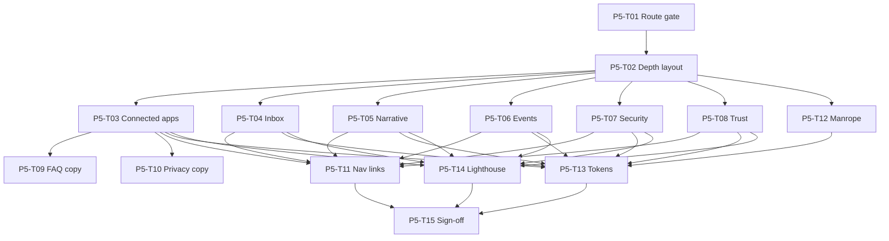

# Phase 5: Task Breakdown

Parent spec: [phase-5-depth-pages.md](./phase-5-depth-pages.md) · Phase 4: [phase-4-theater-animation.md](./phase-4-theater-animation.md) · Integrations audit: [P1-T20](./phase-1/tasks/P1-T20-integrations-audit.md)

This file breaks Phase 5 into individual implementation tasks. Each task maps to depth page alignment, marketing shell extension, or copy/legal updates. Expand any task into `docs/phase-5/tasks/P5-T##-*.md` when you need a longer checklist.

**How to use this file**

1. Pick a task by ID (for example `P5-T03`).
2. Read the linked Phase 1 brief and the current page under `app/`.
3. Implement, then mark status `done` here.
4. Do not mark Phase 5 complete until all **Blocker** tasks are `done` and P5-T15 sign-off is recorded.

**Status values:** `todo` | `in_progress` | `done` | `blocked`

**Prerequisite:** [P4-T14 sign-off](./phase-4/tasks/P4-T14-sign-off.md) (Phase 4 complete, 2026-07-06)

---

## Task index (quick view)

| ID | Task | Status | Blocker? |
|----|------|--------|----------|
| P5-T01 | Expand marketing route gate | done | Yes |
| P5-T02 | `MarketingDepthLayout` shared wrapper | done | Yes |
| P5-T03 | `/connected-apps` 7-app refactor | done | Yes |
| P5-T04 | `/inbox` marketing alignment | done | Yes |
| P5-T05 | `/yesterdays-narrative` alignment | done | Yes |
| P5-T06 | `/upcoming-events` alignment | done | Yes |
| P5-T07 | `/security` trust alignment | done | Yes |
| P5-T08 | `/trust` social proof alignment | done | Yes |
| P5-T09 | FAQ integration copy (7 apps) | done | No |
| P5-T10 | Privacy third-party services list | done | No |
| P5-T11 | Cross-link + nav consistency | done | Yes |
| P5-T12 | Manrope font consolidation | done | Yes |
| P5-T13 | Depth page token migration | done | Yes |
| P5-T14 | Depth page Lighthouse spot-check | done | No |
| P5-T15 | Phase 5 sign-off checklist | done | Yes |

**Total:** 15 tasks · **Blockers:** 12 · **Recommended next task:** Phase 6 → P6-T01

---

## Workstream A: Marketing shell extension

### P5-T01 — Expand marketing route gate

**Status:** done  
**Blocker:** Yes  
**Depends on:** P4-T14, [P2-T06](./phase-2/tasks/P2-T06-root-layout-marketing-branch.md)  
**Blocks:** P5-T02, all depth page tasks  
**Doc:** [P5-T01-marketing-route-gate.md](./phase-5/tasks/P5-T01-marketing-route-gate.md) (completed 2026-07-09)

**Goal:** Extend [`lib/marketing-routes.ts`](../lib/marketing-routes.ts) and [`RootAppShell.tsx`](../components/layout/RootAppShell.tsx) so funnel depth routes use the slim shell (no mascot, cursor, legacy providers).

**Routes included:** `/`, `/inbox`, `/connected-apps`, `/yesterdays-narrative`, `/upcoming-events`, `/security`, `/trust`

**Deliverable:** `isMarketingRoute(pathname)` + `MARKETING_FUNNEL_PATHS`; `scripts/verify-marketing-routes.mjs`; `RootAppShell` gated on funnel routes.

---

### P5-T02 — `MarketingDepthLayout` shared wrapper

**Status:** done  
**Blocker:** Yes  
**Depends on:** P5-T01, [P2-T03](./phase-2/tasks/P2-T03-marketing-layout.md)  
**Blocks:** P5-T03–T08  
**Doc:** [P5-T02-marketing-depth-layout.md](./phase-5/tasks/P5-T02-marketing-depth-layout.md) (completed 2026-07-09)

**Goal:** Reusable layout for inner pages: `MarketingNav`, page hero slot, content, `MarketingFooter`. Sets `data-marketing-theme="dark"`.

**Deliverable:** [`MarketingDepthLayout.tsx`](../components/marketing/MarketingDepthLayout.tsx); depth-aware [`MarketingNav.tsx`](../components/marketing/MarketingNav.tsx) (`/#section` from funnel pages).

---

## Workstream B: Feature depth pages

### P5-T03 — `/connected-apps` 7-app refactor

**Status:** done  
**Blocker:** Yes  
**Depends on:** P5-T02, [P1-T20](./phase-1/tasks/P1-T20-integrations-audit.md)  
**Blocks:** P5-T09, P5-T10, P5-T15  
**Doc:** [P5-T03-connected-apps-refactor.md](./phase-5/tasks/P5-T03-connected-apps-refactor.md) (completed 2026-07-09)

**Goal:** Replace 5-app Lucide list with [`MARKETING_INTEGRATIONS`](../lib/marketing-integrations.ts) (7 apps, PNG icons). Update hero copy, metadata, and workflow cards to match homepage Connect narrative.

**Page:** [`app/connected-apps/page.tsx`](../app/connected-apps/page.tsx) · CSS module deleted

---

### P5-T04 — `/inbox` marketing alignment

**Status:** done  
**Blocker:** Yes  
**Depends on:** P5-T02, [P1-T09](./phase-1/tasks/P1-T09-feature-grid.md)  
**Blocks:** P5-T15  
**Doc:** [P5-T04-inbox-alignment.md](./phase-5/tasks/P5-T04-inbox-alignment.md) (completed 2026-07-09)

**Goal:** Migrate to `MarketingDepthLayout`; align headline/description with feature grid card; marketing tokens; link back to `/#focus`.

**Page:** [`app/inbox/page.tsx`](../app/inbox/page.tsx) · CSS module deleted

---

### P5-T05 — `/yesterdays-narrative` alignment

**Status:** done  
**Blocker:** Yes  
**Depends on:** P5-T02  
**Blocks:** P5-T15  
**Doc:** [P5-T05-yesterdays-narrative-alignment.md](./phase-5/tasks/P5-T05-yesterdays-narrative-alignment.md) (completed 2026-07-09)

**Goal:** Marketing shell + copy aligned with Focus theater depth link and feature grid card.

**Page:** [`app/yesterdays-narrative/page.tsx`](../app/yesterdays-narrative/page.tsx) · CSS module deleted

---

### P5-T06 — `/upcoming-events` alignment

**Status:** done  
**Blocker:** Yes  
**Depends on:** P5-T02  
**Blocks:** P5-T15

**Goal:** Marketing shell + copy aligned with Execute theater and feature grid card.

**Doc:** [P5-T06-upcoming-events-alignment.md](./phase-5/tasks/P5-T06-upcoming-events-alignment.md) (completed 2026-07-09)

**Page:** [`app/upcoming-events/page.tsx`](../app/upcoming-events/page.tsx) · CSS module deleted

---

### P5-T07 — `/security` trust alignment

**Status:** done  
**Blocker:** Yes  
**Depends on:** P5-T02, [P1-T11](./phase-1/tasks/P1-T11-social-proof.md)  
**Blocks:** P5-T15

**Goal:** Marketing shell; copy consistent with homepage Trust section and feature grid Security card.

**Doc:** [P5-T07-security-trust-alignment.md](./phase-5/tasks/P5-T07-security-trust-alignment.md) (completed 2026-07-09)

**Page:** [`app/security/page.tsx`](../app/security/page.tsx) · CSS module deleted

---

### P5-T08 — `/trust` social proof alignment

**Status:** done  
**Blocker:** Yes  
**Depends on:** P5-T02  
**Blocks:** P5-T15

**Goal:** Marketing shell; NVIDIA Inception badge treatment matches homepage; FAQ integration answer references 7 apps.

**Doc:** [P5-T08-trust-social-proof-alignment.md](./phase-5/tasks/P5-T08-trust-social-proof-alignment.md) (completed 2026-07-09)

**Page:** [`app/trust/page.tsx`](../app/trust/page.tsx) · CSS module deleted

---

## Workstream C: Copy + legal alignment

### P5-T09 — FAQ integration copy (7 apps)

**Status:** done  
**Blocker:** No  
**Depends on:** P5-T03  
**Blocks:** P5-T15

**Goal:** Update FAQ integration answer to list all 7 apps per [P1-T20](./phase-1/tasks/P1-T20-integrations-audit.md).

**Doc:** [P5-T09-faq-integration-copy.md](./phase-5/tasks/P5-T09-faq-integration-copy.md) (completed 2026-07-09)

**Page:** [`app/faq/page.tsx`](../app/faq/page.tsx)

---

### P5-T10 — Privacy third-party services list

**Status:** done  
**Blocker:** No  
**Depends on:** P5-T03  
**Blocks:** P5-T15

**Goal:** Name Slack, Jira, and Atlassian as third-party data processors where required.

**Doc:** [P5-T10-privacy-third-party-list.md](./phase-5/tasks/P5-T10-privacy-third-party-list.md) (completed 2026-07-09)

**Page:** [`app/privacy/page.tsx`](../app/privacy/page.tsx)

---

### P5-T11 — Cross-link + nav consistency

**Status:** done  
**Blocker:** Yes  
**Depends on:** P5-T03–T08  
**Blocks:** P5-T15

**Goal:** `MarketingNav` on depth pages links to homepage sections (`/#connect`, `/#features`, `/#trust`, `/#cta`). Feature pages include contextual "Back to product" or pillar links. Footer matches homepage.

**Doc:** [P5-T11-cross-link-nav-consistency.md](./phase-5/tasks/P5-T11-cross-link-nav-consistency.md) (completed 2026-07-09)

**Deliverable:** Shared nav link config in [`lib/marketing-routes.ts`](../lib/marketing-routes.ts).

---

## Workstream D: Design system

### P5-T12 — Manrope font consolidation

**Status:** done  
**Blocker:** Yes  
**Depends on:** P5-T02  
**Blocks:** P5-T13, P5-T15

**Goal:** Remove per-page `Manrope` `@next/font` imports from depth pages; use root `--font-manrope` from [`app/layout.tsx`](../app/layout.tsx).

**Doc:** [P5-T12-manrope-font-consolidation.md](./phase-5/tasks/P5-T12-manrope-font-consolidation.md) (completed 2026-07-09)

**Reference:** [P2-T02](./phase-2/tasks/P2-T02-manrope-font.md) per-page cleanup list.

---

### P5-T13 — Depth page token migration

**Status:** done  
**Blocker:** Yes  
**Depends on:** P5-T12, [P1-T16](./phase-1/tasks/P1-T16-token-reference.md)  
**Blocks:** P5-T15

**Goal:** Replace page-local CSS vars (`--inbox-bg`, etc.) with `mm-*` / `[data-marketing-theme]` semantic tokens where pages are refactored.

**Doc:** [P5-T13-depth-page-token-migration.md](./phase-5/tasks/P5-T13-depth-page-token-migration.md) (completed 2026-07-09)

**Scope:** Pages touched in P5-T03–T08 only; do not block on full CSS module deletion.

---

## Workstream E: QA + sign-off

### P5-T14 — Depth page Lighthouse spot-check

**Status:** done  
**Blocker:** No  
**Depends on:** P5-T03–T08  
**Blocks:** P5-T15

**Goal:** Manual Lighthouse run on each refactored depth page (mobile preset). Record LCP, CLS, INP proxy in task doc. No hard gate (unlike homepage LCP in Phase 6).

**Doc:** [P5-T14-depth-page-lighthouse.md](./phase-5/tasks/P5-T14-depth-page-lighthouse.md) (completed 2026-07-09)

**Deliverable:** [`docs/phase-5/baselines/depth-pages-lighthouse.md`](./phase-5/baselines/depth-pages-lighthouse.md) + per-route JSON.

---

### P5-T15 — Phase 5 sign-off checklist

**Status:** done  
**Blocker:** Yes  
**Depends on:** P5-T01–T14

**Goal:** Formal gate before Phase 6 Hero deletion.

**Doc:** [P5-T15-sign-off.md](./phase-5/tasks/P5-T15-sign-off.md) (completed 2026-07-09)

**Unblocks:** [phase-6-polish.md](./phase-6-polish.md) · [phase-6-tasks.md](./phase-6-tasks.md)

---

## Dependency graph

---

## Phase 5 definition of done

From [phase-5-depth-pages.md](./phase-5-depth-pages.md):

- [x] Marketing shell covers all six primary funnel depth routes
- [x] `/connected-apps` shows all 7 integrations
- [x] Feature grid destinations use marketing theme
- [x] FAQ and privacy name Slack + Jira where required
- [x] Manrope loaded once from root
- [x] P5-T15 sign-off recorded

**After Phase 5:** [Phase 6 polish + Hero deletion](./phase-6-polish.md) · [phase-6-tasks.md](./phase-6-tasks.md)

---

## Explicit non-goals (reminder)

Do not implement in Phase 5:

- Hero deletion, `/app-directory` redirects ([Phase 6](./phase-1/tasks/P1-T19-deprecation-reuse.md))
- Homepage theater animation changes
- Homepage LCP gate closure
- Live API data on marketing pages
- `/billing`, `/contact`, `/waitlist` migration
