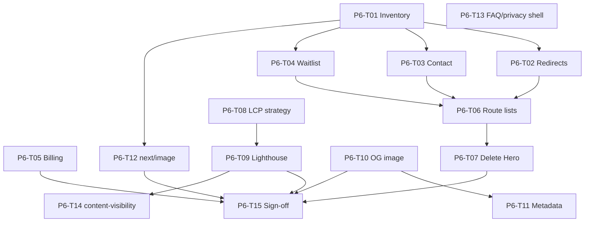

# Phase 6: Task Breakdown

Parent spec: [phase-6-polish.md](./phase-6-polish.md) · Phase 5: [phase-5-depth-pages.md](./phase-5-depth-pages.md) · Deprecation: [P1-T19](./phase-1/tasks/P1-T19-deprecation-reuse.md) · LCP: [P3-T16](./phase-3/tasks/P3-T16-homepage-lcp-revisit.md)

This file breaks Phase 6 into individual implementation tasks. Expand any task into `docs/phase-6/tasks/P6-T##-*.md` when you need a longer checklist.

**How to use this file**

1. Pick a task by ID (for example `P6-T03`).
2. Read the linked brief and current code under `app/` / `components/`.
3. Implement, then mark status `done` here.
4. Do not mark Phase 6 complete until all **Blocker** tasks are `done` and P6-T15 sign-off is recorded.

**Status values:** `todo` | `in_progress` | `done` | `blocked`

**Prerequisite:** [P5-T15 sign-off](./phase-5/tasks/P5-T15-sign-off.md) (Phase 5 complete, 2026-07-09)

---

## Task index (quick view)

| ID | Task | Status | Blocker? |
|----|------|--------|----------|
| P6-T01 | Inventory remaining Hero routes + callers | done | Yes |
| P6-T02 | `next.config.js` redirects for legacy Hero URLs | done | Yes |
| P6-T03 | `/contact` plain marketing page (no Hero) | done | Yes |
| P6-T04 | `/waitlist` → `/#cta` or thin marketing page | done | Yes |
| P6-T05 | `/billing` marketing shell alignment | done | No |
| P6-T06 | Remove `/` from stale Hero route lists | done | Yes |
| P6-T07 | Delete Hero + window components + route config | done | Yes |
| P6-T08 | Homepage LCP: display-font / H1 strategy | done | Yes |
| P6-T09 | Homepage Lighthouse × 3 re-baseline | done | Yes |
| P6-T10 | Regenerate OG / social image | done | Yes |
| P6-T11 | Metadata alignment (homepage + key routes) | deferred | No |
| P6-T12 | Enable `next/image` optimization | done | Yes |
| P6-T13 | Optional: FAQ + privacy marketing shell | done | No |
| P6-T14 | Optional: `content-visibility` below-fold | done | No |
| P6-T15 | Phase 6 sign-off checklist | done | Yes |

**Total:** 15 tasks · **Blockers:** 11 (all done) · **Deferred:** P6-T11 → [P7-T01](./phase-7-tasks.md) · **Next:** [Phase 7](./phase-7-tasks.md)

---

## Workstream A: Hero retirement

### P6-T01 — Inventory remaining Hero routes + callers

**Status:** done  
**Blocker:** Yes  
**Depends on:** P5-T15  
**Blocks:** P6-T02, P6-T06, P6-T07

**Goal:** Document every live consumer of `Hero`, `*Window`, `MINDMESH_HERO_*`, and `ConditionalOverlays` Hero gating. Produce a delete-order checklist.

**Doc:** [P6-T01-hero-inventory.md](./phase-6/tasks/P6-T01-hero-inventory.md) (completed 2026-07-09)

**References:** [`lib/mindmesh-hero-routes.ts`](../lib/mindmesh-hero-routes.ts), [P1-T19](./phase-1/tasks/P1-T19-deprecation-reuse.md)

---

### P6-T02 — Legacy Hero URL redirects

**Status:** done  
**Blocker:** Yes  
**Depends on:** P6-T01  
**Blocks:** P6-T07

**Goal:** Add `redirects()` in [`next.config.js`](../next.config.js) per P1-T19.

**Doc:** [P6-T02-legacy-hero-redirects.md](./phase-6/tasks/P6-T02-legacy-hero-redirects.md) (completed 2026-07-09)

| From | To |
|------|----|
| `/features` | `/#features` (via `middleware.ts`) |
| `/app-directory` | `/connected-apps` |
| `/subscription` | `/billing` |
| `/docs` | `/faq` |
| `/social` | `/` |
| `/demo` | `/` |

Confirm `/dashboard` and `/sensor&mascot` are **not** redirected.

---

### P6-T03 — `/contact` plain marketing page

**Status:** done  
**Blocker:** Yes  
**Depends on:** P6-T01  
**Blocks:** P6-T07

**Goal:** Replace Hero contact window with a plain marketing page (form + `MarketingDepthLayout` or shared plain shell). No mascot/sensor/cursor.

**Doc:** [P6-T03-contact-marketing-page.md](./phase-6/tasks/P6-T03-contact-marketing-page.md) (completed 2026-07-09)

**Page:** [`app/contact/page.tsx`](../app/contact/page.tsx) · form: [`ContactForm.tsx`](../components/marketing/ContactForm.tsx)

---

### P6-T04 — `/waitlist` retirement

**Status:** done  
**Blocker:** Yes  
**Depends on:** P6-T01  
**Blocks:** P6-T07

**Goal:** Prefer redirect `/waitlist` → `/#cta`. If a standalone page must remain, use marketing shell + shared `WaitlistForm` (no Hero).

**Doc:** [P6-T04-waitlist-retirement.md](./phase-6/tasks/P6-T04-waitlist-retirement.md) (completed 2026-07-09)

**Result:** Middleware 308 → `/#cta`; `app/waitlist/page.tsx` deleted.

---

### P6-T05 — `/billing` marketing shell alignment

**Status:** done  
**Blocker:** No  
**Depends on:** P5-T02  
**Blocks:** P6-T15

**Goal:** Move billing onto marketing tokens / depth or plain shell; remove any leftover Hero assumptions. Manrope already consolidated in P5-T12.

**Page:** [`app/billing/page.tsx`](../app/billing/page.tsx)

**Doc:** [P6-T05-billing-marketing-shell.md](./phase-6/tasks/P6-T05-billing-marketing-shell.md) (completed 2026-07-09)

**Result:** `MarketingDepthLayout` + `mm-*` plans UI; CSS module deleted; `/billing` on funnel gate.

---

### P6-T06 — Clean stale Hero route lists

**Status:** done  
**Blocker:** Yes  
**Depends on:** P6-T02, P6-T03, P6-T04  
**Blocks:** P6-T07

**Goal:** Update `MINDMESH_HERO_COMPONENT_ROUTES` / overlay gates so marketing paths never mount Hero providers. Remove `/` if still listed. Keep `/dashboard` behavior intentional.

**Doc:** [P6-T06-clean-hero-route-lists.md](./phase-6/tasks/P6-T06-clean-hero-route-lists.md) (completed 2026-07-09)

**Result:** Component Hero list emptied; `MINDMESH_HERO_ROUTES` = `/dashboard` only; overlays use `MINDMESH_OVERLAY_ROUTES` (`/dashboard`, `/sensor&mascot`).

---

### P6-T07 — Delete Hero + windows + route config

**Status:** done  
**Blocker:** Yes  
**Depends on:** P6-T06  
**Blocks:** P6-T15

**Goal:** Delete unused `Hero.tsx`, `*Window.tsx` (and related dock/chrome) and `mindmesh-hero-routes.ts` once grep shows zero marketing callers. Update imports in root shell.

**Acceptance:** `rg Hero|mindmesh-hero-routes` clean for deleted modules; build passes.

**Doc:** [P6-T07-delete-hero-windows.md](./phase-6/tasks/P6-T07-delete-hero-windows.md) (completed 2026-07-09)

**Result:** Hero + windows + chrome deleted; redirected page stubs removed; dashboard helpers in `lib/mindmesh-legacy-routes.ts`; Asul logo font dropped.

---

## Workstream B: Homepage LCP

### P6-T08 — Homepage LCP display-font / H1 strategy

**Status:** done  
**Blocker:** Yes  
**Depends on:** [P3-T16](./phase-3/tasks/P3-T16-homepage-lcp-revisit.md), [P1-T03](./phase-1/tasks/P1-T03-hero-copy.md)  
**Blocks:** P6-T09

**Goal:** Implement deferred LCP tactics without reordering locked hero copy: Manrope preload for H1, Inter `optional`/`swap` tuning, critical text paint path.

**Doc:** [P6-T08-homepage-lcp-font-strategy.md](./phase-6/tasks/P6-T08-homepage-lcp-font-strategy.md) (completed 2026-07-09)

**Result:** Inter `optional` + no preload; Manrope preloaded `swap`; H1 `.hero-lcp` path. Lighthouse re-baseline in P6-T09.

---

### P6-T09 — Homepage Lighthouse × 3 re-baseline

**Status:** done  
**Blocker:** Yes  
**Depends on:** P6-T08  
**Blocks:** P6-T15

**Goal:** Production build, mobile Lighthouse × 3, median LCP/CLS/TBT. Update baselines under `docs/phase-6/baselines/`. Pass &lt; 2.5s LCP or record signed exception vs [P1-T17](./phase-1/tasks/P1-T17-performance-budget.md).

**Doc:** [P6-T09-homepage-lighthouse-rebaseline.md](./phase-6/tasks/P6-T09-homepage-lighthouse-rebaseline.md) (completed 2026-07-09)

**Result:** Median LCP **2.93s** (H1); CLS 0; score 95. Gate miss with signed exception (−1.13s vs Phase 3).

---

## Workstream C: SEO + images

### P6-T10 — Regenerate OG / social image

**Status:** done  
**Blocker:** Yes  
**Depends on:** Phase 5 homepage visual  
**Blocks:** P6-T11, P6-T15

**Goal:** Replace [`public/og-image.png`](../public/og-image.png) with a capture of the marketing hero composition. Verify OG/Twitter tags still point at the asset.

**Doc:** [P6-T10-regenerate-og-image.md](./phase-6/tasks/P6-T10-regenerate-og-image.md) (completed 2026-07-09)

**Result:** New 1200×630 marketing OG; legacy purple archived; alt + homepage OG/Twitter images updated.

---

### P6-T11 — Metadata alignment

**Status:** deferred  
**Blocker:** No  
**Depends on:** P6-T10, [P1-T03](./phase-1/tasks/P1-T03-hero-copy.md)  
**Blocks:** — (carried to Phase 7)

**Goal:** Align root + key route `metadata` titles/descriptions with approved narrative (no em dash in new prose).

**Deferred:** Root layout still has older “AI-Powered Productivity Assistant” titles. Continues as **[P7-T01](./phase-7-tasks.md#p7-t01--metadata-alignment-ex-p6-t11)** (does not block Phase 6 sign-off).

---

### P6-T12 — Enable `next/image` optimization

**Status:** done  
**Blocker:** Yes  
**Depends on:** P6-T01  
**Blocks:** P6-T15  
**Doc:** [P6-T12-next-image-optimization.md](./phase-6/tasks/P6-T12-next-image-optimization.md)

**Goal:** Set `images.unoptimized` to `false` (or remove) in [`next.config.js`](../next.config.js). Fix any marketing/depth images that break. Spot-check icons + mockups + NVIDIA badge.

**Done:** Removed global `unoptimized`; AVIF/WebP formats; `qualities: [75, 100]`; NVIDIA SVG keeps per-Image `unoptimized`. Spot-checked `/`, `/trust`, `/connected-apps`, `/inbox` on standalone.

---

## Workstream D: Optional polish

### P6-T13 — FAQ + privacy marketing shell

**Status:** done  
**Blocker:** No  
**Depends on:** P5-T09, P5-T10, P5-T02  
**Blocks:** —  
**Doc:** [P6-T13-faq-privacy-marketing-shell.md](./phase-6/tasks/P6-T13-faq-privacy-marketing-shell.md)

**Goal:** Optional: wrap `/faq` and `/privacy` in `MarketingDepthLayout` (or shared legal shell) for visual consistency. Copy already lists 7 apps / Slack+Jira.

**Done:** Both pages on `MarketingDepthLayout` + `mm-*`; privacy CSS module deleted; `/faq` and `/privacy` added to `MARKETING_FUNNEL_PATHS`.

---

### P6-T14 — `content-visibility` below-fold

**Status:** done  
**Blocker:** No  
**Depends on:** P6-T09  
**Blocks:** —  
**Doc:** [P6-T14-content-visibility.md](./phase-6/tasks/P6-T14-content-visibility.md)

**Goal:** Optional: apply `content-visibility: auto` to below-fold homepage sections 4–9 per [P1-T15](./phase-1/tasks/P1-T15-layout-rules.md) / [P1-T17](./phase-1/tasks/P1-T17-performance-budget.md). Verify no CLS regression.

**Done:** Applied to `#features`, `#integrations`, `#trust` with `contain-intrinsic-size`. Theaters 4–6 excluded (sticky). Scroll-through CLS measured 0.

---

## Workstream E: Sign-off

### P6-T15 — Phase 6 sign-off checklist

**Status:** done  
**Blocker:** Yes  
**Depends on:** P6-T01–T14 (blockers required; non-blockers optional)  
**Doc:** [P6-T15-sign-off.md](./phase-6/tasks/P6-T15-sign-off.md) (completed 2026-07-09)

**Goal:** Formal gate that Hero is gone, LCP gate/exception recorded, OG + image pipeline done.

**Result:** Phase 6 approved. All blockers done. P6-T11 deferred to P7-T01. Phase 7: [phase-7-launch.md](./phase-7-launch.md) · [phase-7-tasks.md](./phase-7-tasks.md).

---

## Dependency graph

---

## Phase 6 definition of done

From [phase-6-polish.md](./phase-6-polish.md):

- [x] Remaining Hero traffic routes redirect or are plain marketing pages
- [x] `Hero.tsx`, Hero windows, and `mindmesh-hero-routes.ts` deleted (or zero callers)
- [x] Homepage LCP gate closed or exception signed off
- [x] OG image refreshed
- [x] `images.unoptimized` no longer required for marketing
- [x] P6-T15 sign-off recorded

---

## Explicit non-goals (reminder)

Do not implement in Phase 6:

- Phase 4 theater beat-sheet rewrites
- Live API data on marketing pages
- `/sensor&mascot` redesign
- Forcing depth-page LCP &lt; 2.5s unless product decides

---

## After Phase 6

Continue in **[Phase 7: Launch hardening](./phase-7-launch.md)** · tasks: **[phase-7-tasks.md](./phase-7-tasks.md)** (first: P7-T01 metadata).
