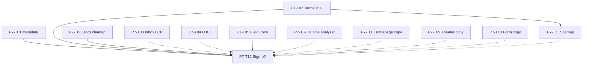

# Phase 7: Task Breakdown

Parent spec: [phase-7-launch.md](./phase-7-launch.md) · Phase 6: [phase-6-polish.md](./phase-6-polish.md) · Sign-off: [P6-T15](./phase-6/tasks/P6-T15-sign-off.md) · Perf: [P1-T17](./phase-1/tasks/P1-T17-performance-budget.md) · Workflow: [P1-T18](./phase-1/tasks/P1-T18-perf-workflow.md)

This file breaks Phase 7 into individual implementation tasks. Expand any task into `docs/phase-7/tasks/P7-T##-*.md` when you need a longer checklist.

**How to use this file**

1. Pick a task by ID (for example `P7-T01`).
2. Read the linked brief and current code under `app/` / `components/`.
3. Implement, then mark status `done` here.
4. Do not mark Phase 7 complete until all **Blocker** tasks are `done` and P7-T12 sign-off is recorded.

**Status values:** `todo` | `in_progress` | `done` | `blocked`

**Prerequisite:** [P6-T15 sign-off](./phase-6/tasks/P6-T15-sign-off.md) (Phase 6 complete, 2026-07-09)

---

## Task index (quick view)

| ID | Task | Status | Blocker? |
|----|------|--------|----------|
| P7-T01 | Metadata alignment (ex-P6-T11) | done | Yes |
| P7-T02 | `/terms` marketing shell | done | Yes |
| P7-T03 | `/inbox` depth LCP follow-up | done | No |
| P7-T04 | Lighthouse CI sketch | done | No |
| P7-T05 | Field CWV / CrUX monitoring note | done | No |
| P7-T06 | Developer docs Hero cleanup | done | Yes |
| P7-T07 | Bundle analyzer spot-check | done | No |
| P7-T08 | Homepage content iteration pass | done | No |
| P7-T09 | Theater caption / demo micro-copy pass | done | No |
| P7-T10 | Waitlist + contact form microcopy | done | No |
| P7-T11 | Sitemap / robots / canonical spot-check | done | No |
| P7-T12 | Phase 7 sign-off checklist | done | Yes |

**Total:** 12 tasks · **Blockers:** 4 · **Phase 7:** complete (P7-T12) · **Next:** [Phase 8 Sensor & Mascot](./phase-8-tasks.md)

---

## Workstream A: SEO + legal shell

### P7-T01 — Metadata alignment (ex-P6-T11)

**Status:** done  
**Blocker:** Yes  
**Depends on:** P6-T15, [P6-T10](./phase-6/tasks/P6-T10-regenerate-og-image.md), [P1-T03](./phase-1/tasks/P1-T03-hero-copy.md)  
**Blocks:** P7-T12  
**Doc:** [P7-T01-metadata-alignment.md](./phase-7/tasks/P7-T01-metadata-alignment.md) (completed 2026-07-10)

**Goal:** Align root + key route `metadata` titles/descriptions with the approved cognitive-layer narrative. Remove leftover “AI-Powered Productivity Assistant” wording. Do not introduce em dashes in new prose (root layout currently uses `—` in default titles).

**Done:** Shared `SITE_TITLE` / `SITE_DESCRIPTION` in `lib/seo.ts`; root layout + homepage + terms/dashboard/billing/connected-apps/sensor&mascot OG titles aligned.

---

### P7-T02 — `/terms` marketing shell

**Status:** done  
**Blocker:** Yes  
**Depends on:** [P6-T13](./phase-6/tasks/P6-T13-faq-privacy-marketing-shell.md), [P5-T02](./phase-5/tasks/P5-T02-marketing-depth-layout.md)  
**Blocks:** P7-T12  
**Doc:** [P7-T02-terms-marketing-shell.md](./phase-7/tasks/P7-T02-terms-marketing-shell.md) (completed 2026-07-10)

**Goal:** Wrap `/terms` in `MarketingDepthLayout` + `mm-*` tokens. Delete `terms.module.css`. Add `/terms` to `MARKETING_FUNNEL_PATHS` and update `scripts/verify-marketing-routes.mjs`. Preserve legal copy.

**Done:** Depth shell + `mm-*` sections; CSS module deleted; `/terms` on funnel gate; privacy + contact links.

---

## Workstream B: Performance ops

### P7-T03 — `/inbox` depth LCP follow-up

**Status:** done  
**Blocker:** No  
**Depends on:** [P5-T14](./phase-5/tasks/P5-T14-depth-page-lighthouse.md), [P6-T12](./phase-6/tasks/P6-T12-next-image-optimization.md)  
**Blocks:** —  
**Doc:** [P7-T03-inbox-lcp-follow-up.md](./phase-7/tasks/P7-T03-inbox-lcp-follow-up.md) (completed 2026-07-10)

**Goal:** Re-measure `/inbox` mobile Lighthouse after `next/image` enablement. If still an outlier, apply low-risk fixes (image sizes, priority, mockup weight) or record an advisory note. Do not block Phase 7 on &lt; 2.5s unless product decides.

**Done:** LCP **5.4s → 2.6s** (score 77 → 97). Fixed mockup intrinsic size + removed `priority`. Still advisory (H1 LCP; no hard depth gate).

---

### P7-T04 — Lighthouse CI sketch

**Status:** done  
**Blocker:** No  
**Depends on:** [P1-T18](./phase-1/tasks/P1-T18-perf-workflow.md), P6-T09 baselines  
**Blocks:** —  
**Doc:** [P7-T04-lighthouse-ci.md](./phase-7/tasks/P7-T04-lighthouse-ci.md) (completed 2026-07-10)

**Goal:** Optional: add `lighthouserc.json` + GitHub Action (or document exact commands) asserting CLS ≤ 0.1 and recording LCP on `/`. Prefer soft fail / warn while the P6 LCP exception stands, or assert against a revised budget.

**Done:** `lighthouserc.cjs` (CLS error, LCP warn ≤ 3.5s), `.github/workflows/lighthouse.yml`, `npm run lhci`.

---

### P7-T05 — Field CWV / CrUX monitoring note

**Status:** done  
**Blocker:** No  
**Depends on:** P6-T09 exception  
**Blocks:** —  
**Doc:** [P7-T05-field-cwv-monitoring.md](./phase-7/tasks/P7-T05-field-cwv-monitoring.md) (completed 2026-07-10)

**Goal:** Document how to pull field LCP/INP/CLS for `mindmesh.global` (CrUX API, Search Console, or RUM). Record whether the lab exception still matches field reality. No code required unless wiring a simple dashboard script.

**Done:** PSI + CrUX API + Search Console runbook; decision rules to close/keep P6 LCP exception; optional RUM deferred.

---

### P7-T07 — Bundle analyzer spot-check

**Status:** done  
**Blocker:** No  
**Depends on:** [P1-T17](./phase-1/tasks/P1-T17-performance-budget.md), [P1-T18](./phase-1/tasks/P1-T18-perf-workflow.md)  
**Blocks:** —

**Goal:** Run `@next/bundle-analyzer` (add if missing) and confirm Framer Motion / theater demos are not in the main homepage chunk. Record a short note under `docs/phase-7/baselines/` if useful.

**Expand into:** [`docs/phase-7/tasks/P7-T07-bundle-analyzer.md`](./phase-7/tasks/P7-T07-bundle-analyzer.md)

**Done:** Analyzer wired (`npm run analyze`); `/` sync chunks clean of Framer / theater bodies / dotlottie. See [baseline](./phase-7/baselines/homepage-bundle-analyzer.md).

---

## Workstream C: Docs + hygiene

### P7-T06 — Developer docs Hero cleanup

**Status:** done  
**Blocker:** Yes  
**Depends on:** [P6-T07](./phase-6/tasks/P6-T07-delete-hero-windows.md)  
**Blocks:** P7-T12

**Goal:** Update [`QUICK_START.md`](../QUICK_START.md), [`README-MIGRATION.md`](../README-MIGRATION.md), and any top-level README sections that still describe the macOS Hero shell as the live homepage. Point readers at marketing `app/page.tsx` and Phase docs.

**Expand into:** [`docs/phase-7/tasks/P7-T06-docs-hero-cleanup.md`](./phase-7/tasks/P7-T06-docs-hero-cleanup.md)

---

### P7-T11 — Sitemap / robots / canonical spot-check

**Status:** done  
**Blocker:** No  
**Depends on:** P7-T02 (if `/terms` gate changes), existing `next-sitemap`  
**Blocks:** —

**Goal:** Confirm `public/sitemap.xml` and `public/robots.txt` list current marketing routes, exclude retired stubs (`/waitlist`, `/features`, etc.), and that canonical/OG URLs still match production.

**Expand into:** [`docs/phase-7/tasks/P7-T11-sitemap-robots-spot-check.md`](./phase-7/tasks/P7-T11-sitemap-robots-spot-check.md)

**Done:** Funnel sitemap complete; robots Disallow fixed via `policies`; `/sensor&mascot` excluded + noindex; OG URLs match `mindmesh.global`.

---

## Workstream D: Content iteration

### P7-T08 — Homepage content iteration pass

**Status:** done  
**Blocker:** No  
**Depends on:** [P1-T01](./phase-1/tasks/P1-T01-narrative.md), [P1-T03](./phase-1/tasks/P1-T03-hero-copy.md)  
**Blocks:** —

**Goal:** Optional product-led copy polish on sections 2–3 and 7–10 without changing locked hero element order unless P1-T03 is formally reopened. Spot-check CLS after edits.

**Expand into:** [`docs/phase-7/tasks/P7-T08-homepage-content-iteration.md`](./phase-7/tasks/P7-T08-homepage-content-iteration.md)

**Done:** Copy-only polish on `#problem`, `#how-it-works`, `#features`, `#integrations`, `#trust`, `#cta`. Hero untouched. CLS risk low (text-only).

---

### P7-T09 — Theater caption / demo micro-copy pass

**Status:** done  
**Blocker:** No  
**Depends on:** Phase 4 theaters  
**Blocks:** —

**Goal:** Optional: tighten theater captions, depth-link labels, and demo fixture copy in `lib/marketing-demo-data.ts` / theater marketing components. No scroll-kit changes.

**Expand into:** [`docs/phase-7/tasks/P7-T09-theater-microcopy.md`](./phase-7/tasks/P7-T09-theater-microcopy.md)

**Done:** Captions single-sourced from fixtures; Acme fixture + depth-link polish; scroll kit untouched.

---

### P7-T10 — Waitlist + contact form microcopy

**Status:** done  
**Blocker:** No  
**Depends on:** P6-T03, P6-T04  
**Blocks:** —

**Goal:** Optional: align form labels, success/error strings, and privacy links with current narrative. Keep API contracts unchanged.

**Expand into:** [`docs/phase-7/tasks/P7-T10-form-microcopy.md`](./phase-7/tasks/P7-T10-form-microcopy.md)

**Done:** WaitlistForm + ContactForm microcopy polish; contact page intro tweak; API payloads unchanged.

---

## Workstream E: Sign-off

### P7-T12 — Phase 7 sign-off checklist

**Status:** done  
**Blocker:** Yes  
**Depends on:** P7-T01, P7-T02, P7-T06 (blockers); non-blockers optional  
**Blocks:** —

**Goal:** Formal gate that metadata + `/terms` + docs hygiene are done; optional ops tasks done or explicitly deferred.

**Expand into:** [`docs/phase-7/tasks/P7-T12-sign-off.md`](./phase-7/tasks/P7-T12-sign-off.md)

**Done:** All blockers + all optionals complete; Phase 7 closed 2026-07-10.

---

## Dependency graph

---

## Phase 7 definition of done

From [phase-7-launch.md](./phase-7-launch.md):

- [x] Metadata aligned on root + key marketing routes
- [x] `/terms` on marketing depth shell
- [x] Stale Hero references removed from primary developer docs
- [x] Optional CI / monitoring tasks done or deferred in sign-off
- [x] P7-T12 sign-off recorded ([P7-T12-sign-off.md](./phase-7/tasks/P7-T12-sign-off.md))

---

## Explicit non-goals (reminder)

Do not implement in Phase 7:

- Theater scroll-kit or beat-sheet architecture rewrites
- Live API data on marketing pages
- `/sensor&mascot` or `/dashboard` redesign (see **[Phase 8](./phase-8-sensor-mascot.md)**)
- New homepage section map without a Phase 1 decision
- Forcing lab LCP &lt; 2.5s solely to close the P6 exception without field data

---

## After Phase 7

**[phase-8-sensor-mascot.md](./phase-8-sensor-mascot.md)** · **[phase-8-tasks.md](./phase-8-tasks.md)** (first: P8-T01 IA decision).
