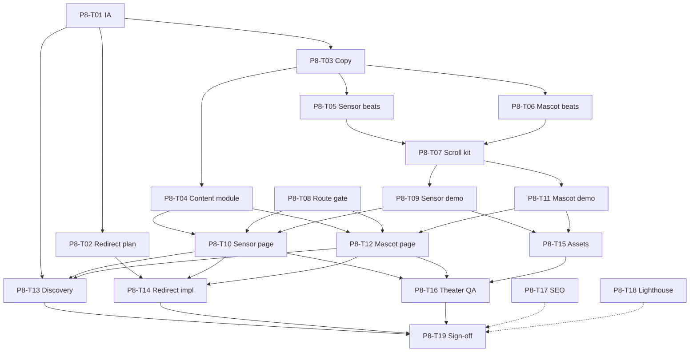

# Phase 8: Task Breakdown

Parent spec: [phase-8-sensor-mascot.md](./phase-8-sensor-mascot.md) · Phase 7: [phase-7-launch.md](./phase-7-launch.md) · Scroll kit: [phase-3-scroll-kit.md](./phase-3-scroll-kit.md) · Theater animation: [phase-4-theater-animation.md](./phase-4-theater-animation.md) · Depth pattern: [phase-5-depth-pages.md](./phase-5-depth-pages.md)

This file breaks Phase 8 into tasks for **Sensor** and **Mascot** product depth pages with **homepage-parity scroll theaters**. Expand any task into `docs/phase-8/tasks/P8-T##-*.md` when needed.

**How to use this file**

1. Pick a task by ID (for example `P8-T08`).
2. Read [phase-8-sensor-mascot.md](./phase-8-sensor-mascot.md) for beat sheets and contracts.
3. Implement, then mark status `done` here.
4. Do not mark Phase 8 complete until all **Blocker** tasks are `done` and P8-T19 sign-off is recorded.

**Status values:** `todo` | `in_progress` | `done` | `blocked`

**Prerequisite:** [P7-T12 sign-off](./phase-7/tasks/P7-T12-sign-off.md) (Phase 7 complete, 2026-07-10).

---

## Task index (quick view)

| ID | Task | Status | Blocker? |
|----|------|--------|----------|
| P8-T01 | IA decision: split routes + feature-grid policy | done | Yes |
| P8-T02 | Legacy `/sensor&mascot` redirect / hub plan | done | Yes |
| P8-T03 | Copy decks: Sensor + Mascot | done | Yes |
| P8-T04 | Shared content module + comparison strip | done | Yes |
| P8-T05 | Lock Sensor theater beat sheet | done | Yes |
| P8-T06 | Lock Mascot theater beat sheet | done | Yes |
| P8-T07 | Extend scroll kit for `sensor` + `mascot` IDs | done | Yes |
| P8-T08 | Expand marketing route gate | done | Yes |
| P8-T09 | `SensorTheaterDemo` (scroll-linked) | done | Yes |
| P8-T10 | Build `/sensor` depth page + theater wiring | done | Yes |
| P8-T11 | `MascotTheaterDemo` (scroll-linked) | done | Yes |
| P8-T12 | Build `/mascot` depth page + theater wiring | done | Yes |
| P8-T13 | Feature grid + FAQ discovery links | done | Yes |
| P8-T14 | Implement legacy redirect + overlay allowlist | done | Yes |
| P8-T15 | Local demo assets (no remote images) | done | Yes |
| P8-T16 | Reduced-motion + off-screen pause + a11y QA | done | Yes |
| P8-T17 | Sitemap / metadata / OG | done | No |
| P8-T18 | Lighthouse spot-check `/sensor` + `/mascot` | done | No |
| P8-T19 | Phase 8 sign-off checklist | done | Yes |

**Total:** 19 tasks · **Blockers:** 17 · **Phase 8:** complete (P8-T19) · **Next:** [Phase 9 Slack compliance](./phase-9-tasks.md)

---

## Workstream A: Decisions + copy

### P8-T01 — IA decision: split routes + feature-grid policy

**Status:** done  
**Blocker:** Yes  
**Depends on:** [phase-8-sensor-mascot.md](./phase-8-sensor-mascot.md), [P1-T09](./phase-1/tasks/P1-T09-feature-grid.md)  
**Blocks:** P8-T02, P8-T03, P8-T13

**Goal:** Lock `/sensor` + `/mascot` routes; decide feature-grid cards (recommend add Sensor + Mascot). Homepage still does not lead with these surfaces.

**Expand into:** [`docs/phase-8/tasks/P8-T01-ia-decision.md`](./phase-8/tasks/P8-T01-ia-decision.md)

**Done:** Split routes locked; feature grid adds Sensor + Mascot (7 cards, before Security); homepage lead unchanged.

---

### P8-T02 — Legacy `/sensor&mascot` redirect / hub plan

**Status:** done  
**Blocker:** Yes  
**Depends on:** P8-T01  
**Blocks:** P8-T14

**Goal:** Choose Option A (308 → `/sensor`), B (→ `/mascot`), or C (thin hub). Plan `#sensor` / `#mascot` hash compatibility via middleware if needed.

**Expand into:** [`docs/phase-8/tasks/P8-T02-legacy-redirect-plan.md`](./phase-8/tasks/P8-T02-legacy-redirect-plan.md)

**Done:** Option A locked; client shim for hash branching (`#mascot` → `/mascot`, else → `/sensor`); no permanent hub.

---

### P8-T03 — Copy decks: Sensor + Mascot

**Status:** done  
**Blocker:** Yes  
**Depends on:** P8-T01  
**Blocks:** P8-T04, P8-T05, P8-T06

**Goal:** Approve page copy (hero, how-it-works, capabilities, CTAs, captions). No em dashes. Seeds in [phase-8-sensor-mascot.md](./phase-8-sensor-mascot.md) + legacy page + FAQ.

**Expand into:** [`docs/phase-8/tasks/P8-T03-copy-decks.md`](./phase-8/tasks/P8-T03-copy-decks.md)

**Done:** Full Sensor + Mascot decks locked (hero through CTA, theater fixtures, comparison, feature-grid stubs).

---

### P8-T04 — Shared content module + comparison strip

**Status:** done  
**Blocker:** Yes  
**Depends on:** P8-T03  
**Blocks:** P8-T10, P8-T12

**Goal:** `lib/marketing-sensor-mascot-content.ts` (or similar) exporting page content, comparison rows, and demo fixture strings (queries, chat lines).

**Expand into:** [`docs/phase-8/tasks/P8-T04-content-module.md`](./phase-8/tasks/P8-T04-content-module.md)

**Done:** Content module shipped with page chrome, comparison strip, Sensor/Mascot theater fixtures, feature-grid + FAQ stubs.

---

## Workstream B: Beat sheets + scroll kit

### P8-T05 — Lock Sensor theater beat sheet

**Status:** done  
**Blocker:** Yes  
**Depends on:** P8-T03, [P1-T06](./phase-1/tasks/P1-T06-theater-connect.md) format  
**Blocks:** P8-T07, P8-T09

**Goal:** Finalize the Sensor progress table (idle → type → results → highlight → confirm → hold). Specify:

- Exact query string and result rows (Acme persona)
- Per-beat `progressStart` / `progressEnd`
- Reduced-motion final progress (**0.90**) and caption
- Which helpers to reuse (`getScrollSyncedCharIndex`, `getBeatLocalProgress`, etc.)

Draft lives in [phase-8-sensor-mascot.md](./phase-8-sensor-mascot.md); this task freezes numbers for code.

**Expand into:** [`docs/phase-8/tasks/P8-T05-sensor-beat-sheet.md`](./phase-8/tasks/P8-T05-sensor-beat-sheet.md)

**Done:** Six contiguous beats locked; `Open Cal` + Calendar confirm; reduced-motion **0.90**; helper contracts for P8-T07/P8-T09.

---

### P8-T06 — Lock Mascot theater beat sheet

**Status:** done  
**Blocker:** Yes  
**Depends on:** P8-T03, [P1-T07](./phase-1/tasks/P1-T07-theater-focus.md) format  
**Blocks:** P8-T07, P8-T11

**Goal:** Finalize Mascot progress table (idle → user ask → typing → reply → action → hold). Specify bubble copy, typing indicator rules, reply chunking, reduced-motion jump (**0.88**) and caption.

**Expand into:** [`docs/phase-8/tasks/P8-T06-mascot-beat-sheet.md`](./phase-8/tasks/P8-T06-mascot-beat-sheet.md)

**Done:** Six contiguous beats locked; staged 3-paragraph reply; Open inbox action; reduced-motion **0.88**; helper contracts for P8-T07/P8-T11.

---

### P8-T07 — Extend scroll kit for `sensor` + `mascot`

**Status:** done  
**Blocker:** Yes  
**Depends on:** P8-T05, P8-T06, [phase-3-scroll-kit.md](./phase-3-scroll-kit.md)  
**Blocks:** P8-T09, P8-T11  

**Goal:** Extend [`lib/marketing-theater-scroll.ts`](../lib/marketing-theater-scroll.ts) and related types:

1. `TheaterId` includes `'sensor' | 'mascot'`
2. `THEATER_WRAPPER_VH` / `THEATER_WRAPPER_CLASS` for both
3. `SENSOR_PROGRESS_STEPS` / `MASCOT_PROGRESS_STEPS` (+ `getTheaterStep` coverage)
4. Any Sensor/Mascot-specific helpers (e.g. result visibility count, chat stage)
5. [`app/globals.css`](../app/globals.css): `[data-theater='sensor'|'mascot']` min-height rules
6. Confirm [`TheaterScrollSection`](../components/marketing/theater/TheaterScrollSection.tsx) / [`useScrollSection`](../hooks/useScrollSection.ts) accept new IDs without homepage regressions

**Acceptance:** Unit-style asserts or script checks for step boundaries; homepage connect/focus/execute unchanged.

**Expand into:** [`docs/phase-8/tasks/P8-T07-scroll-kit-extension.md`](./phase-8/tasks/P8-T07-scroll-kit-extension.md)

**Done:** `sensor`/`mascot` on TheaterId + VH/CSS + locked steps; Sensor/Mascot visual-state helpers; homepage fixtures typed as `HomepageTheaterId`; asserts + `tsc` clean.

---

## Workstream C: Sensor page

### P8-T08 — Expand marketing route gate

**Status:** done  
**Blocker:** Yes  
**Depends on:** P8-T01, [P5-T01](./phase-5/tasks/P5-T01-marketing-route-gate.md)  
**Blocks:** P8-T10, P8-T12, P8-T14

**Goal:** Add `/sensor` and `/mascot` to `MARKETING_FUNNEL_PATHS`; update `scripts/verify-marketing-routes.mjs`. Slim shell only (no overlays).

**Expand into:** [`docs/phase-8/tasks/P8-T08-marketing-route-gate.md`](./phase-8/tasks/P8-T08-marketing-route-gate.md)

**Done:** `/sensor` + `/mascot` on funnel gate; legacy `/sensor&mascot` excluded; verify script + `tsc` clean.

---

### P8-T09 — `SensorTheaterDemo` (scroll-linked)

**Status:** done  
**Blocker:** Yes  
**Depends on:** P8-T05, P8-T07, [phase-4-theater-animation.md](./phase-4-theater-animation.md)  
**Blocks:** P8-T10

**Goal:** Implement `components/marketing/theater/demos/SensorTheaterDemo.tsx` (path flexible under `theater/demos/`):

- Consumes `useTheaterScroll()` / context: `progress`, `step`, `isPaused`
- Implements locked Sensor beat sheet (typing + results + confirm)
- Framer Motion: `transform` + `opacity` only
- **No** import of `SensorBarSpotlight`
- Reduced-motion: render final frame when parent jumps progress
- Prefer coded UI over screenshots

Mirror patterns from [`ConnectTheaterDemo.tsx`](../components/marketing/theater/demos/ConnectTheaterDemo.tsx).

**Expand into:** [`docs/phase-8/tasks/P8-T09-sensor-theater-demo.md`](./phase-8/tasks/P8-T09-sensor-theater-demo.md)

**Done:** `SensorTheaterDemo` + `MarketingSensorPanel`; scrubbed Open Cal → results → highlight → confirm; no live overlay; exported from theater barrel.

---

### P8-T10 — Build `/sensor` depth page + theater wiring

**Status:** done  
**Blocker:** Yes  
**Depends on:** P8-T04, P8-T08, P8-T09  
**Blocks:** P8-T13, P8-T16

**Goal:** [`app/sensor/page.tsx`](../app/sensor/page.tsx):

1. `MarketingDepthLayout` hero + copy sections  
2. `TheaterScrollSection theaterId="sensor"` wrapping dynamically imported `SensorTheaterDemo`  
3. Caption + sibling/waitlist CTAs  
4. Metadata from copy deck  

**Acceptance:**

- [x] Page + theater wiring shipped (scroll / reduced-motion / pause QA in P8-T16)
- [x] Mobile shorter wrapper via scroll kit CSS
- [x] No SiteNav / Lottie / remote hero images

**Expand into:** [`docs/phase-8/tasks/P8-T10-sensor-page.md`](./phase-8/tasks/P8-T10-sensor-page.md)

**Done:** `/sensor` depth page with locked anatomy; `ProductTheaterSensor` + dynamic demo; content from P8-T04 module.

---

## Workstream D: Mascot page

### P8-T11 — `MascotTheaterDemo` (scroll-linked)

**Status:** done  
**Blocker:** Yes  
**Depends on:** P8-T06, P8-T07  
**Blocks:** P8-T12

**Goal:** `components/marketing/theater/demos/MascotTheaterDemo.tsx`:

- User bubble → typing → grounded reply → action affordance
- Scroll-synced reply text where useful (`getScrollSyncedCharIndex` or staged opacity)
- **No** `MascotChatbot` / Lottie
- Same motion + pause rules as Sensor

**Expand into:** [`docs/phase-8/tasks/P8-T11-mascot-theater-demo.md`](./phase-8/tasks/P8-T11-mascot-theater-demo.md)

**Done:** `MascotTheaterDemo` + `MarketingMascotPanel`; staged 3-paragraph reply + Open inbox; no live chatbot; exported from theater barrel.

---

### P8-T12 — Build `/mascot` depth page + theater wiring

**Status:** done  
**Blocker:** Yes  
**Depends on:** P8-T04, P8-T08, P8-T11  
**Blocks:** P8-T13, P8-T16

**Goal:** [`app/mascot/page.tsx`](../app/mascot/page.tsx) parallel to Sensor: depth shell + `TheaterScrollSection theaterId="mascot"` + dynamic demo.

**Acceptance:** Mirror P8-T10 for `/mascot`.

**Expand into:** [`docs/phase-8/tasks/P8-T12-mascot-page.md`](./phase-8/tasks/P8-T12-mascot-page.md)

**Done:** `/mascot` depth page with locked anatomy; `ProductTheaterMascot` + dynamic demo; sibling CTAs → `/sensor`.

---

## Workstream E: Discovery + migration

### P8-T13 — Feature grid + FAQ discovery links

**Status:** done  
**Blocker:** Yes  
**Depends on:** P8-T01, P8-T10, P8-T12  
**Blocks:** P8-T19

**Goal:** FAQ “Learn more” links; implement feature-grid decision from P8-T01 (amend P1-T09 note if cards added).

**Expand into:** [`docs/phase-8/tasks/P8-T13-discovery-links.md`](./phase-8/tasks/P8-T13-discovery-links.md)

**Done:** 7-card feature grid (Sensor + Mascot before Security); FAQ Learn more → `/sensor` / `/mascot`; P1-T09 amended.

---

### P8-T14 — Implement legacy redirect + overlay allowlist

**Status:** done  
**Blocker:** Yes  
**Depends on:** P8-T02, P8-T08, P8-T10, P8-T12  
**Blocks:** P8-T19

**Goal:** Ship redirect/hub; delete legacy page + CSS module; update `MINDMESH_OVERLAY_ROUTES` (drop `/sensor&mascot`); grep-fix internal links.

**Expand into:** [`docs/phase-8/tasks/P8-T14-legacy-redirect-impl.md`](./phase-8/tasks/P8-T14-legacy-redirect-impl.md)

**Done:** Client hash shim (`#mascot` → `/mascot`, else → `/sensor`); CSS deleted; overlays dashboard-only; footer + dashboard links updated.

---

### P8-T15 — Local demo assets (no remote images)

**Status:** done  
**Blocker:** Yes  
**Depends on:** P8-T09, P8-T11  
**Blocks:** P8-T16

**Goal:** All theater visuals local or coded. Zero `lh3.googleusercontent` (or similar) on new pages.

**Expand into:** [`docs/phase-8/tasks/P8-T15-local-assets.md`](./phase-8/tasks/P8-T15-local-assets.md)

**Done:** Audit clean; Sensor/Mascot demos are coded UI only (no remote images, no Lottie, no `next/image` on those pages).

---

## Workstream F: QA + sign-off

### P8-T16 — Reduced-motion + off-screen pause + a11y QA

**Status:** done  
**Blocker:** Yes  
**Depends on:** P8-T10, P8-T12, P8-T15, [P3-T12](./phase-3/tasks/P3-T12-reduced-motion-qa.md), [P3-T13](./phase-3/tasks/P3-T13-off-screen-pause-qa.md)  
**Blocks:** P8-T19

**Goal:** Same bar as homepage theaters:

- [x] Reduced motion → final frames + captions  
- [x] Leave page / scroll away → demos pause (`isPaused`)  
- [x] Re-enter → progress matches scroll position  
- [x] Keyboard / headings / contrast  
- [x] No body scroll-lock from legacy mascot tooltip behavior  

**Expand into:** [`docs/phase-8/tasks/P8-T16-theater-qa.md`](./phase-8/tasks/P8-T16-theater-qa.md)

**Done:** CDP QA on `/sensor` + `/mascot`; reduced-motion pins 0.90 / 0.88; off-screen pause + resume; no overlays / scroll-lock.

---

### P8-T17 — Sitemap / metadata / OG

**Status:** done  
**Blocker:** No  
**Depends on:** P8-T10, P8-T12, P8-T14  
**Blocks:** —

**Goal:** Unique metadata; sitemap includes `/sensor` and `/mascot`; legacy path not a soft 200.

**Expand into:** [`docs/phase-8/tasks/P8-T17-seo-sitemap.md`](./phase-8/tasks/P8-T17-seo-sitemap.md)

**Done:** Sitemap regenerated (14 funnel URLs incl. `/sensor` + `/mascot`); legacy excluded + noindex; unique OG metadata verified in build HTML.

---

### P8-T18 — Lighthouse spot-check `/sensor` + `/mascot`

**Status:** done  
**Blocker:** No  
**Depends on:** P8-T10, P8-T12, P8-T15  
**Blocks:** —

**Goal:** Prod build, mobile Lighthouse × 1–2 per page. Record `docs/phase-8/baselines/`. Confirm Framer not in initial shell chunk. Advisory LCP; watch CLS / TBT.

**Expand into:** [`docs/phase-8/tasks/P8-T18-lighthouse-spot-check.md`](./phase-8/tasks/P8-T18-lighthouse-spot-check.md)

**Done:** Sensor LCP ~2.7–3.0s (score 94–95); Mascot representative ~3.0s (score 94); CLS 0; Framer absent from shell; baselines recorded.

---

### P8-T19 — Phase 8 sign-off checklist

**Status:** done  
**Blocker:** Yes  
**Depends on:** All blockers through P8-T16  
**Blocks:** —  
**Doc:** [P8-T19-sign-off.md](./phase-8/tasks/P8-T19-sign-off.md) (completed 2026-07-10)

**Goal:** Formal gate: both scroll theaters ship, legacy migrated, discovery wired, QA passed.

**Done:** Phase 8 complete. Carry-forward: Phase 9 Slack compliance; Phase 10 theater upgrades. Entry docs stubbed.

---

## Dependency graph

---

## Phase 8 definition of done

- [x] `/sensor` and `/mascot` on marketing shell with **scroll-linked** theaters  
- [x] Beat sheets locked and implemented (scrub + reduced-motion)  
- [x] Scroll kit extended (`sensor` / `mascot` IDs + CSS)  
- [x] Legacy `/sensor&mascot` redirected; overlay allowlist updated  
- [x] FAQ (+ optional feature grid) discover both pages  
- [x] No Lottie / remote hero images  
- [x] Theater QA (pause + reduced motion) passed  
- [x] P8-T19 sign-off recorded ([P8-T19](./phase-8/tasks/P8-T19-sign-off.md))  

---

## Explicit non-goals (reminder)

- Live overlays on `/` or other funnel routes  
- Rewriting Connect / Focus / Execute homepage theaters  
- Live API data in demos  
- Desktop onboarding tour parity on the marketing site  
- `/dashboard` redesign  
